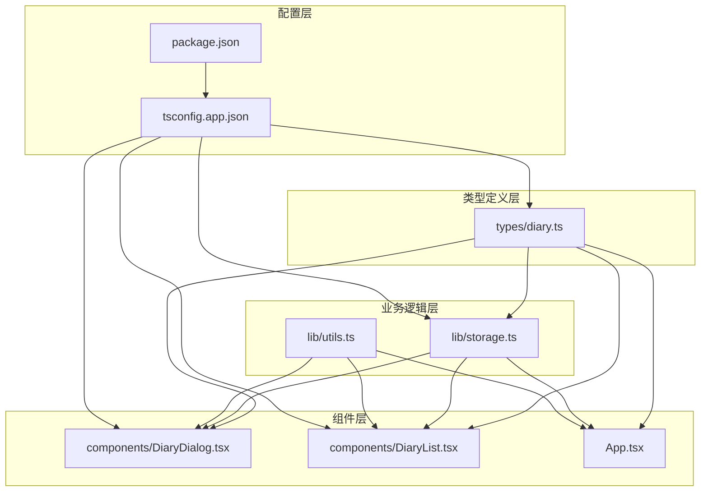
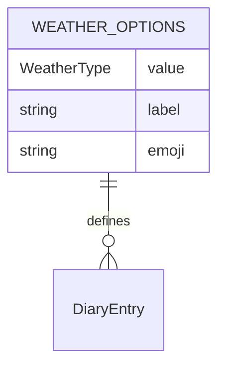
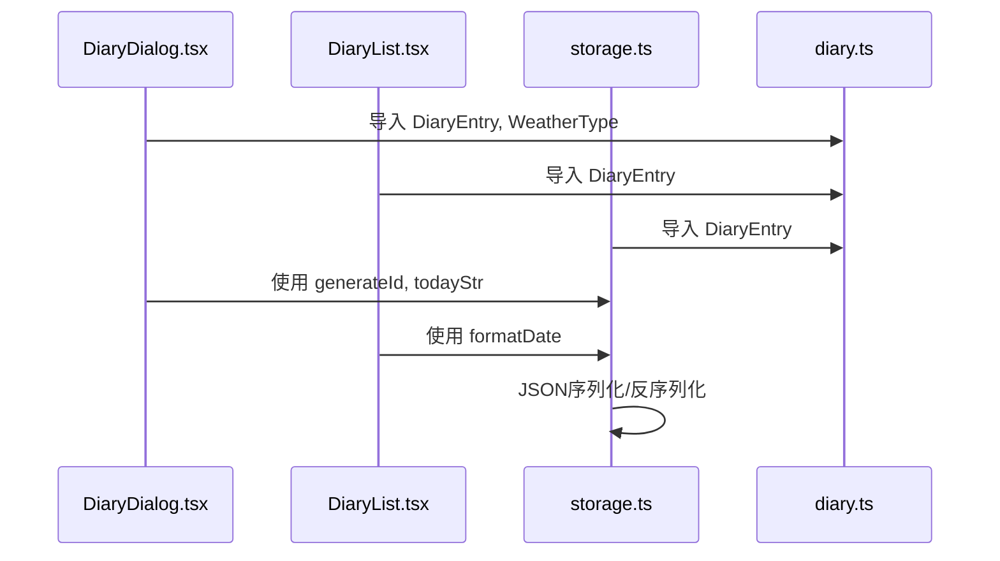
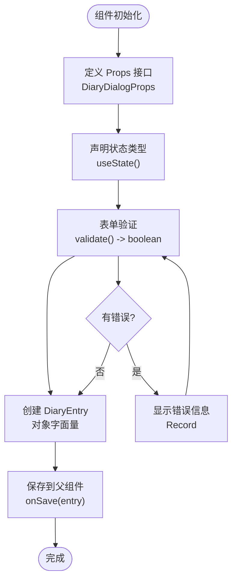
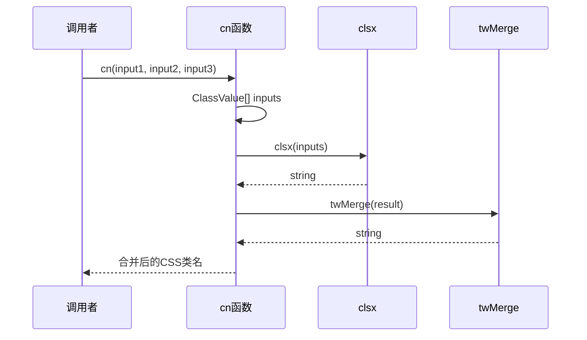
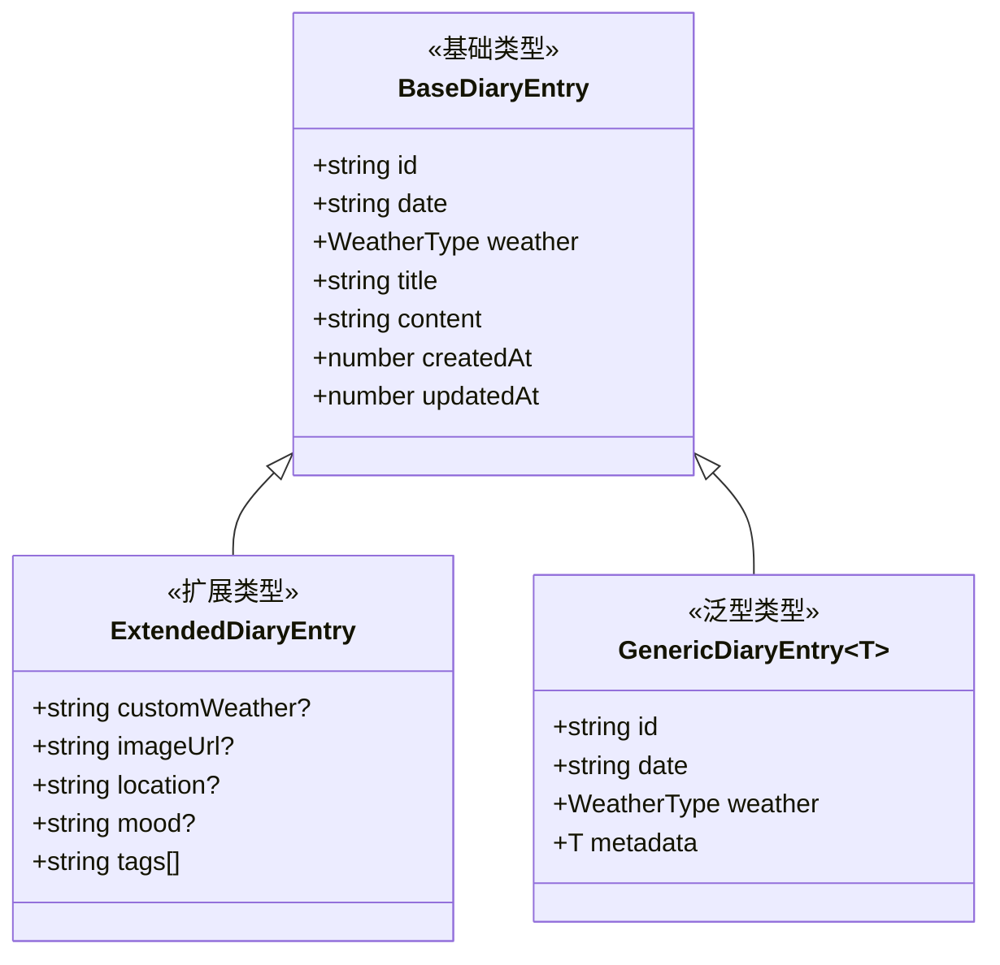
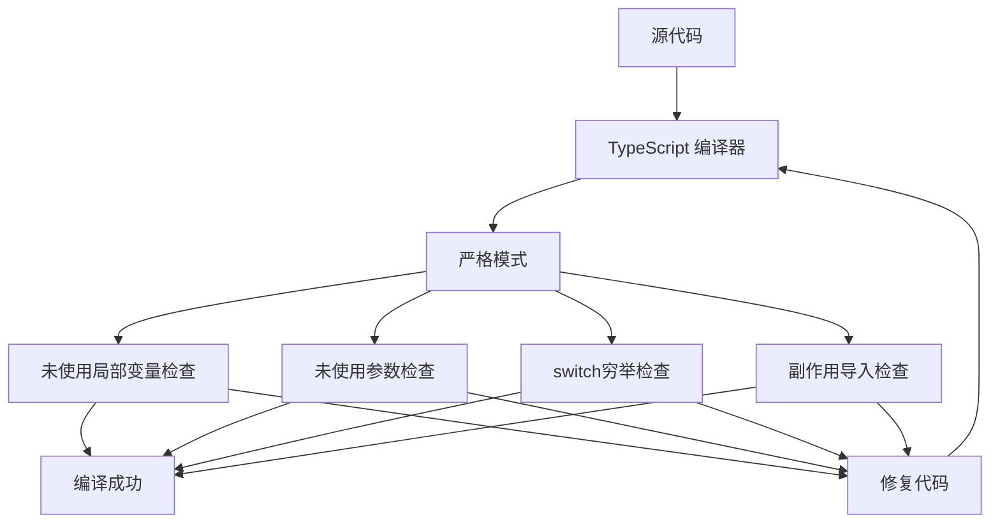
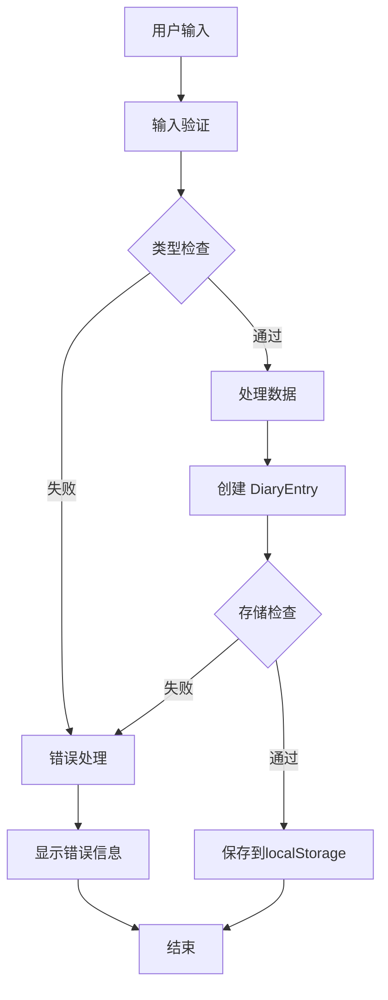
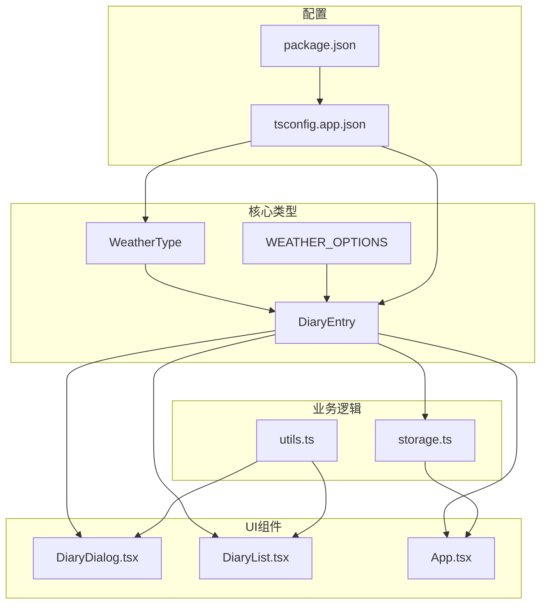
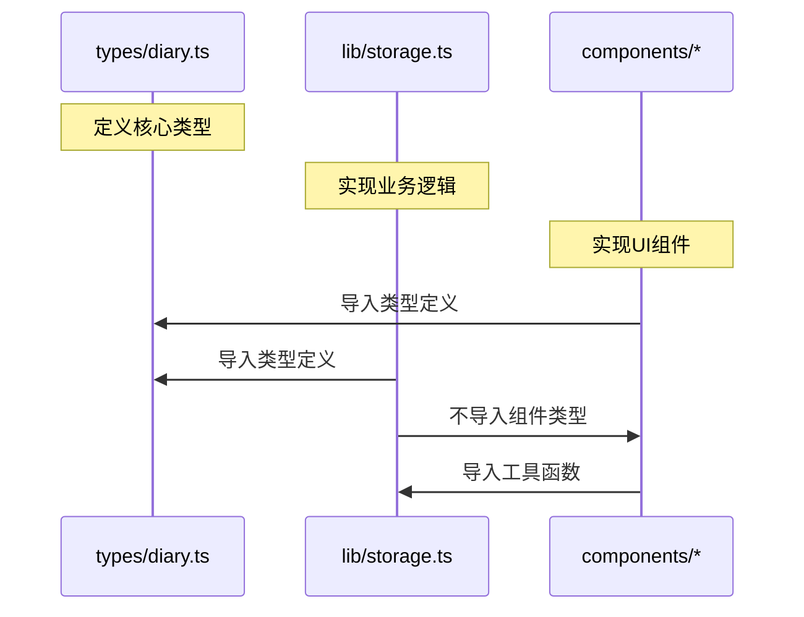

# TypeScript类型系统

<cite>
**本文档引用的文件**
- [src/types/diary.ts](file://src/types/diary.ts)
- [src/lib/utils.ts](file://src/lib/utils.ts)
- [src/lib/storage.ts](file://src/lib/storage.ts)
- [src/components/DiaryDialog.tsx](file://src/components/DiaryDialog.tsx)
- [src/components/DiaryList.tsx](file://src/components/DiaryList.tsx)
- [src/App.tsx](file://src/App.tsx)
- [tsconfig.app.json](file://tsconfig.app.json)
- [tsconfig.json](file://tsconfig.json)
- [package.json](file://package.json)
</cite>

## 目录
1. [简介](#简介)
2. [项目结构与类型组织](#项目结构与类型组织)
3. [核心类型定义](#核心类型定义)
4. [类型系统架构](#类型系统架构)
5. [类型使用与最佳实践](#类型使用与最佳实践)
6. [类型安全性保障](#类型安全性保障)
7. [依赖关系分析](#依赖关系分析)
8. [性能考虑](#性能考虑)
9. [故障排除指南](#故障排除指南)
10. [结论](#结论)

## 简介

My-Diary项目采用TypeScript构建，实现了完整的类型安全体系。该项目通过精心设计的类型系统，确保了数据模型的一致性、编译时的类型检查以及运行时的类型验证。本文档将深入分析项目中的类型定义、使用模式和最佳实践，帮助开发者充分利用TypeScript的类型安全特性。

## 项目结构与类型组织

项目采用模块化的类型组织方式，将类型定义集中在专门的目录中，遵循单一职责原则：



**图表来源**
- [src/types/diary.ts:1-22](file://src/types/diary.ts#L1-L22)
- [src/lib/storage.ts:1-58](file://src/lib/storage.ts#L1-L58)
- [src/lib/utils.ts:1-7](file://src/lib/utils.ts#L1-L7)

**章节来源**
- [src/types/diary.ts:1-22](file://src/types/diary.ts#L1-L22)
- [tsconfig.app.json:1-24](file://tsconfig.app.json#L1-L24)

## 核心类型定义

### WeatherType 天气类型

项目定义了一个精确的联合类型来约束天气状态：

```mermaid
classDiagram
class WeatherType {
<<union type>>
"sunny"
"cloudy"
"rainy"
"snowy"
"windy"
"custom"
}
class DiaryEntry {
+string id
+string date
+WeatherType weather
+string customWeather?
+string title
+string content
+number createdAt
+number updatedAt
}
class WeatherOption {
+WeatherType value
+string label
+string emoji
}
DiaryEntry --> WeatherType : "uses"
WeatherOption --> WeatherType : "contains"
```

**图表来源**
- [src/types/diary.ts:2](file://src/types/diary.ts#L2)
- [src/types/diary.ts:4-13](file://src/types/diary.ts#L4-L13)
- [src/types/diary.ts:15-21](file://src/types/diary.ts#L15-L21)

WeatherType是一个精确的字符串字面量联合类型，提供了以下约束：
- 严格限定的天气值集合
- 支持自定义天气选项
- 编译时类型安全保障

**章节来源**
- [src/types/diary.ts:2](file://src/types/diary.ts#L2)
- [src/types/diary.ts:4-13](file://src/types/diary.ts#L4-L13)

### DiaryEntry 日记条目接口

DiaryEntry是项目的核心数据模型，定义了完整的日记条目结构：

| 属性名 | 类型 | 必填 | 描述 |
|--------|------|------|------|
| id | string | 是 | 唯一标识符 |
| date | string | 是 | 日期字符串（YYYY-MM-DD格式） |
| weather | WeatherType | 是 | 天气类型 |
| customWeather | string | 否 | 自定义天气描述 |
| title | string | 是 | 标题 |
| content | string | 是 | 内容 |
| createdAt | number | 是 | 创建时间戳 |
| updatedAt | number | 是 | 更新时间戳 |

**章节来源**
- [src/types/diary.ts:4-13](file://src/types/diary.ts#L4-L13)

### WEATHER_OPTIONS 天气选项常量

项目提供了预定义的天气选项数组，用于UI显示和用户选择：



**图表来源**
- [src/types/diary.ts:15-21](file://src/types/diary.ts#L15-L21)

**章节来源**
- [src/types/diary.ts:15-21](file://src/types/diary.ts#L15-L21)

## 类型系统架构

### 类型导入与使用模式

项目采用统一的类型导入策略，确保类型定义的一致性和可维护性：



**图表来源**
- [src/components/DiaryDialog.tsx:3-6](file://src/components/DiaryDialog.tsx#L3-L6)
- [src/components/DiaryList.tsx:2-5](file://src/components/DiaryList.tsx#L2-L5)
- [src/lib/storage.ts:1](file://src/lib/storage.ts#L1)

### 类型别名与接口的关系

项目巧妙地结合了类型别名和接口来实现类型安全：

```mermaid
classDiagram
class TypeAlias {
<<WeatherType>>
"精确字符串联合"
"编译时检查"
"运行时验证"
}
class Interface {
<<DiaryEntry>>
"结构化数据"
"属性约束"
"可选属性"
}
class Constant {
<<WEATHER_OPTIONS>>
"配置数组"
"UI显示"
"本地化支持"
}
TypeAlias --> Interface : "被使用"
Constant --> TypeAlias : "定义值域"
```

**图表来源**
- [src/types/diary.ts:2](file://src/types/diary.ts#L2)
- [src/types/diary.ts:4-13](file://src/types/diary.ts#L4-L13)
- [src/types/diary.ts:15-21](file://src/types/diary.ts#L15-L21)

**章节来源**
- [src/components/DiaryDialog.tsx:3-6](file://src/components/DiaryDialog.tsx#L3-L6)
- [src/components/DiaryList.tsx:2-5](file://src/components/DiaryList.tsx#L2-L5)
- [src/lib/storage.ts:1](file://src/lib/storage.ts#L1)

## 类型使用与最佳实践

### 组件中的类型使用

#### DiaryDialog 组件类型使用

DiaryDialog组件展示了多种类型使用模式：

1. **Props接口定义**：明确组件的输入参数
2. **状态类型声明**：使用泛型约束状态变量
3. **事件处理类型**：确保回调函数的类型安全



**图表来源**
- [src/components/DiaryDialog.tsx:8-14](file://src/components/DiaryDialog.tsx#L8-L14)
- [src/components/DiaryDialog.tsx:16-46](file://src/components/DiaryDialog.tsx#L16-L46)
- [src/components/DiaryDialog.tsx:56-80](file://src/components/DiaryDialog.tsx#L56-L80)

#### DiaryList 组件类型使用

DiaryList组件展示了复杂类型在实际应用中的使用：

1. **列表项类型**：明确传入的数据结构
2. **分页逻辑**：类型安全的索引计算
3. **条件渲染**：基于类型信息的UI分支

**章节来源**
- [src/components/DiaryDialog.tsx:8-14](file://src/components/DiaryDialog.tsx#L8-L14)
- [src/components/DiaryDialog.tsx:56-80](file://src/components/DiaryDialog.tsx#L56-L80)
- [src/components/DiaryList.tsx:7-13](file://src/components/DiaryList.tsx#L7-L13)

### 泛型与类型推导

#### 工具函数中的泛型使用

utils.ts中的cn函数展示了泛型的最佳实践：



**图表来源**
- [src/lib/utils.ts:4-6](file://src/lib/utils.ts#L4-L6)

**章节来源**
- [src/lib/utils.ts:4-6](file://src/lib/utils.ts#L4-L6)

### 类型扩展方法

#### 扩展DiaryEntry类型

要扩展DiaryEntry类型，可以采用以下几种方式：

1. **接口合并**：通过TypeScript的接口合并特性添加新属性
2. **类型声明合并**：在模块声明文件中扩展现有类型
3. **泛型包装**：创建新的类型包装器来添加功能



**图表来源**
- [src/types/diary.ts:4-13](file://src/types/diary.ts#L4-L13)

## 类型安全性保障

### 编译时检查机制

项目通过严格的TypeScript配置实现了全面的编译时检查：



**图表来源**
- [tsconfig.app.json:14-18](file://tsconfig.app.json#L14-L18)

### 运行时验证策略

虽然项目主要依赖编译时类型检查，但在关键位置实施了运行时验证：



**图表来源**
- [src/components/DiaryDialog.tsx:56-80](file://src/components/DiaryDialog.tsx#L56-L80)
- [src/lib/storage.ts:5-13](file://src/lib/storage.ts#L5-L13)

**章节来源**
- [tsconfig.app.json:14-18](file://tsconfig.app.json#L14-L18)
- [src/components/DiaryDialog.tsx:56-80](file://src/components/DiaryDialog.tsx#L56-L80)
- [src/lib/storage.ts:5-13](file://src/lib/storage.ts#L5-L13)

## 依赖关系分析

### 类型依赖图

项目中的类型依赖关系清晰且模块化：



**图表来源**
- [src/types/diary.ts:2-21](file://src/types/diary.ts#L2-L21)
- [src/lib/storage.ts:1](file://src/lib/storage.ts#L1)
- [src/lib/utils.ts:1](file://src/lib/utils.ts#L1)

### 循环依赖检测

项目通过合理的模块划分避免了循环依赖：



**图表来源**
- [src/types/diary.ts:1-22](file://src/types/diary.ts#L1-L22)
- [src/lib/storage.ts:1](file://src/lib/storage.ts#L1)
- [src/components/DiaryDialog.tsx:1-7](file://src/components/DiaryDialog.tsx#L1-L7)

**章节来源**
- [src/types/diary.ts:1-22](file://src/types/diary.ts#L1-L22)
- [src/lib/storage.ts:1](file://src/lib/storage.ts#L1)
- [src/components/DiaryDialog.tsx:1-7](file://src/components/DiaryDialog.tsx#L1-L7)

## 性能考虑

### 类型检查性能优化

项目通过以下方式优化TypeScript的性能：

1. **严格模式配置**：启用全面的类型检查，确保代码质量
2. **模块解析优化**：使用bundler模块解析，提高编译速度
3. **路径映射**：通过@路径简化导入语句
4. **跳过库检查**：跳过第三方库的类型检查，加快编译

### 运行时性能影响

类型系统对运行时性能的影响最小化：

- 类型信息在编译时移除
- 运行时只保留必要的类型验证逻辑
- 避免不必要的类型断言操作

**章节来源**
- [tsconfig.app.json:3-21](file://tsconfig.app.json#L3-L21)

## 故障排除指南

### 常见类型错误及解决方案

#### 1. 类型不兼容错误

**问题**：当尝试将非DiaryEntry类型的对象赋值给DiaryEntry变量时

**解决方案**：
- 确保对象包含所有必需属性
- 验证属性类型是否正确
- 使用类型守卫进行运行时检查

#### 2. 可选属性访问错误

**问题**：访问可能不存在的可选属性时

**解决方案**：
- 使用可选链操作符（?.）
- 提供默认值
- 实施运行时验证

#### 3. 联合类型处理错误

**问题**：在处理WeatherType联合类型时出现类型错误

**解决方案**：
- 使用类型守卫进行区分
- 实施穷举检查
- 提供适当的默认分支

### 类型调试技巧

1. **使用TypeScript Playground**：在线测试类型推导
2. **启用详细错误信息**：在tsconfig中配置详细的编译选项
3. **使用类型断言**：仅在必要时使用，配合运行时验证
4. **创建类型测试文件**：验证类型定义的正确性

**章节来源**
- [src/components/DiaryDialog.tsx:56-80](file://src/components/DiaryDialog.tsx#L56-L80)
- [src/lib/storage.ts:5-13](file://src/lib/storage.ts#L5-L13)

## 结论

My-Diary项目的TypeScript类型系统展现了现代前端开发的最佳实践。通过精心设计的类型定义、严格的编译时检查和合理的运行时验证，项目实现了高度的类型安全性和良好的开发体验。

### 主要优势

1. **类型安全**：通过精确的联合类型和接口定义，确保数据结构的一致性
2. **开发效率**：完整的IDE支持和智能提示，提升开发体验
3. **代码质量**：严格的编译时检查，减少运行时错误
4. **可维护性**：清晰的类型组织和模块化设计，便于长期维护

### 改进建议

1. **增加运行时验证**：为关键数据添加更严格的运行时类型检查
2. **扩展类型测试**：创建更完善的类型单元测试
3. **文档化类型**：为复杂的类型定义添加详细的JSDoc注释
4. **类型演进策略**：制定类型变更的向后兼容策略

通过持续优化类型系统，My-Diary项目将继续保持高质量的代码标准，为用户提供可靠的日记管理体验。