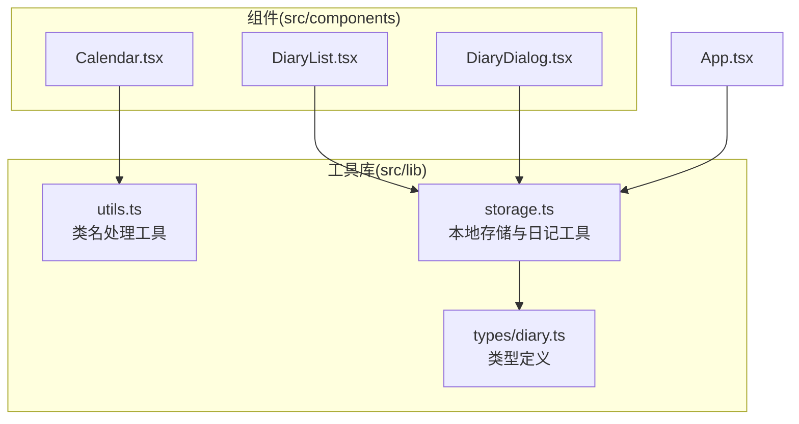
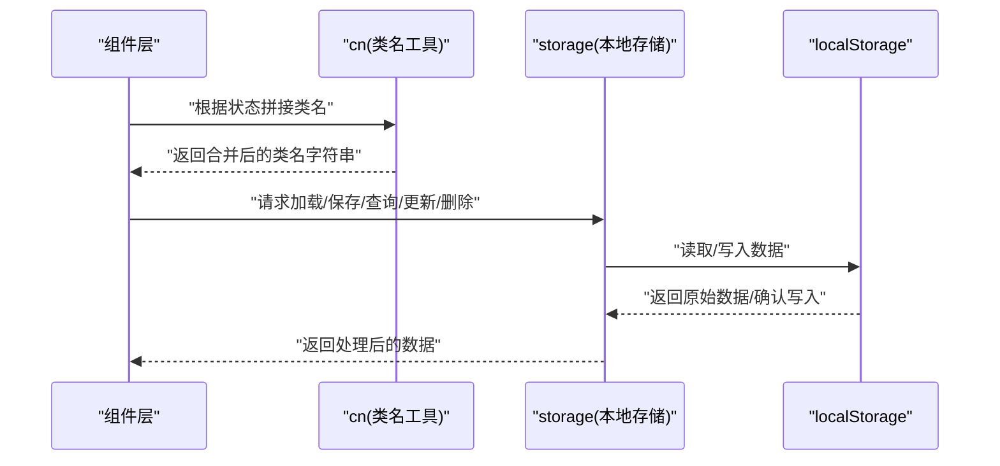
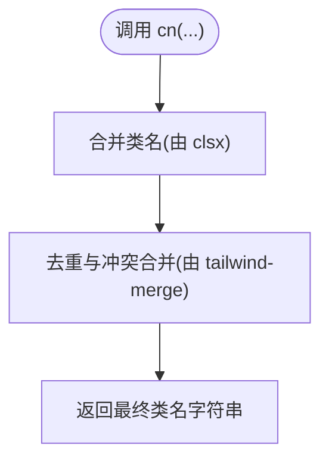
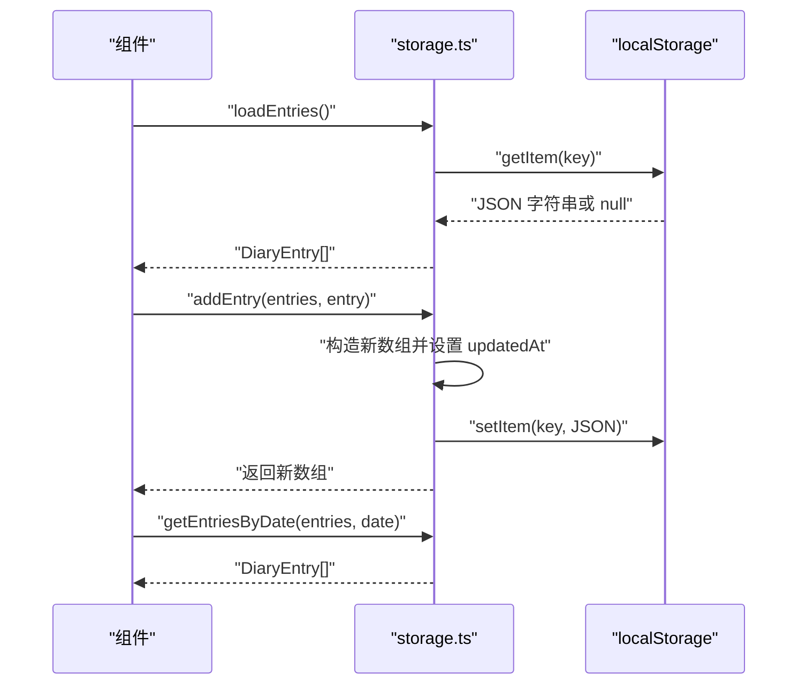
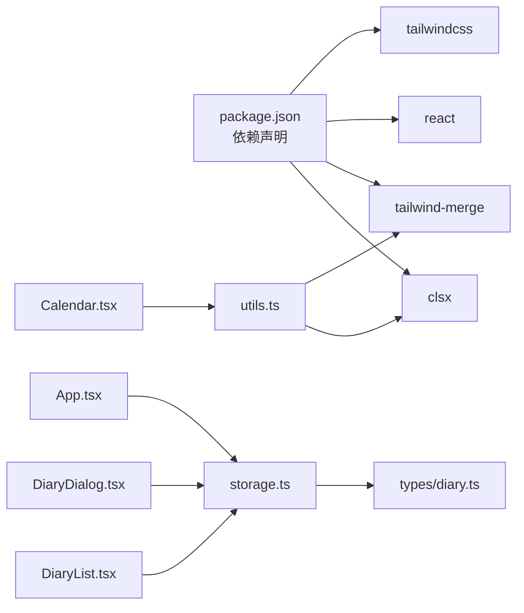

# 工具函数库

<cite>
**本文引用的文件**
- [utils.ts](file://src/lib/utils.ts)
- [storage.ts](file://src/lib/storage.ts)
- [diary.ts](file://src/types/diary.ts)
- [Calendar.tsx](file://src/components/Calendar.tsx)
- [DiaryList.tsx](file://src/components/DiaryList.tsx)
- [DiaryDialog.tsx](file://src/components/DiaryDialog.tsx)
- [App.tsx](file://src/App.tsx)
- [package.json](file://package.json)
</cite>

## 目录
1. [简介](#简介)
2. [项目结构](#项目结构)
3. [核心组件](#核心组件)
4. [架构总览](#架构总览)
5. [详细组件分析](#详细组件分析)
6. [依赖关系分析](#依赖关系分析)
7. [性能考量](#性能考量)
8. [故障排查指南](#故障排查指南)
9. [结论](#结论)
10. [附录](#附录)

## 简介
本文件面向 My-Diary 项目的工具函数库，系统性梳理并说明 utils.ts 与 storage.ts 提供的实用工具，涵盖类名处理、类型检查、数据转换、本地存储与日期格式化等能力。文档以“可读性优先”的方式呈现，既适合初学者快速上手，也便于资深开发者深入理解设计原则、性能特征与扩展路径，并提供测试与质量保障建议。

## 项目结构
工具函数库位于 src/lib 目录：
- utils.ts：提供类名合并工具 cn，用于简化 Tailwind CSS 类名拼接与冲突合并。
- storage.ts：封装本地存储与日记条目管理，提供加载、保存、增删改查、日期筛选、格式化与 ID 生成等能力。
- types/diary.ts：定义日记条目类型与天气枚举，为工具函数提供类型约束。
- 组件层通过 import 使用工具函数，例如 Calendar、DiaryList、DiaryDialog 等均调用 cn 或 storage 工具。

图表来源
- [utils.ts:1-7](file://src/lib/utils.ts#L1-L7)
- [storage.ts:1-58](file://src/lib/storage.ts#L1-L58)
- [diary.ts:1-22](file://src/types/diary.ts#L1-L22)
- [Calendar.tsx:1-159](file://src/components/Calendar.tsx#L1-L159)
- [DiaryList.tsx:1-200](file://src/components/DiaryList.tsx#L1-L200)
- [DiaryDialog.tsx:1-232](file://src/components/DiaryDialog.tsx#L1-L232)
- [App.tsx:1-42](file://src/App.tsx#L1-L42)

章节来源
- [utils.ts:1-7](file://src/lib/utils.ts#L1-L7)
- [storage.ts:1-58](file://src/lib/storage.ts#L1-L58)
- [diary.ts:1-22](file://src/types/diary.ts#L1-L22)
- [Calendar.tsx:1-159](file://src/components/Calendar.tsx#L1-L159)
- [DiaryList.tsx:1-200](file://src/components/DiaryList.tsx#L1-L200)
- [DiaryDialog.tsx:1-232](file://src/components/DiaryDialog.tsx#L1-L232)
- [App.tsx:1-42](file://src/App.tsx#L1-L42)

## 核心组件
- 类名处理工具 cn
  - 功能：将多个类名输入经 clsx 合并后，再用 tailwind-merge 去除冲突，输出最终类字符串。
  - 参数：可变长度的 ClassValue 数组（支持字符串、对象、数组、条件表达式等）。
  - 返回值：字符串形式的类名。
  - 使用场景：组件内部根据状态动态拼装样式类，避免重复与冲突。
  - 设计原则：最小化副作用、保持纯函数特性；与 Tailwind CSS 生态无缝衔接。
  - 性能考虑：合并与去重操作为 O(n) 级别，对 UI 渲染影响可忽略。
  - 扩展方法：可作为全局样式工具，在任意需要拼接类名的地方复用。
  - 最佳实践：优先传入布尔条件与映射对象，减少字符串拼接；避免在高频渲染中重复构造大数组。
  - 示例路径：[Calendar.tsx:101-134](file://src/components/Calendar.tsx#L101-L134)、[DiaryList.tsx:92-122](file://src/components/DiaryList.tsx#L92-L122)、[DiaryDialog.tsx:120-164](file://src/components/DiaryDialog.tsx#L120-L164)

- 本地存储与日记工具 storage.ts
  - 加载与保存：loadEntries、saveEntries
    - 功能：从 localStorage 读取或写入日记条目数组。
    - 参数：loadEntries 无参；saveEntries 接收 DiaryEntry[]。
    - 返回值：loadEntries 返回 DiaryEntry[]；saveEntries 无返回值。
    - 使用场景：应用启动时初始化数据；每次增删改后持久化。
    - 错误处理：解析失败或空数据时返回空数组，确保健壮性。
    - 示例路径：[App.tsx:19-23](file://src/App.tsx#L19-L23)、[storage.ts:5-17](file://src/lib/storage.ts#L5-L17)

  - 新增、更新、删除：addEntry、updateEntry、deleteEntry
    - 功能：新增条目到头部、按 id 更新条目并自动设置更新时间戳、按 id 过滤删除。
    - 参数：addEntry 接收当前条目数组与新条目；updateEntry 接收当前数组与更新条目；deleteEntry 接收当前数组与 id。
    - 返回值：返回更新后的数组；同时自动保存到 localStorage。
    - 使用场景：表单提交、编辑对话框保存、删除确认后的状态更新。
    - 示例路径：[DiaryDialog.tsx:66-80](file://src/components/DiaryDialog.tsx#L66-L80)、[DiaryList.tsx:39-43](file://src/components/DiaryList.tsx#L39-L43)

  - 查询与筛选：getDatesWithDiary、getEntriesByDate
    - 功能：提取所有有日记的日期集合、按日期筛选条目。
    - 参数：getDatesWithDiary 接收 DiaryEntry[]；getEntriesByDate 接收 DiaryEntry[] 与日期字符串。
    - 返回值：Set<string> 与 DiaryEntry[]。
    - 使用场景：日历标记、按日筛选列表。
    - 示例路径：[App.tsx:26-33](file://src/App.tsx#L26-L33)、[Calendar.tsx:119-119](file://src/components/Calendar.tsx#L119-L119)

  - 日期格式化与生成：formatDate、todayStr
    - 功能：将 ISO 日期字符串格式化为中文本地化日期；生成今日日期字符串。
    - 参数：formatDate 接收日期字符串；todayStr 无参。
    - 返回值：字符串。
    - 使用场景：显示标题、默认日期、提示文案。
    - 示例路径：[DiaryList.tsx:51-51](file://src/components/DiaryList.tsx#L51-L51)、[DiaryDialog.tsx:17-17](file://src/components/DiaryDialog.tsx#L17-L17)

  - ID 生成：generateId
    - 功能：生成唯一 id，包含时间戳与随机片段。
    - 参数：无。
    - 返回值：字符串。
    - 使用场景：新增条目时分配 id。
    - 示例路径：[DiaryDialog.tsx:70-70](file://src/components/DiaryDialog.tsx#L70-L70)

章节来源
- [utils.ts:1-7](file://src/lib/utils.ts#L1-L7)
- [storage.ts:1-58](file://src/lib/storage.ts#L1-L58)
- [diary.ts:1-22](file://src/types/diary.ts#L1-L22)
- [Calendar.tsx:1-159](file://src/components/Calendar.tsx#L1-L159)
- [DiaryList.tsx:1-200](file://src/components/DiaryList.tsx#L1-L200)
- [DiaryDialog.tsx:1-232](file://src/components/DiaryDialog.tsx#L1-L232)
- [App.tsx:1-42](file://src/App.tsx#L1-L42)

## 架构总览
工具函数库与组件层的交互关系如下：

图表来源
- [utils.ts:1-7](file://src/lib/utils.ts#L1-L7)
- [storage.ts:1-58](file://src/lib/storage.ts#L1-L58)
- [Calendar.tsx:1-159](file://src/components/Calendar.tsx#L1-L159)
- [DiaryList.tsx:1-200](file://src/components/DiaryList.tsx#L1-L200)
- [DiaryDialog.tsx:1-232](file://src/components/DiaryDialog.tsx#L1-L232)

## 详细组件分析

### 类名处理工具 cn
- 设计与实现要点
  - 输入：可变参数 ClassValue[]，支持字符串、对象、数组、条件表达式。
  - 处理：先由 clsx 合并，再由 tailwind-merge 去除冲突，保证最终类名简洁且不重复。
  - 输出：字符串类名。
- 使用模式
  - 条件类名：根据状态切换 active/disabled 等。
  - 周末/今日/选中/有日记等多条件组合。
- 性能与复杂度
  - 时间复杂度：O(n)，n 为输入类名数量。
  - 空间复杂度：O(n)。
- 最佳实践
  - 将条件逻辑集中在 cn 调用处，避免在模板中做复杂拼接。
  - 避免频繁创建超大数组，必要时缓存中间结果。
- 示例路径
  - [Calendar.tsx:101-134](file://src/components/Calendar.tsx#L101-L134)
  - [DiaryList.tsx:92-122](file://src/components/DiaryList.tsx#L92-L122)
  - [DiaryDialog.tsx:120-164](file://src/components/DiaryDialog.tsx#L120-L164)

图表来源
- [utils.ts:1-7](file://src/lib/utils.ts#L1-L7)

章节来源
- [utils.ts:1-7](file://src/lib/utils.ts#L1-L7)
- [Calendar.tsx:1-159](file://src/components/Calendar.tsx#L1-L159)
- [DiaryList.tsx:1-200](file://src/components/DiaryList.tsx#L1-L200)
- [DiaryDialog.tsx:1-232](file://src/components/DiaryDialog.tsx#L1-L232)

### 本地存储与日记工具 storage.ts
- 数据模型与类型
  - DiaryEntry：包含 id、date、weather、customWeather、title、content、createdAt、updatedAt。
  - WeatherType：限定天气枚举值。
- 关键函数与流程
  - 加载与保存：从 localStorage 读取/写入 DiaryEntry[]，异常时回退为空数组。
  - 新增/更新/删除：在内存中构建新数组并立即持久化，返回新数组。
  - 查询：按日期集合与按日期过滤。
  - 日期工具：格式化为中文本地化日期、生成今日日期字符串。
  - ID 生成：基于时间戳与随机片段的稳定唯一标识。
- 错误处理与边界
  - 解析失败或空数据时返回空数组，避免崩溃。
  - 更新时自动设置 updatedAt，确保排序与时间线正确。
- 性能与复杂度
  - 读写：O(1)（localStorage 访问），受浏览器实现影响。
  - 过滤/映射：O(n)。
  - 建议：在组件层使用 useMemo 缓存计算结果，减少重复计算。
- 示例路径
  - [App.tsx:19-33](file://src/App.tsx#L19-L33)
  - [DiaryDialog.tsx:66-80](file://src/components/DiaryDialog.tsx#L66-L80)
  - [DiaryList.tsx:39-43](file://src/components/DiaryList.tsx#L39-L43)

图表来源
- [storage.ts:1-58](file://src/lib/storage.ts#L1-L58)
- [App.tsx:1-42](file://src/App.tsx#L1-L42)

章节来源
- [storage.ts:1-58](file://src/lib/storage.ts#L1-L58)
- [diary.ts:1-22](file://src/types/diary.ts#L1-L22)
- [App.tsx:1-42](file://src/App.tsx#L1-L42)
- [DiaryDialog.tsx:1-232](file://src/components/DiaryDialog.tsx#L1-L232)
- [DiaryList.tsx:1-200](file://src/components/DiaryList.tsx#L1-L200)

## 依赖关系分析
- 工具库依赖
  - utils.ts 依赖 clsx 与 tailwind-merge，用于类名合并与冲突消除。
  - storage.ts 依赖 DiaryEntry 类型定义，确保数据结构一致性。
- 组件依赖
  - Calendar、DiaryList、DiaryDialog 通过 import 使用 cn 与 storage 工具。
  - App 通过 import 使用 storage 工具进行初始化与筛选。
- 版本与生态
  - 项目使用 React 18、Tailwind CSS 与相关工具库，工具函数与生态保持一致。

图表来源
- [package.json:1-30](file://package.json#L1-L30)
- [utils.ts:1-7](file://src/lib/utils.ts#L1-L7)
- [storage.ts:1-58](file://src/lib/storage.ts#L1-L58)
- [diary.ts:1-22](file://src/types/diary.ts#L1-L22)
- [Calendar.tsx:1-159](file://src/components/Calendar.tsx#L1-L159)
- [DiaryList.tsx:1-200](file://src/components/DiaryList.tsx#L1-L200)
- [DiaryDialog.tsx:1-232](file://src/components/DiaryDialog.tsx#L1-L232)
- [App.tsx:1-42](file://src/App.tsx#L1-L42)

章节来源
- [package.json:1-30](file://package.json#L1-L30)
- [utils.ts:1-7](file://src/lib/utils.ts#L1-L7)
- [storage.ts:1-58](file://src/lib/storage.ts#L1-L58)
- [diary.ts:1-22](file://src/types/diary.ts#L1-L22)
- [Calendar.tsx:1-159](file://src/components/Calendar.tsx#L1-L159)
- [DiaryList.tsx:1-200](file://src/components/DiaryList.tsx#L1-L200)
- [DiaryDialog.tsx:1-232](file://src/components/DiaryDialog.tsx#L1-L232)
- [App.tsx:1-42](file://src/App.tsx#L1-L42)

## 性能考量
- 类名处理
  - cn 的合并与去重为 O(n)，在组件渲染中调用频率较高，建议：
    - 将条件类名集中于 cn 调用处，避免在模板中做复杂拼接。
    - 对于高频渲染，可将静态类名抽离为常量，减少重复计算。
- 本地存储
  - localStorage 读写为 O(1)，但可能阻塞主线程，建议：
    - 在组件初始化时一次性加载，避免在渲染过程中频繁读写。
    - 对批量更新（如分页、筛选）使用 useMemo 缓存中间结果。
    - 大数据量时考虑分页或懒加载策略。
- 日期与格式化
  - formatDate 仅做本地化格式化，成本低；todayStr 生成今日字符串，建议复用组件状态中的 today 字符串，避免重复生成。

[本节为通用性能建议，无需特定文件引用]

## 故障排查指南
- 类名未生效或冲突
  - 症状：样式错乱、覆盖不生效。
  - 排查：检查 cn 调用处的条件顺序与布尔值，确保 tailwind-merge 能正确识别冲突类。
  - 参考路径：[Calendar.tsx:101-134](file://src/components/Calendar.tsx#L101-L134)、[DiaryList.tsx:92-122](file://src/components/DiaryList.tsx#L92-L122)、[DiaryDialog.tsx:120-164](file://src/components/DiaryDialog.tsx#L120-L164)
- 本地存储异常
  - 症状：日记丢失、页面刷新后数据消失。
  - 排查：确认 localStorage 是否被清理；检查 JSON 解析是否抛出异常；确认 key 是否一致。
  - 参考路径：[storage.ts:5-17](file://src/lib/storage.ts#L5-L17)
- 更新时间戳不正确
  - 症状：排序异常或“最近更新”显示错误。
  - 排查：确认 updateEntry 是否正确设置 updatedAt；避免手动覆盖该字段。
  - 参考路径：[storage.ts:25-29](file://src/lib/storage.ts#L25-L29)
- 日期筛选无效
  - 症状：按日筛选无结果或显示错误。
  - 排查：确认 date 字符串格式为 'YYYY-MM-DD'；检查 getEntriesByDate 的比较逻辑。
  - 参考路径：[storage.ts:41-43](file://src/lib/storage.ts#L41-L43)、[App.tsx:29-33](file://src/App.tsx#L29-L33)

章节来源
- [storage.ts:1-58](file://src/lib/storage.ts#L1-L58)
- [Calendar.tsx:1-159](file://src/components/Calendar.tsx#L1-L159)
- [DiaryList.tsx:1-200](file://src/components/DiaryList.tsx#L1-L200)
- [DiaryDialog.tsx:1-232](file://src/components/DiaryDialog.tsx#L1-L232)
- [App.tsx:1-42](file://src/App.tsx#L1-L42)

## 结论
工具函数库以“简单、可靠、可复用”为核心目标，将类名处理与本地存储两大常用场景抽象为高内聚、低耦合的模块。通过 cn 与 storage 的配合，组件层可以专注于业务逻辑与交互体验，而无需关心底层细节。建议在后续迭代中持续关注性能优化与错误兜底，保持工具函数的稳定性与可维护性。

[本节为总结性内容，无需特定文件引用]

## 附录

### 函数清单与使用模式速查
- 类名处理
  - cn(...inputs: ClassValue[]): 返回合并后的类名字符串
  - 使用场景：按钮、卡片、日历单元格等根据状态切换样式
  - 示例路径：[Calendar.tsx:101-134](file://src/components/Calendar.tsx#L101-L134)、[DiaryList.tsx:92-122](file://src/components/DiaryList.tsx#L92-L122)、[DiaryDialog.tsx:120-164](file://src/components/DiaryDialog.tsx#L120-L164)

- 本地存储与日记工具
  - loadEntries(): 从 localStorage 读取 DiaryEntry[]
  - saveEntries(entries: DiaryEntry[]): 写入 DiaryEntry[]
  - addEntry(entries: DiaryEntry[], entry: DiaryEntry): 新增条目并返回新数组
  - updateEntry(entries: DiaryEntry[], updated: DiaryEntry): 更新条目并返回新数组
  - deleteEntry(entries: DiaryEntry[], id: string): 删除条目并返回新数组
  - getDatesWithDiary(entries: DiaryEntry[]): Set<string>
  - getEntriesByDate(entries: DiaryEntry[], date: string): DiaryEntry[]
  - formatDate(date: string): 中文本地化日期字符串
  - todayStr(): 今日日期字符串
  - generateId(): 唯一 id
  - 示例路径：[storage.ts:1-58](file://src/lib/storage.ts#L1-L58)、[App.tsx:19-33](file://src/App.tsx#L19-L33)、[DiaryDialog.tsx:66-80](file://src/components/DiaryDialog.tsx#L66-L80)

### 单元测试方法与质量保证策略
- 测试策略
  - 类名处理：针对不同输入组合（字符串、对象、数组、条件）验证输出类名是否符合预期；重点覆盖 tailwind-merge 的冲突消除行为。
  - 本地存储：模拟 localStorage，验证 loadEntries/saveEntries 的读写一致性；覆盖解析异常、空数据、重复 id 等边界场景。
  - 日期工具：验证 formatDate 的本地化输出与 todayStr 的格式一致性；对边界日期（月初、年末）进行测试。
  - 增删改查：对 addEntry/updateEntry/deleteEntry 的返回值与副作用（localStorage 写入）进行断言。
- 质量保证
  - 类型安全：确保所有函数参数与返回值与 DiaryEntry、WeatherType 等类型定义一致。
  - 错误兜底：对异常路径（JSON 解析失败、localStorage 不可用）进行测试与处理。
  - 性能监控：在高频渲染场景下，评估 cn 与 getEntriesByDate 的调用次数与耗时，必要时引入缓存或分页。
- 测试示例路径（示意）
  - [utils.ts:1-7](file://src/lib/utils.ts#L1-L7)
  - [storage.ts:1-58](file://src/lib/storage.ts#L1-L58)
  - [diary.ts:1-22](file://src/types/diary.ts#L1-L22)

[本节为通用测试建议，无需特定文件引用]