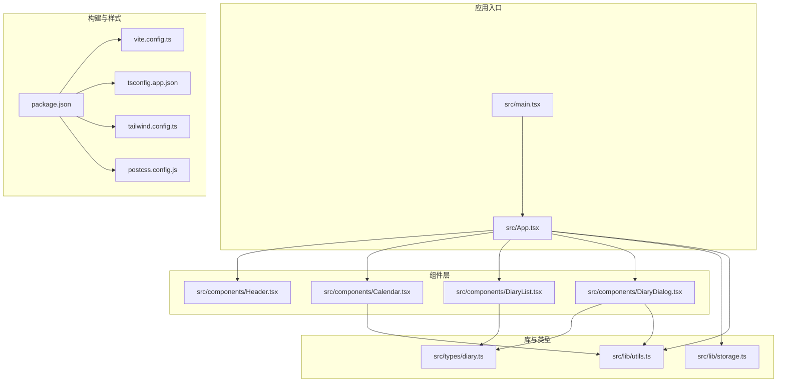
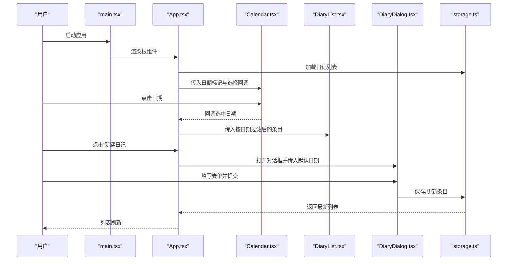
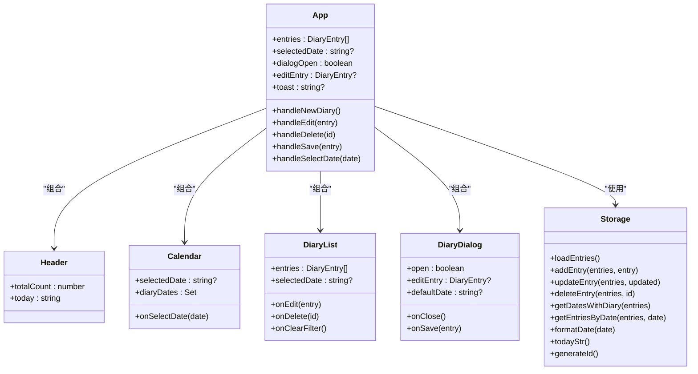
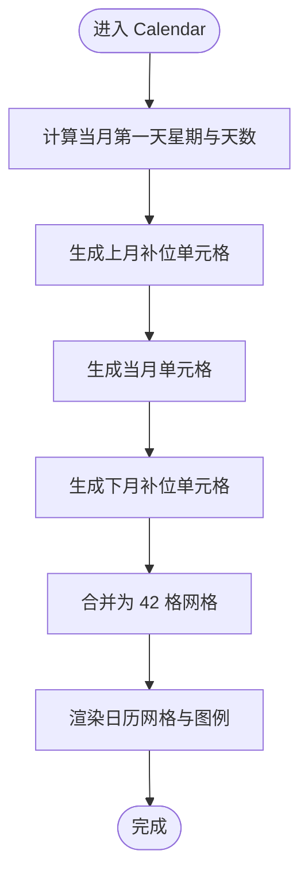
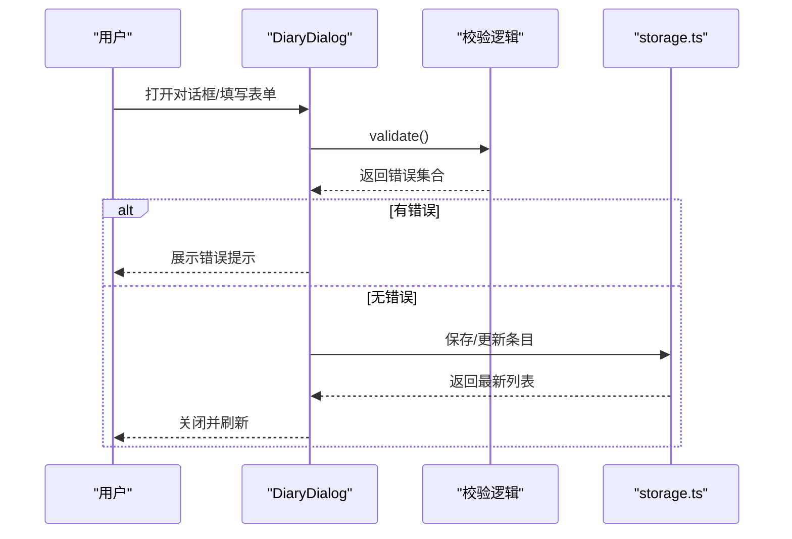
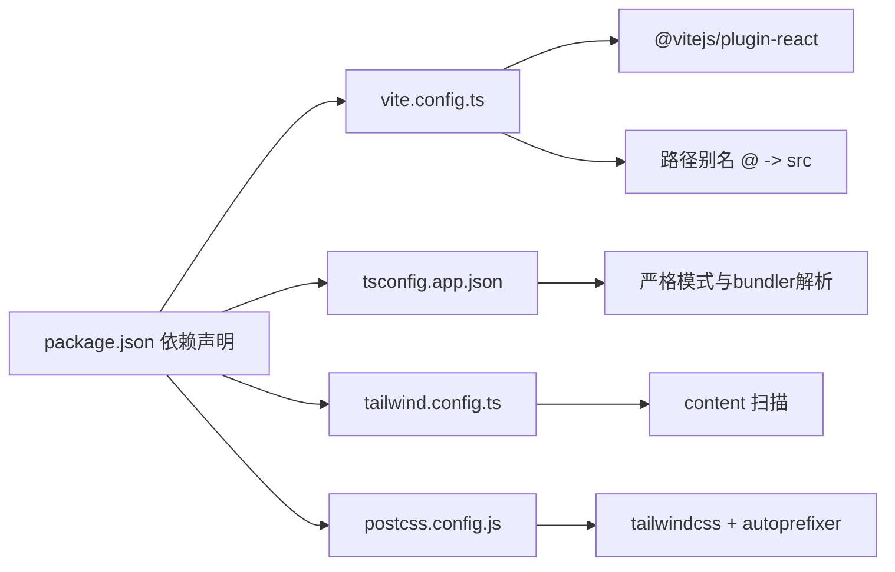

# 开发指南

<cite>
**本文引用的文件**
- [package.json](file://package.json)
- [vite.config.ts](file://vite.config.ts)
- [tsconfig.json](file://tsconfig.json)
- [tsconfig.app.json](file://tsconfig.app.json)
- [tailwind.config.ts](file://tailwind.config.ts)
- [postcss.config.js](file://postcss.config.js)
- [.gitignore](file://.gitignore)
- [src/main.tsx](file://src/main.tsx)
- [src/App.tsx](file://src/App.tsx)
- [src/lib/utils.ts](file://src/lib/utils.ts)
- [src/lib/storage.ts](file://src/lib/storage.ts)
- [src/types/diary.ts](file://src/types/diary.ts)
- [src/components/Header.tsx](file://src/components/Header.tsx)
- [src/components/Calendar.tsx](file://src/components/Calendar.tsx)
- [src/components/DiaryList.tsx](file://src/components/DiaryList.tsx)
- [src/components/DiaryDialog.tsx](file://src/components/DiaryDialog.tsx)
</cite>

## 目录
1. [简介](#简介)
2. [项目结构](#项目结构)
3. [核心组件](#核心组件)
4. [架构总览](#架构总览)
5. [详细组件分析](#详细组件分析)
6. [依赖分析](#依赖分析)
7. [性能考虑](#性能考虑)
8. [故障排查指南](#故障排查指南)
9. [结论](#结论)
10. [附录](#附录)

## 简介
本开发指南面向 My-Diary 项目团队，目标是帮助开发者快速搭建与优化开发环境，掌握 Vite、TypeScript、TailwindCSS 的配置要点，建立统一的代码规范与最佳实践，并提供调试、性能优化、代码审查、测试与持续集成的实施建议。文档同时给出版本管理与协作流程的最佳实践，确保多人协作高效稳定。

## 项目结构
项目采用以功能域为中心的组织方式，前端基于 React + TypeScript，构建工具为 Vite，样式通过 TailwindCSS 驱动，使用 PostCSS 自动化处理。

图表来源
- [src/main.tsx:1-11](file://src/main.tsx#L1-L11)
- [src/App.tsx:1-170](file://src/App.tsx#L1-L170)
- [src/components/Header.tsx:1-32](file://src/components/Header.tsx#L1-L32)
- [src/components/Calendar.tsx:1-159](file://src/components/Calendar.tsx#L1-L159)
- [src/components/DiaryList.tsx:1-200](file://src/components/DiaryList.tsx#L1-L200)
- [src/components/DiaryDialog.tsx:1-232](file://src/components/DiaryDialog.tsx#L1-L232)
- [src/lib/utils.ts:1-7](file://src/lib/utils.ts#L1-L7)
- [src/lib/storage.ts:1-58](file://src/lib/storage.ts#L1-L58)
- [src/types/diary.ts:1-22](file://src/types/diary.ts#L1-L22)
- [package.json:1-30](file://package.json#L1-L30)
- [vite.config.ts:1-13](file://vite.config.ts#L1-L13)
- [tsconfig.app.json:1-24](file://tsconfig.app.json#L1-L24)
- [tailwind.config.ts:1-102](file://tailwind.config.ts#L1-L102)
- [postcss.config.js:1-4](file://postcss.config.js#L1-L4)

章节来源
- [package.json:1-30](file://package.json#L1-L30)
- [vite.config.ts:1-13](file://vite.config.ts#L1-L13)
- [tsconfig.app.json:1-24](file://tsconfig.app.json#L1-L24)
- [tailwind.config.ts:1-102](file://tailwind.config.ts#L1-L102)
- [postcss.config.js:1-4](file://postcss.config.js#L1-L4)
- [src/main.tsx:1-11](file://src/main.tsx#L1-L11)
- [src/App.tsx:1-170](file://src/App.tsx#L1-L170)

## 核心组件
- 应用入口与根组件
  - 入口脚本负责挂载根组件并引入全局样式。
  - 根组件负责状态管理、视图布局与子组件协调。
- 组件职责
  - Header：展示应用标题与统计信息。
  - Calendar：提供日期选择与标记功能。
  - DiaryList：展示日记列表、分页与空态。
  - DiaryDialog：新建/编辑日记的表单与校验。
- 数据与工具
  - storage：封装本地存储读写与日期工具。
  - utils：Tailwind 合并类名的通用函数。
  - 类型定义：DiaryEntry 与天气枚举。

章节来源
- [src/main.tsx:1-11](file://src/main.tsx#L1-L11)
- [src/App.tsx:1-170](file://src/App.tsx#L1-L170)
- [src/components/Header.tsx:1-32](file://src/components/Header.tsx#L1-L32)
- [src/components/Calendar.tsx:1-159](file://src/components/Calendar.tsx#L1-L159)
- [src/components/DiaryList.tsx:1-200](file://src/components/DiaryList.tsx#L1-L200)
- [src/components/DiaryDialog.tsx:1-232](file://src/components/DiaryDialog.tsx#L1-L232)
- [src/lib/storage.ts:1-58](file://src/lib/storage.ts#L1-L58)
- [src/lib/utils.ts:1-7](file://src/lib/utils.ts#L1-L7)
- [src/types/diary.ts:1-22](file://src/types/diary.ts#L1-L22)

## 架构总览
应用采用“入口 -> 根组件 -> 功能组件”的层次化结构；数据流从 storage 抽象出 CRUD 与查询，根组件通过 props 与回调向下传递，形成单向数据流。

图表来源
- [src/main.tsx:1-11](file://src/main.tsx#L1-L11)
- [src/App.tsx:1-170](file://src/App.tsx#L1-L170)
- [src/components/Calendar.tsx:1-159](file://src/components/Calendar.tsx#L1-L159)
- [src/components/DiaryList.tsx:1-200](file://src/components/DiaryList.tsx#L1-L200)
- [src/components/DiaryDialog.tsx:1-232](file://src/components/DiaryDialog.tsx#L1-L232)
- [src/lib/storage.ts:1-58](file://src/lib/storage.ts#L1-L58)

## 详细组件分析

### 组件关系与交互（类图）

图表来源
- [src/App.tsx:1-170](file://src/App.tsx#L1-L170)
- [src/components/Header.tsx:1-32](file://src/components/Header.tsx#L1-L32)
- [src/components/Calendar.tsx:1-159](file://src/components/Calendar.tsx#L1-L159)
- [src/components/DiaryList.tsx:1-200](file://src/components/DiaryList.tsx#L1-L200)
- [src/components/DiaryDialog.tsx:1-232](file://src/components/DiaryDialog.tsx#L1-L232)
- [src/lib/storage.ts:1-58](file://src/lib/storage.ts#L1-L58)

章节来源
- [src/App.tsx:1-170](file://src/App.tsx#L1-L170)
- [src/components/Header.tsx:1-32](file://src/components/Header.tsx#L1-L32)
- [src/components/Calendar.tsx:1-159](file://src/components/Calendar.tsx#L1-L159)
- [src/components/DiaryList.tsx:1-200](file://src/components/DiaryList.tsx#L1-L200)
- [src/components/DiaryDialog.tsx:1-232](file://src/components/DiaryDialog.tsx#L1-L232)
- [src/lib/storage.ts:1-58](file://src/lib/storage.ts#L1-L58)

### 日历组件算法（流程图）

图表来源
- [src/components/Calendar.tsx:44-66](file://src/components/Calendar.tsx#L44-L66)

章节来源
- [src/components/Calendar.tsx:1-159](file://src/components/Calendar.tsx#L1-L159)

### 对话框表单校验（序列图）

图表来源
- [src/components/DiaryDialog.tsx:56-80](file://src/components/DiaryDialog.tsx#L56-L80)
- [src/lib/storage.ts:19-35](file://src/lib/storage.ts#L19-L35)

章节来源
- [src/components/DiaryDialog.tsx:1-232](file://src/components/DiaryDialog.tsx#L1-L232)
- [src/lib/storage.ts:1-58](file://src/lib/storage.ts#L1-L58)

## 依赖分析
- 构建与运行
  - Vite 提供开发服务器与打包能力；通过插件体系支持 React 与路径别名。
  - TypeScript 使用严格模式与 bundler 解析，配合 tsc -b 与 Vite 并行构建。
- 样式管线
  - TailwindCSS 配置扫描 HTML 与 TSX，启用暗色模式与动画插件；PostCSS 自动添加浏览器前缀。
- 依赖管理
  - React 生态与 UI 图标库；clsx/tailwind-merge 组合类名；lucide-react 提供图标。

图表来源
- [package.json:1-30](file://package.json#L1-L30)
- [vite.config.ts:1-13](file://vite.config.ts#L1-L13)
- [tsconfig.app.json:1-24](file://tsconfig.app.json#L1-L24)
- [tailwind.config.ts:1-102](file://tailwind.config.ts#L1-L102)
- [postcss.config.js:1-4](file://postcss.config.js#L1-L4)

章节来源
- [package.json:1-30](file://package.json#L1-L30)
- [vite.config.ts:1-13](file://vite.config.ts#L1-L13)
- [tsconfig.app.json:1-24](file://tsconfig.app.json#L1-L24)
- [tailwind.config.ts:1-102](file://tailwind.config.ts#L1-L102)
- [postcss.config.js:1-4](file://postcss.config.js#L1-L4)

## 性能考虑
- 构建与打包
  - 使用 Vite 的原生 ESM 与按需加载，减少冷启动时间；生产构建自动 Tree-shaking 与压缩。
  - TypeScript 与 Vite 并行：先 tsc -b 生成类型检查缓存，再 vite build 产出产物。
- 样式与渲染
  - TailwindCSS 按需扫描，避免未使用类名进入产物；合理拆分组件，避免不必要的重渲染。
  - 使用 useMemo 与局部状态，减少列表渲染与日期计算的重复开销。
- 本地存储
  - 单键持久化，批量写入；避免频繁 JSON 解析与 stringify。
- 调试与监控
  - 开发阶段启用 React DevTools；利用浏览器性能面板定位长任务与重排。
  - 使用网络面板观察静态资源加载；使用 Application 面板检查 localStorage 使用情况。

章节来源
- [package.json:6-10](file://package.json#L6-L10)
- [src/App.tsx:25-38](file://src/App.tsx#L25-L38)
- [src/lib/storage.ts:15-17](file://src/lib/storage.ts#L15-L17)

## 故障排查指南
- 开发环境问题
  - 无法启动 dev 服务：确认 Node 版本与依赖安装；检查端口占用；清理 node_modules 与重新安装。
  - 路径别名失效：确认 vite.config.ts 中 @ 别名指向 src；TS 配置 paths 保持一致。
- TypeScript 错误
  - 严格模式报错：根据 noUnusedLocals/noUnusedParameters 等规则完善参数与变量使用。
  - JSX/模块解析：确保 moduleResolution 为 bundler，且 jsx 使用 react-jsx。
- 样式不生效
  - Tailwind 未扫描到文件：确认 content 包含 TSX 文件；重启开发服务器。
  - 暗色模式无效：检查 darkMode 配置与类名切换逻辑。
- 本地存储异常
  - JSON 解析失败：捕获异常并回退为空数组；避免直接覆盖键值导致格式破坏。
- Git 忽略规则
  - 确保 dist、node_modules、日志等被忽略；避免将构建产物与依赖提交到仓库。

章节来源
- [vite.config.ts:5-12](file://vite.config.ts#L5-L12)
- [tsconfig.app.json:2-21](file://tsconfig.app.json#L2-L21)
- [tailwind.config.ts:4-6](file://tailwind.config.ts#L4-L6)
- [src/lib/storage.ts:5-13](file://src/lib/storage.ts#L5-L13)
- [.gitignore:1-7](file://.gitignore#L1-L7)

## 结论
本指南提供了 My-Diary 项目的开发环境配置、代码结构与关键组件的深入分析，以及调试与性能优化建议。建议团队在日常开发中遵循统一的命名与文件组织规范，结合 TypeScript 严格模式与 TailwindCSS 的按需特性，持续提升可维护性与性能表现。

## 附录

### 开发环境配置清单
- Vite
  - 插件：@vitejs/plugin-react
  - 路径别名：@ -> src
- TypeScript
  - target/module：ESNext
  - strict：开启
  - moduleResolution：bundler
  - paths：@/* -> ./src/*
- TailwindCSS
  - content：扫描 index.html 与 src/**/*.{ts,tsx}
  - 插件：tailwindcss-animate
- PostCSS
  - 插件：tailwindcss + autoprefixer

章节来源
- [vite.config.ts:1-13](file://vite.config.ts#L1-L13)
- [tsconfig.app.json:1-24](file://tsconfig.app.json#L1-L24)
- [tailwind.config.ts:1-102](file://tailwind.config.ts#L1-L102)
- [postcss.config.js:1-4](file://postcss.config.js#L1-L4)

### 代码规范与最佳实践
- 命名约定
  - 组件文件：帕斯卡命名（Calendar.tsx）
  - 变量与函数：驼峰命名（handleSave、formatDate）
  - 类型：接口与枚举使用大写开头（DiaryEntry、WeatherType）
- 文件组织
  - 按功能域划分：components、lib、types、styles
  - 组件导出：默认导出为主，必要时具名导出
- 注释标准
  - 复杂逻辑添加简要注释；对外暴露的 props 与回调添加说明
- 样式
  - 优先使用 Tailwind 工具类；必要时在 styles 中扩展主题变量
- 本地存储
  - 统一键名常量；异常捕获与回退策略

章节来源
- [src/components/Calendar.tsx:1-159](file://src/components/Calendar.tsx#L1-L159)
- [src/lib/storage.ts:1-58](file://src/lib/storage.ts#L1-L58)
- [src/types/diary.ts:1-22](file://src/types/diary.ts#L1-L22)

### 调试技巧
- 浏览器 DevTools
  - React DevTools：检查组件树与状态变化
  - 性能面板：识别长任务与重绘
  - 网络面板：验证静态资源加载
- 控制台与日志
  - 使用 toast 或 console 输出关键状态
- 断点与条件断点
  - 在 storage 的增删改处设置断点，观察数据一致性

章节来源
- [src/App.tsx:35-38](file://src/App.tsx#L35-L38)
- [src/lib/storage.ts:15-17](file://src/lib/storage.ts#L15-L17)

### 代码审查清单
- 代码质量
  - 是否通过 TypeScript 严格模式检查
  - 是否存在未使用的变量或参数
  - 是否使用 useMemo/useCallback 降低重渲染
- 安全与健壮性
  - localStorage 异常处理是否完备
  - 表单校验是否覆盖所有必填项
- 可维护性
  - 组件职责单一；props 接口清晰
  - 样式与主题变量集中管理

章节来源
- [tsconfig.app.json:14-18](file://tsconfig.app.json#L14-L18)
- [src/components/DiaryDialog.tsx:56-80](file://src/components/DiaryDialog.tsx#L56-L80)
- [src/lib/storage.ts:5-13](file://src/lib/storage.ts#L5-L13)

### 测试策略与持续集成（CI）
- 单元测试
  - 对 storage 的 CRUD 与工具函数进行测试
  - 对复杂纯函数（如日期格式化）编写边界用例
- 端到端测试
  - 使用自动化测试框架覆盖关键用户流程（新建/编辑/删除/筛选）
- CI 配置建议
  - 安装依赖 → 类型检查 → 单测 → 构建 → 部署预览
  - 与代码审查联动，确保 PR 合并前通过流水线

[本节为通用指导，无需特定文件引用]

### 版本管理与协作流程
- 分支策略
  - 主分支仅允许通过 Pull Request 合并
  - 功能开发在特性分支，修复在 hotfix 分支
- 提交规范
  - 使用清晰的提交信息，描述变更目的与影响范围
- 代码审查
  - 至少一名同事审查后方可合并
- 发布与回滚
  - 通过标签与发布说明管理版本；保留回滚方案

[本节为通用指导，无需特定文件引用]