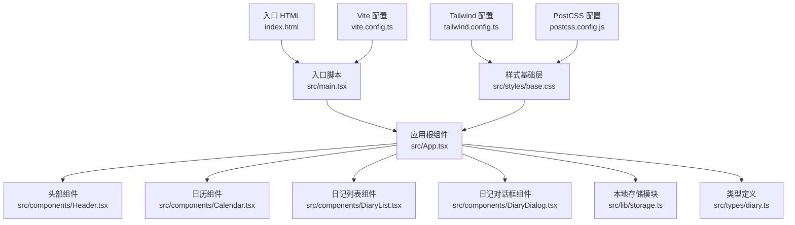
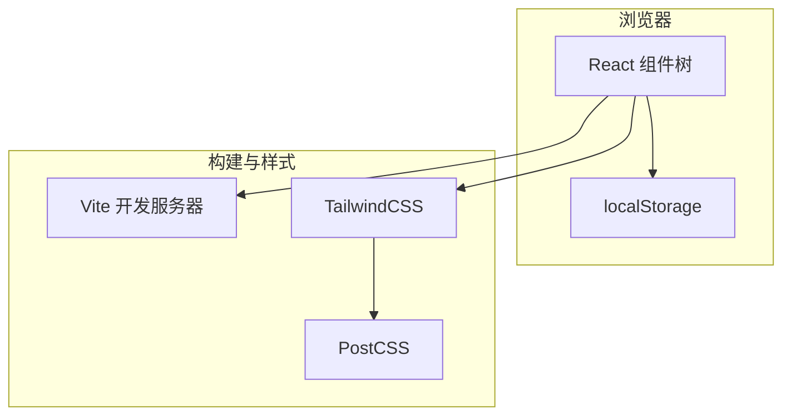
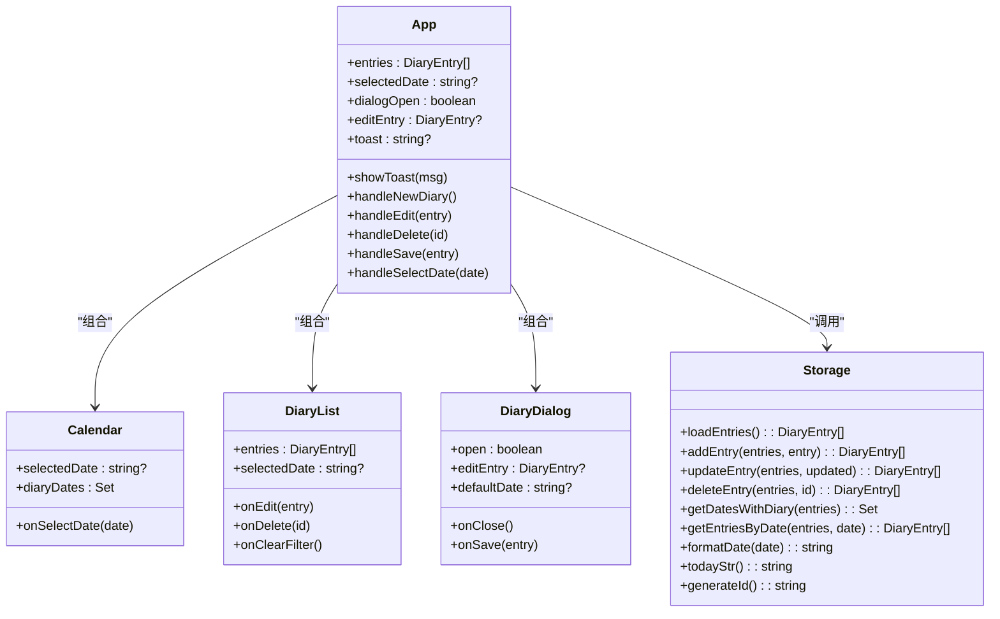
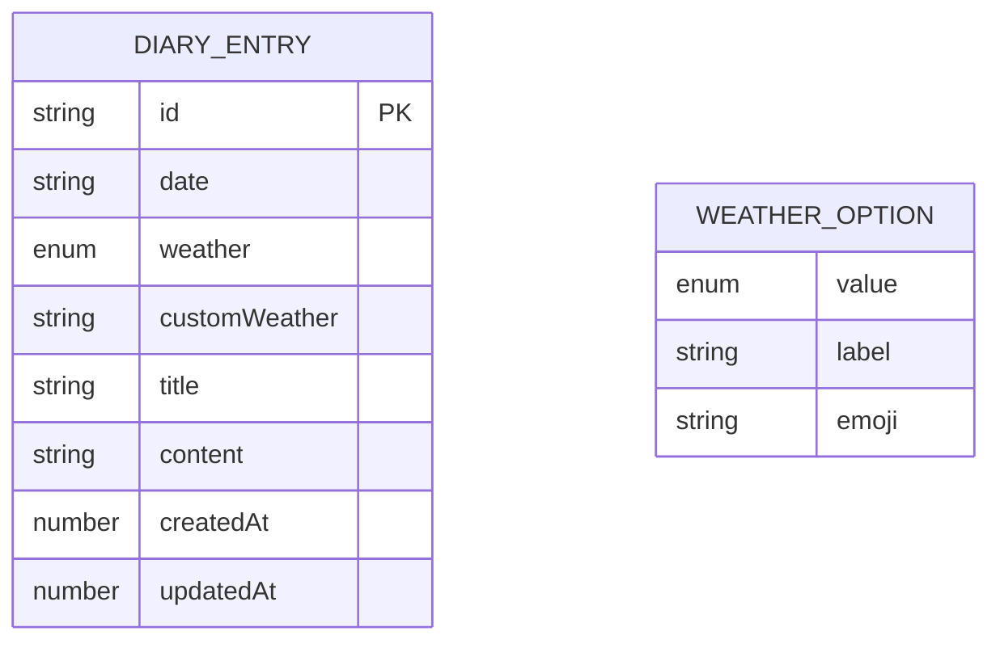
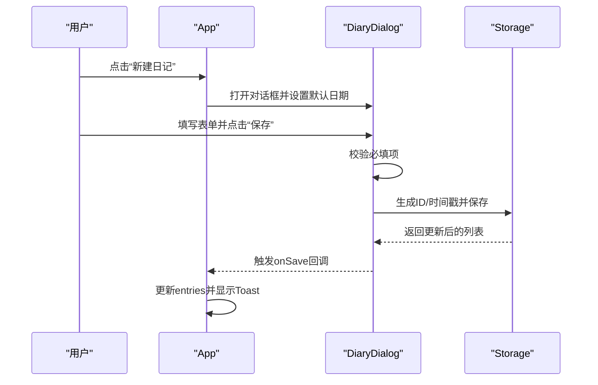
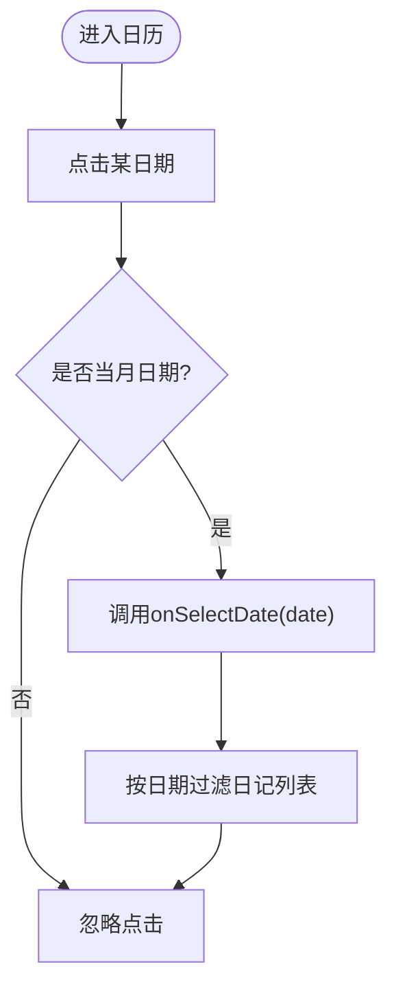
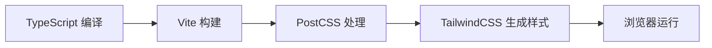

# 快速开始

<cite>
**本文引用的文件**
- [package.json](file://package.json)
- [vite.config.ts](file://vite.config.ts)
- [index.html](file://index.html)
- [src/main.tsx](file://src/main.tsx)
- [src/App.tsx](file://src/App.tsx)
- [src/lib/storage.ts](file://src/lib/storage.ts)
- [src/types/diary.ts](file://src/types/diary.ts)
- [src/components/Calendar.tsx](file://src/components/Calendar.tsx)
- [src/components/DiaryList.tsx](file://src/components/DiaryList.tsx)
- [src/components/DiaryDialog.tsx](file://src/components/DiaryDialog.tsx)
- [src/styles/base.css](file://src/styles/base.css)
- [tailwind.config.ts](file://tailwind.config.ts)
- [postcss.config.js](file://postcss.config.js)
</cite>

## 目录
1. [简介](#简介)
2. [项目结构](#项目结构)
3. [核心组件](#核心组件)
4. [架构总览](#架构总览)
5. [详细组件分析](#详细组件分析)
6. [依赖分析](#依赖分析)
7. [性能考虑](#性能考虑)
8. [故障排查指南](#故障排查指南)
9. [结论](#结论)
10. [附录](#附录)

## 简介
本指南面向新手开发者，帮助你在30分钟内完成 My-Diary 项目的克隆、环境准备、依赖安装与开发服务器启动，并快速体验应用的核心功能。项目基于 React 18、Vite 6、TypeScript 5 与 TailwindCSS 3，采用本地存储实现日记数据持久化。

## 项目结构
该项目采用“按功能分层”的组织方式，核心目录与职责如下：
- src/components：可复用 UI 组件（日历、列表、对话框、头部）
- src/lib：应用逻辑与工具（本地存储、通用工具）
- src/types：TypeScript 类型定义（日记实体与天气枚举）
- src/styles：基础样式与主题变量
- 配置文件：vite.config.ts、tailwind.config.ts、postcss.config.js、tsconfig.* 等

图表来源
- [index.html:1-16](file://index.html#L1-L16)
- [src/main.tsx:1-11](file://src/main.tsx#L1-L11)
- [src/App.tsx:1-170](file://src/App.tsx#L1-L170)
- [src/components/Calendar.tsx:1-159](file://src/components/Calendar.tsx#L1-L159)
- [src/components/DiaryList.tsx:1-200](file://src/components/DiaryList.tsx#L1-L200)
- [src/components/DiaryDialog.tsx:1-232](file://src/components/DiaryDialog.tsx#L1-L232)
- [src/lib/storage.ts:1-58](file://src/lib/storage.ts#L1-L58)
- [src/types/diary.ts:1-22](file://src/types/diary.ts#L1-L22)
- [src/styles/base.css:1-29](file://src/styles/base.css#L1-L29)
- [tailwind.config.ts:1-102](file://tailwind.config.ts#L1-L102)
- [postcss.config.js:1-4](file://postcss.config.js#L1-L4)
- [vite.config.ts:1-13](file://vite.config.ts#L1-L13)

章节来源
- [package.json:1-30](file://package.json#L1-L30)
- [vite.config.ts:1-13](file://vite.config.ts#L1-L13)
- [index.html:1-16](file://index.html#L1-L16)
- [src/main.tsx:1-11](file://src/main.tsx#L1-L11)
- [src/App.tsx:1-170](file://src/App.tsx#L1-L170)

## 核心组件
- 应用根组件负责状态管理与页面布局，包括头部、日历、日记列表与对话框。
- 日历组件支持月份切换、今日高亮、选中日期回调。
- 列表组件支持按日期筛选、分页与空态展示。
- 对话框组件支持新建/编辑日记、表单校验与保存。
- 本地存储模块封装 localStorage 的读写与增删改查操作。

章节来源
- [src/App.tsx:1-170](file://src/App.tsx#L1-L170)
- [src/components/Calendar.tsx:1-159](file://src/components/Calendar.tsx#L1-L159)
- [src/components/DiaryList.tsx:1-200](file://src/components/DiaryList.tsx#L1-L200)
- [src/components/DiaryDialog.tsx:1-232](file://src/components/DiaryDialog.tsx#L1-L232)
- [src/lib/storage.ts:1-58](file://src/lib/storage.ts#L1-L58)

## 架构总览
应用采用前端单页应用（SPA）架构，通过 Vite 提供开发服务器与构建能力；TailwindCSS 与 PostCSS 实现样式体系；React Hooks 管理组件状态；localStorage 实现数据持久化。

图表来源
- [src/App.tsx:1-170](file://src/App.tsx#L1-L170)
- [tailwind.config.ts:1-102](file://tailwind.config.ts#L1-L102)
- [postcss.config.js:1-4](file://postcss.config.js#L1-L4)
- [vite.config.ts:1-13](file://vite.config.ts#L1-L13)

## 详细组件分析

### 组件关系类图

图表来源
- [src/App.tsx:1-170](file://src/App.tsx#L1-L170)
- [src/components/Calendar.tsx:1-159](file://src/components/Calendar.tsx#L1-L159)
- [src/components/DiaryList.tsx:1-200](file://src/components/DiaryList.tsx#L1-L200)
- [src/components/DiaryDialog.tsx:1-232](file://src/components/DiaryDialog.tsx#L1-L232)
- [src/lib/storage.ts:1-58](file://src/lib/storage.ts#L1-L58)

### 数据模型与类型

图表来源
- [src/types/diary.ts:1-22](file://src/types/diary.ts#L1-L22)

### 交互时序：新建/编辑日记

图表来源
- [src/App.tsx:40-65](file://src/App.tsx#L40-L65)
- [src/components/DiaryDialog.tsx:66-80](file://src/components/DiaryDialog.tsx#L66-L80)
- [src/lib/storage.ts:19-29](file://src/lib/storage.ts#L19-L29)

### 流程图：日历选择日期

图表来源
- [src/components/Calendar.tsx:124-139](file://src/components/Calendar.tsx#L124-L139)
- [src/App.tsx:67-69](file://src/App.tsx#L67-L69)

## 依赖分析
- 运行时依赖：React、React DOM、TailwindCSS 动画插件、图标库等
- 开发依赖：Vite、React 插件、TypeScript、TailwindCSS、PostCSS、Autoprefixer
- 构建链路：TypeScript 编译 → Vite 打包 → PostCSS/Tailwind 处理 → 浏览器运行

图表来源
- [package.json:6-28](file://package.json#L6-L28)
- [postcss.config.js:1-4](file://postcss.config.js#L1-L4)
- [tailwind.config.ts:1-102](file://tailwind.config.ts#L1-L102)

章节来源
- [package.json:1-30](file://package.json#L1-L30)
- [postcss.config.js:1-4](file://postcss.config.js#L1-L4)
- [tailwind.config.ts:1-102](file://tailwind.config.ts#L1-L102)

## 性能考虑
- 使用 useMemo 优化日历标记与列表排序，避免不必要的重渲染。
- 列表分页减少一次性渲染大量节点带来的压力。
- 本地存储读写在内存中进行，注意避免超大文本导致的卡顿。
- 生产构建建议使用 Vite 的预览模式检查打包体积与加载性能。

章节来源
- [src/App.tsx:25-33](file://src/App.tsx#L25-L33)
- [src/components/DiaryList.tsx:15-37](file://src/components/DiaryList.tsx#L15-L37)

## 故障排查指南
- 端口被占用（常见为 5173）：
  - 修改 Vite 配置中的端口或关闭占用进程后重试。
  - 参考路径：[vite.config.ts:1-13](file://vite.config.ts#L1-L13)
- 依赖安装失败（网络/权限问题）：
  - 清理缓存并重装依赖；确保使用 Node.js 18+ 与稳定版 npm/pnpm/yarn。
  - 参考路径：[package.json:1-30](file://package.json#L1-L30)
- TypeScript 报错：
  - 检查 tsconfig 引用与类型声明；确保所有模块路径别名正确解析。
  - 参考路径：[tsconfig.json:1-2](file://tsconfig.json#L1-L2)
- 样式未生效：
  - 确认 Tailwind 配置的 content 路径包含源文件；PostCSS 插件顺序正确。
  - 参考路径：[tailwind.config.ts:1-102](file://tailwind.config.ts#L1-L102), [postcss.config.js:1-4](file://postcss.config.js#L1-L4)
- 无法访问页面或空白屏：
  - 检查入口 HTML 是否正确挂载到 #root；确认 index.html 与 main.tsx 的关联。
  - 参考路径：[index.html:11-14](file://index.html#L11-L14), [src/main.tsx:1-11](file://src/main.tsx#L1-L11)

## 结论
按照本指南完成环境准备与启动流程后，你将能在本地运行 My-Diary 并体验新建、编辑、删除日记与按日期筛选等核心功能。后续可进一步探索组件扩展、主题定制与构建优化。

## 附录

### 开发环境前置要求
- Node.js：推荐使用 18.x 或更高稳定版本
- 包管理器：npm（随 Node.js 附带）或 pnpm/yarn
- 文本编辑器：推荐 VS Code 并安装相关语言扩展

### 快速开始步骤
1) 克隆仓库  
   使用 Git 克隆项目至本地目录

2) 安装依赖  
   在项目根目录执行依赖安装命令（例如 npm install）

3) 启动开发服务器  
   执行开发脚本以启动本地服务（例如 npm run dev）

4) 首次运行后的基本使用  
   - 点击“新建日记”打开对话框，填写标题与内容后保存
   - 在日历中选择日期查看当天日记
   - 使用列表的分页与筛选功能浏览历史记录
   - 编辑或删除现有日记条目

### 常见问题与解决方案
- 端口冲突：修改 Vite 配置中的端口或释放占用端口
- 依赖安装失败：更换镜像源、升级 Node.js 或清理缓存后重试
- 样式异常：检查 Tailwind content 路径与 PostCSS 插件配置
- TypeScript 错误：核对 tsconfig 引用与模块路径别名