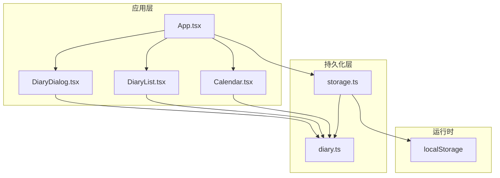
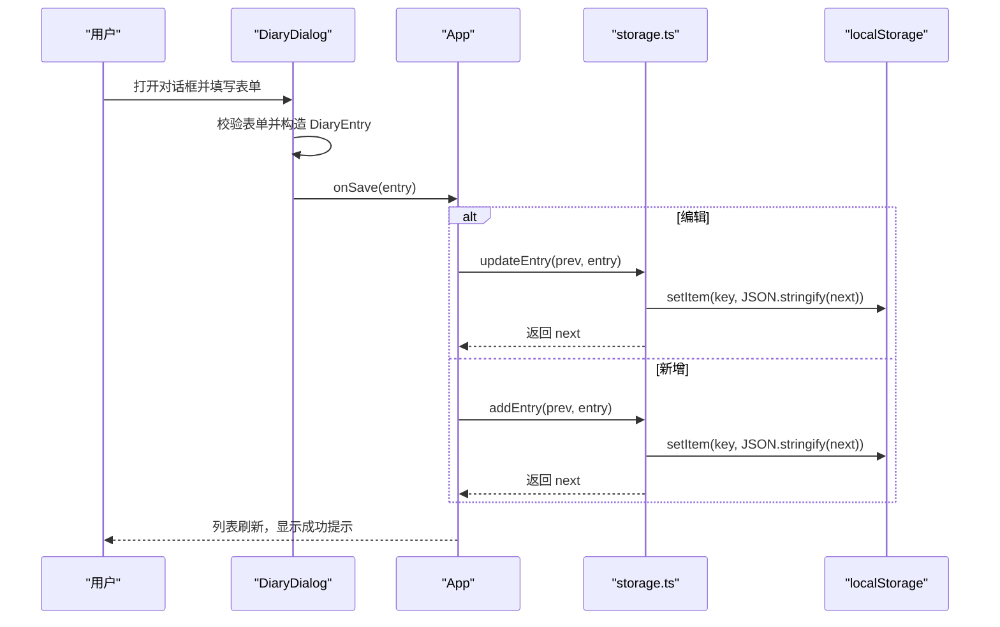
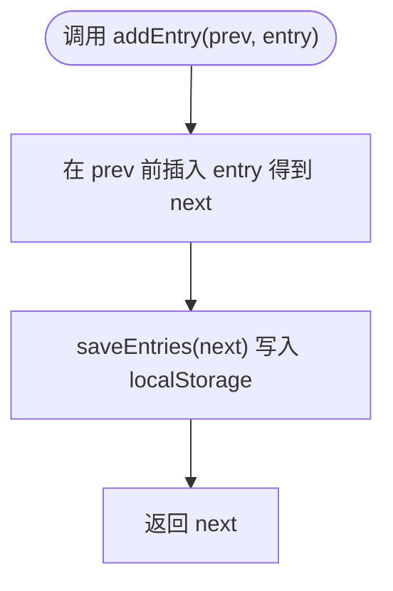
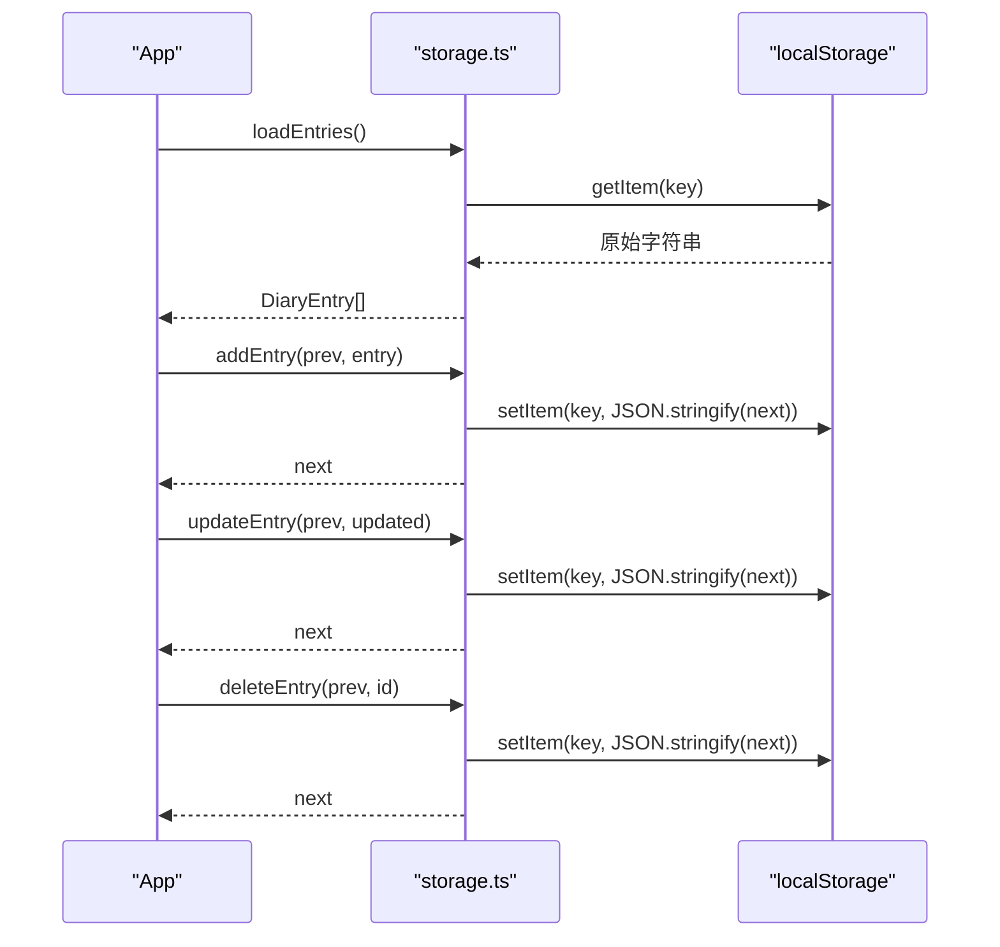
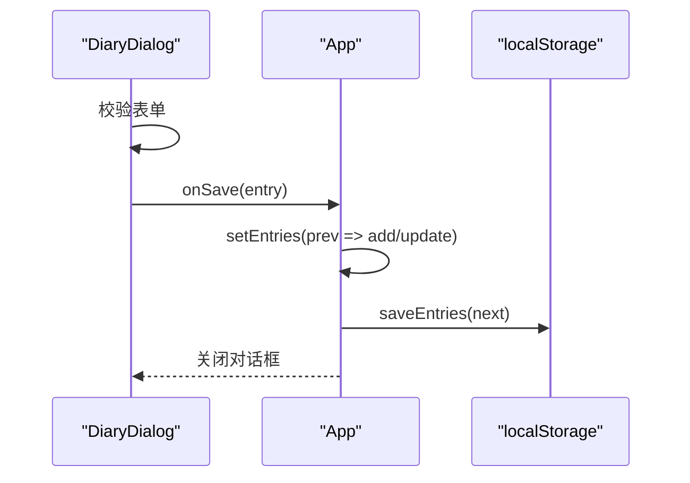
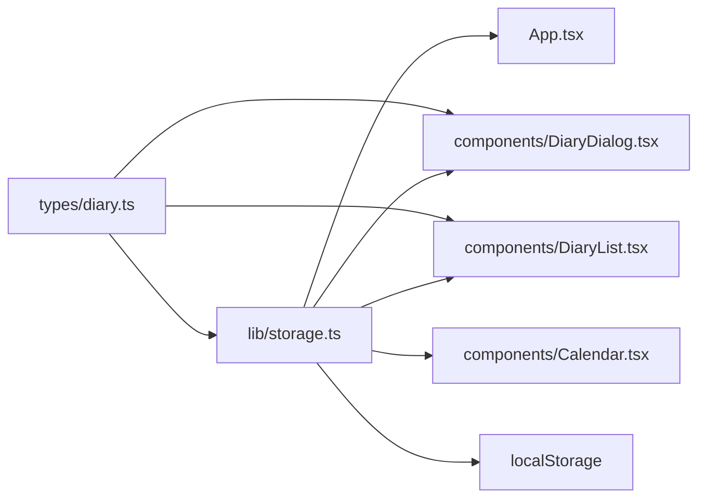

# 数据持久化

<cite>
**本文引用的文件**
- [src/lib/storage.ts](file://src/lib/storage.ts)
- [src/types/diary.ts](file://src/types/diary.ts)
- [src/App.tsx](file://src/App.tsx)
- [src/components/DiaryDialog.tsx](file://src/components/DiaryDialog.tsx)
- [src/components/DiaryList.tsx](file://src/components/DiaryList.tsx)
- [src/components/Calendar.tsx](file://src/components/Calendar.tsx)
- [src/lib/utils.ts](file://src/lib/utils.ts)
- [src/main.tsx](file://src/main.tsx)
- [src/index.css](file://src/index.css)
- [package.json](file://package.json)
</cite>

## 目录
1. [简介](#简介)
2. [项目结构](#项目结构)
3. [核心组件](#核心组件)
4. [架构总览](#架构总览)
5. [详细组件分析](#详细组件分析)
6. [依赖关系分析](#依赖关系分析)
7. [性能考量](#性能考量)
8. [故障排除指南](#故障排除指南)
9. [结论](#结论)
10. [附录](#附录)

## 简介
本文件面向 My-Diary 项目的“数据持久化”子系统，聚焦于基于浏览器 localStorage 的本地存储策略与实现细节。文档从数据模型设计、CRUD 实现机制、序列化与反序列化处理、版本兼容性、最佳实践、错误处理与性能优化、迁移与故障排除等方面进行系统化梳理，帮助开发者高效管理与维护应用数据。

## 项目结构
My-Diary 的数据持久化相关代码集中在以下模块：
- 类型定义：src/types/diary.ts
- 存储逻辑：src/lib/storage.ts
- 应用入口与状态：src/App.tsx
- 组件交互：src/components/DiaryDialog.tsx、src/components/DiaryList.tsx、src/components/Calendar.tsx
- 工具函数：src/lib/utils.ts
- 样式与构建配置：src/index.css、package.json



图表来源
- [src/App.tsx:18-145](file://src/App.tsx#L18-L145)
- [src/lib/storage.ts:1-58](file://src/lib/storage.ts#L1-L58)
- [src/types/diary.ts:1-22](file://src/types/diary.ts#L1-L22)

章节来源
- [src/App.tsx:18-145](file://src/App.tsx#L18-L145)
- [src/lib/storage.ts:1-58](file://src/lib/storage.ts#L1-L58)
- [src/types/diary.ts:1-22](file://src/types/diary.ts#L1-L22)

## 核心组件
- 数据模型：DiaryEntry 定义了日记条目的字段与天气枚举；WEATHER_OPTIONS 提供天气选项映射。
- 存储模块：封装了 loadEntries、saveEntries、addEntry、updateEntry、deleteEntry、getDatesWithDiary、getEntriesByDate、formatDate、todayStr、generateId 等方法，统一管理 localStorage 的读写与查询。
- 应用入口：App.tsx 初始化 entries 状态并暴露 CRUD 回调，驱动 UI 更新与数据落盘。
- 组件交互：DiaryDialog 负责表单校验与生成/更新 DiaryEntry；DiaryList 展示与分页；Calendar 提供日期选择与标记。

章节来源
- [src/types/diary.ts:4-22](file://src/types/diary.ts#L4-L22)
- [src/lib/storage.ts:5-58](file://src/lib/storage.ts#L5-L58)
- [src/App.tsx:18-65](file://src/App.tsx#L18-L65)
- [src/components/DiaryDialog.tsx:16-80](file://src/components/DiaryDialog.tsx#L16-L80)
- [src/components/DiaryList.tsx:23-131](file://src/components/DiaryList.tsx#L23-L131)
- [src/components/Calendar.tsx:17-159](file://src/components/Calendar.tsx#L17-L159)

## 架构总览
My-Diary 的数据持久化采用“内存状态 + localStorage 同步”的模式：
- 应用启动时从 localStorage 加载 entries 并初始化到 React 状态。
- 用户通过对话框新增或编辑日记，生成/更新 DiaryEntry 后调用存储模块进行保存。
- 删除与筛选通过存储模块返回的新数组替换状态，保证 UI 与存储一致。
- 日期标记与按日筛选由存储模块提供的辅助函数完成。



图表来源
- [src/components/DiaryDialog.tsx:66-80](file://src/components/DiaryDialog.tsx#L66-L80)
- [src/App.tsx:50-65](file://src/App.tsx#L50-L65)
- [src/lib/storage.ts:19-35](file://src/lib/storage.ts#L19-L35)

## 详细组件分析

### 数据模型：DiaryEntry 与天气枚举
- 字段定义
  - id: 字符串，唯一标识
  - date: 字符串，格式为 'YYYY-MM-DD'
  - weather: 枚举 WeatherType，支持内置天气与自定义天气
  - customWeather?: 字符串，当 weather 为 custom 时使用
  - title: 标题
  - content: 内容
  - createdAt/updatedAt: 数值时间戳，用于排序与追踪
- 天气选项
  - WEATHER_OPTIONS 提供天气值、标签与表情的映射，便于 UI 展示与选择

```mermaid
classDiagram
class DiaryEntry {
+string id
+string date
+WeatherType weather
+string customWeather?
+string title
+string content
+number createdAt
+number updatedAt
}
class WeatherType {
<<enumeration>>
"sunny"
"cloudy"
"rainy"
"snowy"
"windy"
"custom"
}
class WeatherOption {
+WeatherType value
+string label
+string emoji
}
DiaryEntry --> WeatherType : "使用"
WeatherOption --> WeatherType : "映射"
```

图表来源
- [src/types/diary.ts:4-22](file://src/types/diary.ts#L4-L22)

章节来源
- [src/types/diary.ts:4-22](file://src/types/diary.ts#L4-L22)

### 存储模块：基于 localStorage 的 CRUD
- 加载与保存
  - loadEntries：从 localStorage 读取原始字符串，JSON 解析为 DiaryEntry[]；异常时返回空数组
  - saveEntries：将 DiaryEntry[] JSON 序列化后写入 localStorage
- 增删改查
  - addEntry：在数组开头插入新条目，立即保存
  - updateEntry：根据 id 替换条目，并更新 updatedAt，立即保存
  - deleteEntry：过滤掉指定 id 的条目，立即保存
  - getDatesWithDiary：从 entries 中提取所有日期去重集合
  - getEntriesByDate：按日期筛选条目
- 辅助工具
  - formatDate：将 'YYYY-MM-DD' 格式日期本地化为中文可读格式
  - todayStr：生成当前日期 'YYYY-MM-DD'
  - generateId：生成唯一 id（带随机后缀）



图表来源
- [src/lib/storage.ts:19-23](file://src/lib/storage.ts#L19-L23)
- [src/lib/storage.ts:15-17](file://src/lib/storage.ts#L15-L17)

章节来源
- [src/lib/storage.ts:5-58](file://src/lib/storage.ts#L5-L58)

### 应用入口：状态初始化与 CRUD 回调
- 初始化
  - 使用 loadEntries() 作为 useState 的惰性初始化，避免重复 IO
- CRUD 回调
  - handleSave：区分编辑与新增，调用 updateEntry 或 addEntry，并显示 toast
  - handleDelete：调用 deleteEntry，显示删除提示
- 日期筛选
  - 使用 useMemo 计算 diaryDates（Set），并按 selectedDate 过滤条目
  - 默认按 updatedAt 倒序展示



图表来源
- [src/App.tsx:18-65](file://src/App.tsx#L18-L65)
- [src/lib/storage.ts:5-35](file://src/lib/storage.ts#L5-L35)

章节来源
- [src/App.tsx:18-65](file://src/App.tsx#L18-L65)
- [src/lib/storage.ts:5-35](file://src/lib/storage.ts#L5-L35)

### 组件交互：对话框、列表与日历
- DiaryDialog
  - 表单校验 validate：检查日期、标题、内容与自定义天气
  - 构造 DiaryEntry：根据 editEntry 是否存在决定 id、createdAt 与 updatedAt
  - 调用 onSave 将条目回传至 App
- DiaryList
  - 展示条目列表，支持分页（每页固定数量）
  - 通过 getWeatherDisplay 渲染天气标签
- Calendar
  - 生成日历网格，标记有日记的日期
  - 通过 onSelectDate 切换 selectedDate，触发列表筛选



图表来源
- [src/components/DiaryDialog.tsx:56-80](file://src/components/DiaryDialog.tsx#L56-L80)
- [src/App.tsx:55-65](file://src/App.tsx#L55-L65)
- [src/lib/storage.ts:15-17](file://src/lib/storage.ts#L15-L17)

章节来源
- [src/components/DiaryDialog.tsx:16-80](file://src/components/DiaryDialog.tsx#L16-L80)
- [src/components/DiaryList.tsx:23-131](file://src/components/DiaryList.tsx#L23-L131)
- [src/components/Calendar.tsx:17-159](file://src/components/Calendar.tsx#L17-L159)

## 依赖关系分析
- 类型依赖：DiaryEntry 与 WEATHER_OPTIONS 由 types/diary.ts 提供，被 storage.ts、components/DiaryDialog.tsx、components/DiaryList.tsx 引用。
- 存储依赖：App.tsx 依赖 storage.ts 的 CRUD 与查询函数；DiaryDialog.tsx 依赖 generateId 与 todayStr；DiaryList.tsx 依赖 formatDate。
- 运行时依赖：localStorage 作为唯一持久化介质，所有数据读写均通过 storage.ts 封装。



图表来源
- [src/types/diary.ts:1-22](file://src/types/diary.ts#L1-L22)
- [src/lib/storage.ts:1-58](file://src/lib/storage.ts#L1-L58)
- [src/App.tsx:8-16](file://src/App.tsx#L8-L16)
- [src/components/DiaryDialog.tsx:3-6](file://src/components/DiaryDialog.tsx#L3-L6)
- [src/components/DiaryList.tsx:2-5](file://src/components/DiaryList.tsx#L2-L5)
- [src/components/Calendar.tsx:1-3](file://src/components/Calendar.tsx#L1-L3)

章节来源
- [src/types/diary.ts:1-22](file://src/types/diary.ts#L1-L22)
- [src/lib/storage.ts:1-58](file://src/lib/storage.ts#L1-L58)
- [src/App.tsx:8-16](file://src/App.tsx#L8-L16)

## 性能考量
- 读写策略
  - 惰性初始化：App.tsx 使用 loadEntries() 作为初始状态，避免重复读取
  - 单点写入：每次 CRUD 后立即 saveEntries，减少跨组件状态同步成本
- 查询优化
  - getDatesWithDiary 返回 Set，用于日历标记 O(1) 查找
  - getEntriesByDate 仅在需要时按日期过滤，避免全量遍历
- UI 渲染
  - useMemo 缓存 diaryDates 与 displayedEntries，降低不必要的重渲染
  - DiaryList 分页减少单次渲染的数据量
- 时间戳排序
  - 默认按 updatedAt 倒序，提升最近编辑条目的可见性

章节来源
- [src/App.tsx:18-33](file://src/App.tsx#L18-L33)
- [src/lib/storage.ts:37-43](file://src/lib/storage.ts#L37-L43)
- [src/components/DiaryList.tsx:15-37](file://src/components/DiaryList.tsx#L15-L37)

## 故障排除指南
- 常见问题与定位
  - 无法加载数据：检查 localStorage 中的键名是否正确，确认 JSON 格式是否有效
  - 保存失败：确认浏览器未禁用 localStorage，或未超出配额
  - 数据不一致：确认所有 CRUD 调用均通过 storage.ts 的封装方法，避免绕过保存
- 错误处理
  - loadEntries 对解析异常进行兜底返回空数组，避免应用崩溃
  - 表单校验在 DiaryDialog 中集中处理，减少无效数据进入存储层
- 调试建议
  - 在浏览器开发者工具的 Application/Storage/localStorage 中查看键值
  - 在控制台执行 JSON.parse(localStorage.getItem('my-diary-entries')) 验证数据结构
  - 使用浏览器网络面板观察 localStorage 的读写次数

章节来源
- [src/lib/storage.ts:5-12](file://src/lib/storage.ts#L5-L12)
- [src/components/DiaryDialog.tsx:56-64](file://src/components/DiaryDialog.tsx#L56-L64)

## 结论
My-Diary 的数据持久化以 localStorage 为核心，通过类型安全的 DiaryEntry 模型与统一的存储模块，实现了简洁可靠的 CRUD 流程。配合 React 状态与 useMemo 优化，应用在功能与性能之间取得良好平衡。建议在后续版本中引入版本号与迁移策略，以应对数据结构演进与向后兼容需求。

## 附录

### 数据序列化与反序列化
- 序列化：saveEntries 将 DiaryEntry[] JSON 序列化后写入 localStorage
- 反序列化：loadEntries 从 localStorage 读取字符串并 JSON 解析为 DiaryEntry[]
- 注意事项：若未来扩展字段，需确保解析过程对缺失字段有默认值处理

章节来源
- [src/lib/storage.ts:6-16](file://src/lib/storage.ts#L6-L16)

### 版本兼容性与迁移建议
- 当前版本
  - 数据结构稳定，字段明确，无显式版本号
- 迁移策略建议
  - 引入版本号字段（如 version: number），在 loadEntries 中检测并执行迁移
  - 迁移步骤：读取旧数据 -> 检测版本 -> 转换结构 -> 写回新格式 -> 清理旧键
  - 保持向后兼容：对缺失字段提供默认值，避免破坏现有数据
- 何时迁移
  - 新增必填字段、变更字段类型、调整日期格式等

章节来源
- [src/lib/storage.ts:5-12](file://src/lib/storage.ts#L5-L12)

### 最佳实践清单
- 读写一致性
  - 所有数据变更必须通过 storage.ts 的封装方法，避免直接操作 localStorage
- 错误隔离
  - 在 loadEntries 中捕获解析异常，返回空数组，避免影响 UI 初始化
- 性能优先
  - 使用 useMemo 缓存计算结果；分页展示大量条目
  - 仅在必要时保存，避免频繁 setItem
- 可维护性
  - 明确字段含义与约束（如日期格式、必填项）
  - 保持类型定义与存储逻辑的一致性

章节来源
- [src/App.tsx:18-33](file://src/App.tsx#L18-L33)
- [src/lib/storage.ts:5-12](file://src/lib/storage.ts#L5-L12)
- [src/components/DiaryList.tsx:15-37](file://src/components/DiaryList.tsx#L15-L37)