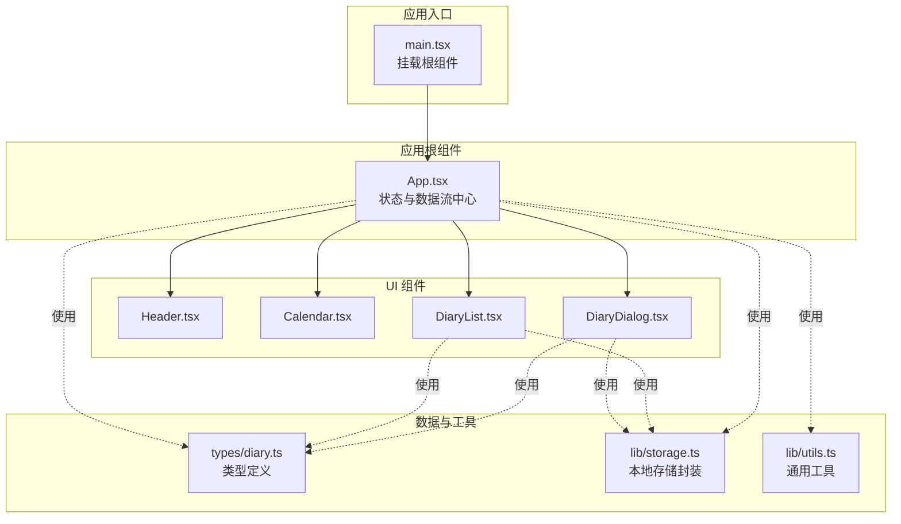
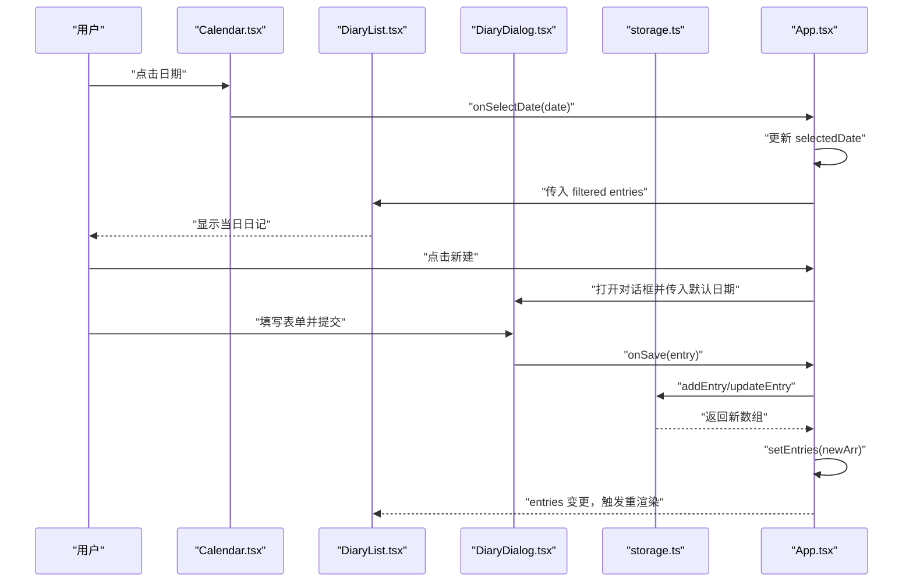
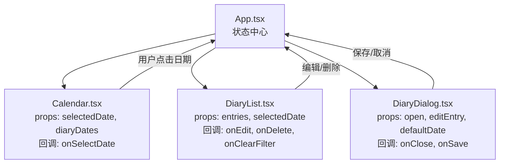
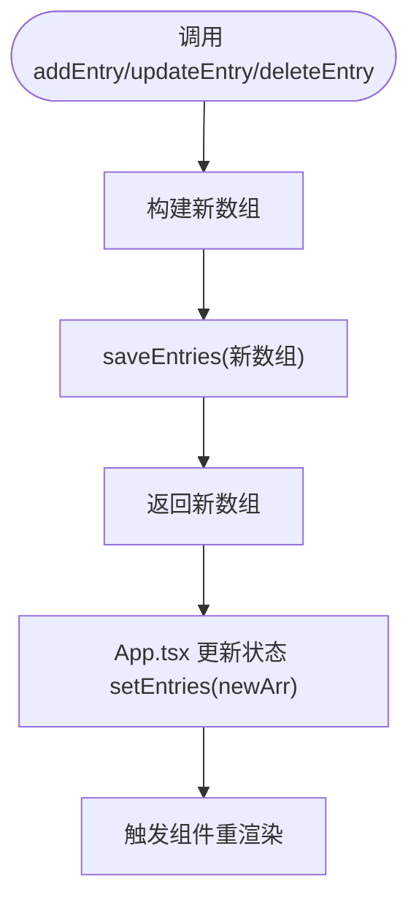
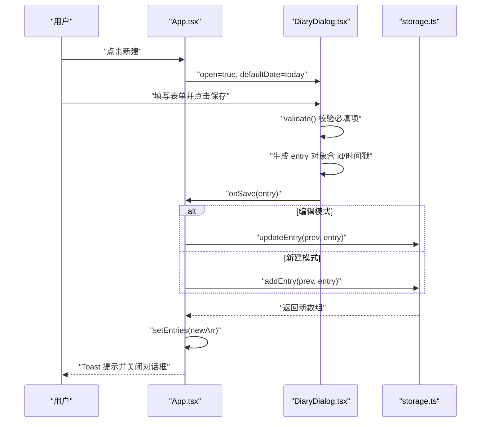
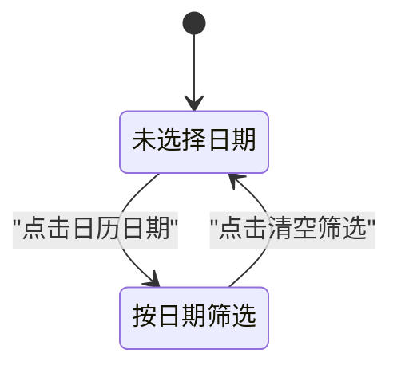
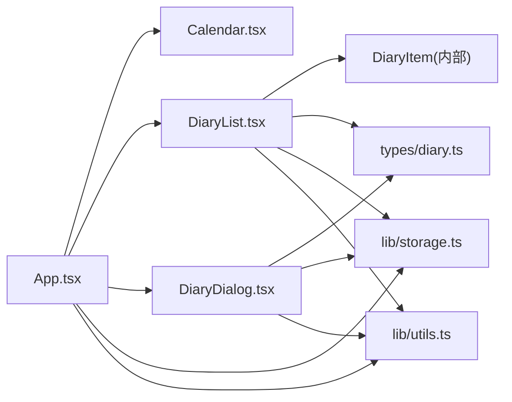

# 数据流设计

<cite>
**本文档引用的文件**
- [src/types/diary.ts](file://src/types/diary.ts)
- [src/lib/storage.ts](file://src/lib/storage.ts)
- [src/App.tsx](file://src/App.tsx)
- [src/main.tsx](file://src/main.tsx)
- [src/components/DiaryDialog.tsx](file://src/components/DiaryDialog.tsx)
- [src/components/Calendar.tsx](file://src/components/Calendar.tsx)
- [src/components/DiaryList.tsx](file://src/components/DiaryList.tsx)
- [src/components/Header.tsx](file://src/components/Header.tsx)
- [src/lib/utils.ts](file://src/lib/utils.ts)
- [package.json](file://package.json)
- [vite.config.ts](file://vite.config.ts)
</cite>

## 目录
1. [简介](#简介)
2. [项目结构](#项目结构)
3. [核心组件](#核心组件)
4. [架构总览](#架构总览)
5. [详细组件分析](#详细组件分析)
6. [依赖关系分析](#依赖关系分析)
7. [性能考虑](#性能考虑)
8. [故障排除指南](#故障排除指南)
9. [结论](#结论)

## 简介
本文件围绕 My-Diary 项目的“单向数据流”设计理念，系统梳理从用户交互到数据持久化的完整数据流转过程。重点包括：
- DiaryEntry 数据模型的设计与约束
- 组件间数据传递机制（props 向下传递、回调函数向上返回）
- 数据流优化策略（memoization、避免不必要重渲染）
- 数据流图与状态转换图，展示复杂用户操作下的数据变化轨迹

## 项目结构
项目采用基于功能模块的组织方式，核心目录与职责如下：
- src/types：类型定义，包含 DiaryEntry 接口与天气枚举
- src/lib：工具与业务逻辑，包含本地存储封装与通用工具
- src/components：UI 组件，包含日历、对话框、列表等
- src/App.tsx：应用根组件，集中管理状态与数据流
- src/main.tsx：入口文件，挂载 React 根节点



图表来源
- [src/main.tsx:1-11](file://src/main.tsx#L1-L11)
- [src/App.tsx:1-170](file://src/App.tsx#L1-L170)
- [src/components/Header.tsx:1-32](file://src/components/Header.tsx#L1-L32)
- [src/components/Calendar.tsx:1-159](file://src/components/Calendar.tsx#L1-L159)
- [src/components/DiaryList.tsx:1-200](file://src/components/DiaryList.tsx#L1-L200)
- [src/components/DiaryDialog.tsx:1-232](file://src/components/DiaryDialog.tsx#L1-L232)
- [src/types/diary.ts:1-22](file://src/types/diary.ts#L1-L22)
- [src/lib/storage.ts:1-58](file://src/lib/storage.ts#L1-L58)
- [src/lib/utils.ts:1-7](file://src/lib/utils.ts#L1-L7)

章节来源
- [src/main.tsx:1-11](file://src/main.tsx#L1-L11)
- [src/App.tsx:1-170](file://src/App.tsx#L1-L170)

## 核心组件
本节聚焦于数据流的关键参与者及其职责：
- App.tsx：应用状态中心，负责加载、增删改查、筛选与提示
- DiaryDialog.tsx：表单组件，负责输入校验与提交
- DiaryList.tsx：列表组件，负责分页与空态处理
- Calendar.tsx：日历组件，负责日期选择与标记
- storage.ts：数据持久化与查询工具
- types/diary.ts：数据模型与天气选项

章节来源
- [src/App.tsx:1-170](file://src/App.tsx#L1-L170)
- [src/components/DiaryDialog.tsx:1-232](file://src/components/DiaryDialog.tsx#L1-L232)
- [src/components/DiaryList.tsx:1-200](file://src/components/DiaryList.tsx#L1-L200)
- [src/components/Calendar.tsx:1-159](file://src/components/Calendar.tsx#L1-L159)
- [src/lib/storage.ts:1-58](file://src/lib/storage.ts#L1-L58)
- [src/types/diary.ts:1-22](file://src/types/diary.ts#L1-L22)

## 架构总览
My-Diary 的数据流遵循“单向数据流”原则：
- 状态集中在 App.tsx，通过 props 向下传递给子组件
- 子组件通过回调函数向上返回事件，由 App.tsx 更新状态
- 数据变更后，自动触发重新渲染，确保 UI 与状态一致
- 本地存储作为最终落点，保证刷新后数据不丢失



图表来源
- [src/App.tsx:67-69](file://src/App.tsx#L67-L69)
- [src/App.tsx:55-65](file://src/App.tsx#L55-L65)
- [src/components/Calendar.tsx:114-140](file://src/components/Calendar.tsx#L114-L140)
- [src/components/DiaryList.tsx:23-131](file://src/components/DiaryList.tsx#L23-L131)
- [src/components/DiaryDialog.tsx:66-80](file://src/components/DiaryDialog.tsx#L66-L80)
- [src/lib/storage.ts:19-35](file://src/lib/storage.ts#L19-L35)

## 详细组件分析

### DiaryEntry 数据模型
DiaryEntry 是应用的核心数据结构，用于承载每条日记的完整信息。其字段与约束如下：
- id: 字符串，唯一标识
- date: 字符串，格式为 'YYYY-MM-DD'
- weather: 枚举类型 WeatherType，支持内置天气与自定义天气
- customWeather?: 字符串，当 weather 为 custom 时必填
- title: 字符串，标题
- content: 字符串，正文
- createdAt: 数字，毫秒级时间戳
- updatedAt: 数字，毫秒级时间戳

天气选项定义了内置天气的值、标签与表情符号，便于 UI 展示与选择。

```mermaid
classDiagram
class DiaryEntry {
+string id
+string date
+WeatherType weather
+string? customWeather
+string title
+string content
+number createdAt
+number updatedAt
}
class WeatherType {
<<enumeration>>
"sunny"
"cloudy"
"rainy"
"snowy"
"windy"
"custom"
}
DiaryEntry --> WeatherType : "使用"
```

图表来源
- [src/types/diary.ts:4-13](file://src/types/diary.ts#L4-L13)
- [src/types/diary.ts:2-2](file://src/types/diary.ts#L2-L2)

章节来源
- [src/types/diary.ts:1-22](file://src/types/diary.ts#L1-L22)

### 组件间数据传递机制
- props 向下传递：App.tsx 将 entries、selectedDate、diaryDates 等状态通过 props 传递给 Calendar、DiaryList、DiaryDialog 等组件
- 回调函数向上返回：Calendar 的 onSelectDate、DiaryList 的 onEdit/onDelete、DiaryDialog 的 onSave 等回调，将用户操作反馈给 App.tsx
- 状态提升：所有状态集中在 App.tsx，确保单一事实来源，避免组件间状态分散



图表来源
- [src/App.tsx:94-133](file://src/App.tsx#L94-L133)
- [src/components/Calendar.tsx:17-140](file://src/components/Calendar.tsx#L17-L140)
- [src/components/DiaryList.tsx:23-131](file://src/components/DiaryList.tsx#L23-L131)
- [src/components/DiaryDialog.tsx:8-14](file://src/components/DiaryDialog.tsx#L8-L14)

章节来源
- [src/App.tsx:94-133](file://src/App.tsx#L94-L133)
- [src/components/Calendar.tsx:17-140](file://src/components/Calendar.tsx#L17-L140)
- [src/components/DiaryList.tsx:23-131](file://src/components/DiaryList.tsx#L23-L131)
- [src/components/DiaryDialog.tsx:8-14](file://src/components/DiaryDialog.tsx#L8-L14)

### 数据持久化与查询
storage.ts 提供了完整的 CRUD 与查询能力：
- 加载与保存：loadEntries/saveEntries 基于 localStorage 实现
- 增删改：addEntry/updateEntry/deleteEntry 返回新数组并自动保存
- 查询：getDatesWithDiary/getEntriesByDate/formatDate/todayStr/generateId 提供便捷查询与格式化



图表来源
- [src/lib/storage.ts:15-35](file://src/lib/storage.ts#L15-L35)
- [src/App.tsx:50-65](file://src/App.tsx#L50-L65)

章节来源
- [src/lib/storage.ts:1-58](file://src/lib/storage.ts#L1-L58)
- [src/App.tsx:50-65](file://src/App.tsx#L50-L65)

### 复杂用户操作下的数据变化轨迹
以下序列图展示了“新建/编辑日记”的完整流程，包括表单校验、生成 ID、更新时间戳与持久化。



图表来源
- [src/App.tsx:40-65](file://src/App.tsx#L40-L65)
- [src/components/DiaryDialog.tsx:56-80](file://src/components/DiaryDialog.tsx#L56-L80)
- [src/lib/storage.ts:19-29](file://src/lib/storage.ts#L19-L29)

章节来源
- [src/App.tsx:40-65](file://src/App.tsx#L40-L65)
- [src/components/DiaryDialog.tsx:56-80](file://src/components/DiaryDialog.tsx#L56-L80)
- [src/lib/storage.ts:19-29](file://src/lib/storage.ts#L19-L29)

### 状态转换图（日历筛选）
展示从“未选择日期”到“按日期筛选”的状态转换。



图表来源
- [src/App.tsx:67-69](file://src/App.tsx#L67-L69)
- [src/components/Calendar.tsx:124-126](file://src/components/Calendar.tsx#L124-L126)
- [src/components/DiaryList.tsx:59-67](file://src/components/DiaryList.tsx#L59-L67)

章节来源
- [src/App.tsx:67-69](file://src/App.tsx#L67-L69)
- [src/components/Calendar.tsx:124-126](file://src/components/Calendar.tsx#L124-L126)
- [src/components/DiaryList.tsx:59-67](file://src/components/DiaryList.tsx#L59-L67)

## 依赖关系分析
- 组件依赖：App.tsx 依赖 Calendar、DiaryList、DiaryDialog；DiaryList 依赖 DiaryItem；DiaryDialog 依赖 types/diary.ts 与 storage.ts
- 工具依赖：utils.ts 提供样式合并工具，被多个组件复用
- 配置依赖：vite.config.ts 配置路径别名 @ 指向 src，简化导入路径



图表来源
- [src/App.tsx:3-6](file://src/App.tsx#L3-L6)
- [src/components/DiaryList.tsx:1-5](file://src/components/DiaryList.tsx#L1-L5)
- [src/components/DiaryDialog.tsx:3-6](file://src/components/DiaryDialog.tsx#L3-L6)
- [src/lib/utils.ts:1-7](file://src/lib/utils.ts#L1-L7)

章节来源
- [src/App.tsx:3-6](file://src/App.tsx#L3-L6)
- [src/components/DiaryList.tsx:1-5](file://src/components/DiaryList.tsx#L1-L5)
- [src/components/DiaryDialog.tsx:3-6](file://src/components/DiaryDialog.tsx#L3-L6)
- [src/lib/utils.ts:1-7](file://src/lib/utils.ts#L1-L7)

## 性能考虑
- memoization 使用
  - App.tsx 使用 useMemo 计算 diaryDates 与 displayedEntries，避免在无依赖变更时重复计算
  - 依赖数组仅包含 entries 与 selectedDate，确保筛选与排序逻辑只在相关状态变化时执行
- 避免不必要重渲染
  - DiaryList 内部使用局部状态 page，selectedDate 变化时通过 ref 与渲染期间的副作用重置分页，减少外部状态波动
  - DiaryDialog 在 open 变化时重置表单，避免在非打开状态下进行不必要的状态更新
- 本地存储优化
  - storage.ts 的 CRUD 方法直接返回新数组并统一保存，减少中间状态的复杂性
  - 通过 Set 快速判断某日期是否存在日记，提高日历渲染效率

章节来源
- [src/App.tsx:25-33](file://src/App.tsx#L25-L33)
- [src/components/DiaryList.tsx:23-33](file://src/components/DiaryList.tsx#L23-L33)
- [src/components/DiaryDialog.tsx:26-46](file://src/components/DiaryDialog.tsx#L26-L46)
- [src/lib/storage.ts:37-43](file://src/lib/storage.ts#L37-L43)

## 故障排除指南
- 表单校验失败
  - 现象：保存按钮不可用或出现错误提示
  - 排查：确认日期、标题、内容是否为空；当选择自定义天气时需填写 customWeather
  - 参考路径：[src/components/DiaryDialog.tsx:56-64](file://src/components/DiaryDialog.tsx#L56-L64)
- 本地存储异常
  - 现象：刷新后日记丢失或页面报错
  - 排查：localStorage 是否可用；JSON 解析是否成功；键名是否正确
  - 参考路径：[src/lib/storage.ts:5-13](file://src/lib/storage.ts#L5-L13)
- 日期筛选无效
  - 现象：点击日历日期后列表未更新
  - 排查：selectedDate 是否正确传入 DiaryList；onSelectDate 回调是否触发
  - 参考路径：[src/App.tsx:67-69](file://src/App.tsx#L67-L69), [src/components/Calendar.tsx:124-126](file://src/components/Calendar.tsx#L124-L126)
- 删除确认
  - 现象：误删日记
  - 排查：确认浏览器确认框是否弹出；onConfirm 逻辑是否正确执行
  - 参考路径：[src/components/DiaryList.tsx:39-43](file://src/components/DiaryList.tsx#L39-L43)

章节来源
- [src/components/DiaryDialog.tsx:56-64](file://src/components/DiaryDialog.tsx#L56-L64)
- [src/lib/storage.ts:5-13](file://src/lib/storage.ts#L5-L13)
- [src/App.tsx:67-69](file://src/App.tsx#L67-L69)
- [src/components/Calendar.tsx:124-126](file://src/components/Calendar.tsx#L124-L126)
- [src/components/DiaryList.tsx:39-43](file://src/components/DiaryList.tsx#L39-L43)

## 结论
My-Diary 的数据流设计以“单向数据流”为核心，通过状态提升与回调机制实现清晰的数据流向。App.tsx 作为状态中心，结合 useMemo 与局部状态，有效避免不必要重渲染；storage.ts 提供稳定的本地持久化能力；组件间通过 props 与回调协作，形成高内聚、低耦合的架构。该设计既保证了开发可维护性，也兼顾了用户体验与性能表现。