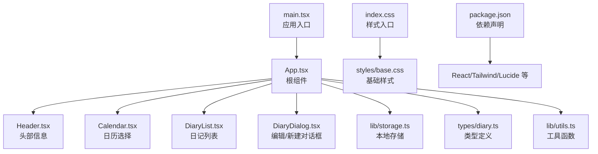
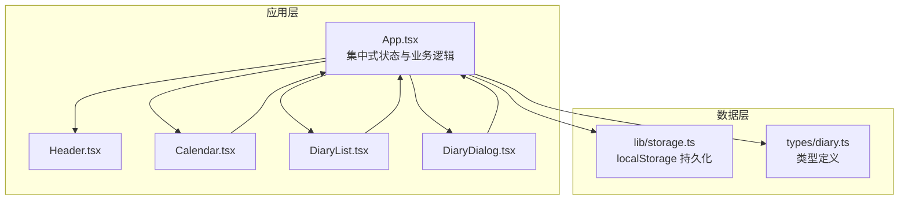
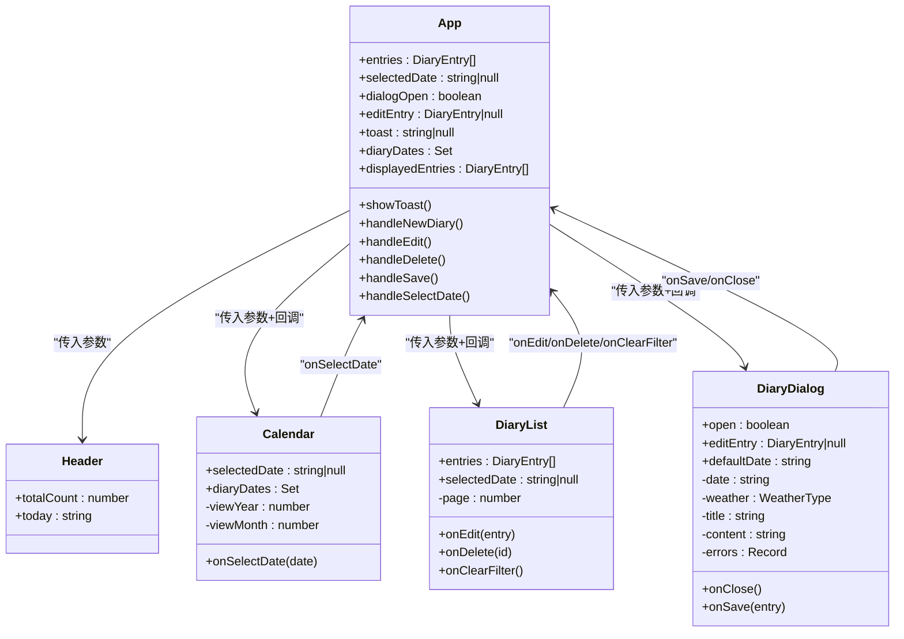
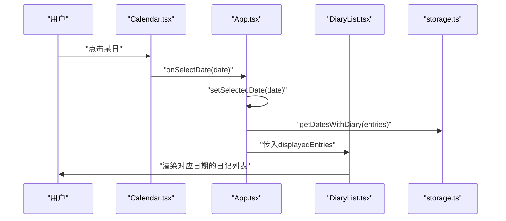
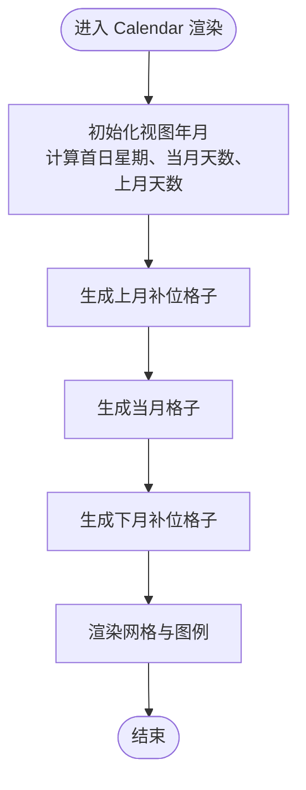
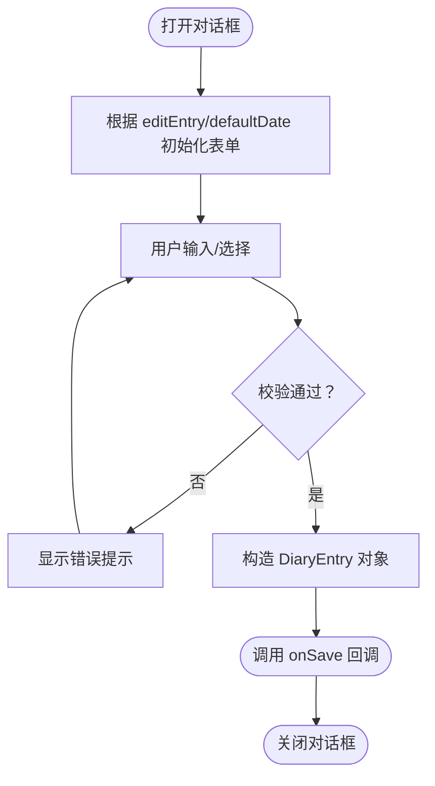
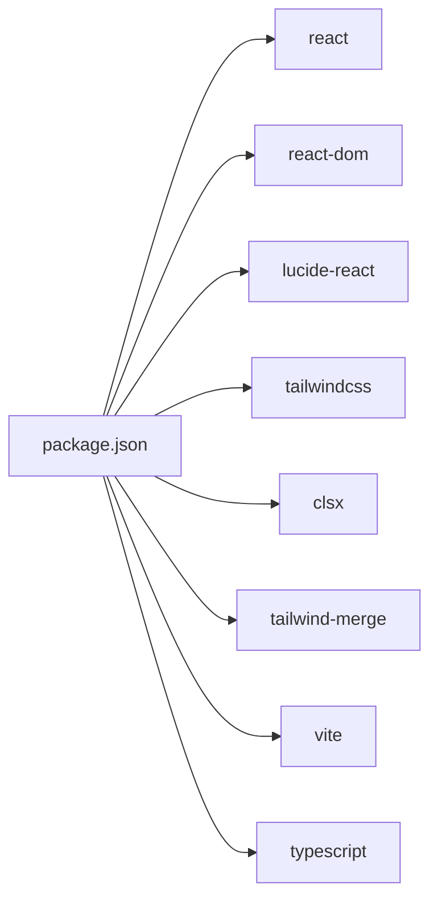

# 架构设计

<cite>
**本文引用的文件**
- [src/App.tsx](file://src/App.tsx)
- [src/main.tsx](file://src/main.tsx)
- [src/components/Header.tsx](file://src/components/Header.tsx)
- [src/components/Calendar.tsx](file://src/components/Calendar.tsx)
- [src/components/DiaryList.tsx](file://src/components/DiaryList.tsx)
- [src/components/DiaryDialog.tsx](file://src/components/DiaryDialog.tsx)
- [src/lib/storage.ts](file://src/lib/storage.ts)
- [src/lib/utils.ts](file://src/lib/utils.ts)
- [src/types/diary.ts](file://src/types/diary.ts)
- [src/styles/base.css](file://src/styles/base.css)
- [src/index.css](file://src/index.css)
- [package.json](file://package.json)
</cite>

## 目录
1. [简介](#简介)
2. [项目结构](#项目结构)
3. [核心组件](#核心组件)
4. [架构总览](#架构总览)
5. [详细组件分析](#详细组件分析)
6. [依赖分析](#依赖分析)
7. [性能考量](#性能考量)
8. [故障排查指南](#故障排查指南)
9. [结论](#结论)
10. [附录](#附录)

## 简介
本项目“我的日记”采用组件化架构，围绕React函数式组件与Hooks构建，通过集中式状态管理实现数据驱动的交互体验。应用以“入口组件 + 多个功能组件”的方式组织，配合本地存储模块完成数据持久化，形成轻量、可维护且易扩展的前端架构。

## 项目结构
项目采用按功能域分层的目录组织：
- 入口与根组件：main.tsx、App.tsx
- 功能组件：Header、Calendar、DiaryList、DiaryDialog
- 工具与类型：lib/utils.ts、lib/storage.ts、types/diary.ts
- 样式系统：index.css、styles/*.css
- 依赖配置：package.json

**图表来源**
- [src/main.tsx:1-11](file://src/main.tsx#L1-L11)
- [src/App.tsx:1-170](file://src/App.tsx#L1-L170)
- [src/components/Header.tsx:1-32](file://src/components/Header.tsx#L1-L32)
- [src/components/Calendar.tsx:1-159](file://src/components/Calendar.tsx#L1-L159)
- [src/components/DiaryList.tsx:1-200](file://src/components/DiaryList.tsx#L1-L200)
- [src/components/DiaryDialog.tsx:1-232](file://src/components/DiaryDialog.tsx#L1-L232)
- [src/lib/storage.ts:1-58](file://src/lib/storage.ts#L1-L58)
- [src/lib/utils.ts:1-7](file://src/lib/utils.ts#L1-L7)
- [src/types/diary.ts:1-22](file://src/types/diary.ts#L1-L22)
- [src/index.css:1-9](file://src/index.css#L1-L9)
- [src/styles/base.css:1-29](file://src/styles/base.css#L1-L29)
- [package.json:1-30](file://package.json#L1-L30)

**章节来源**
- [src/main.tsx:1-11](file://src/main.tsx#L1-L11)
- [src/App.tsx:1-170](file://src/App.tsx#L1-L170)
- [src/index.css:1-9](file://src/index.css#L1-L9)
- [src/styles/base.css:1-29](file://src/styles/base.css#L1-L29)
- [package.json:1-30](file://package.json#L1-L30)

## 核心组件
- 根组件 App：负责全局状态（日记列表、选中日期、对话框开关、编辑项、Toast提示）、计算日历标记与当前展示列表、处理新增/编辑/删除/保存、传递属性到子组件。
- Header：展示应用名称、总记录数与当前日期。
- Calendar：展示日历网格，支持切换月份、回到今天、点击日期回调。
- DiaryList：展示日记列表，支持按日期筛选、分页、编辑/删除操作。
- DiaryDialog：新建/编辑日记的模态表单，包含校验与保存回调。

**章节来源**
- [src/App.tsx:18-145](file://src/App.tsx#L18-L145)
- [src/components/Header.tsx:8-31](file://src/components/Header.tsx#L8-L31)
- [src/components/Calendar.tsx:17-158](file://src/components/Calendar.tsx#L17-L158)
- [src/components/DiaryList.tsx:23-131](file://src/components/DiaryList.tsx#L23-L131)
- [src/components/DiaryDialog.tsx:16-231](file://src/components/DiaryDialog.tsx#L16-L231)

## 架构总览
应用采用“自顶向下”的组件树结构，根组件集中管理状态并通过props向子组件传递数据与回调。数据流从用户交互触发事件，经由根组件处理后更新状态，再由子组件重新渲染。本地存储模块提供数据持久化能力，类型定义确保数据结构一致性。

**图表来源**
- [src/App.tsx:18-145](file://src/App.tsx#L18-L145)
- [src/components/Header.tsx:8-31](file://src/components/Header.tsx#L8-L31)
- [src/components/Calendar.tsx:17-158](file://src/components/Calendar.tsx#L17-L158)
- [src/components/DiaryList.tsx:23-131](file://src/components/DiaryList.tsx#L23-L131)
- [src/components/DiaryDialog.tsx:16-231](file://src/components/DiaryDialog.tsx#L16-L231)
- [src/lib/storage.ts:1-58](file://src/lib/storage.ts#L1-L58)
- [src/types/diary.ts:1-22](file://src/types/diary.ts#L1-L22)

## 详细组件分析

### 组件关系与职责
- App.tsx：集中式状态管理，负责数据计算与业务流程控制；作为父组件向子组件传递数据与回调。
- Header.tsx：只读展示组件，接收总数与日期参数。
- Calendar.tsx：内部维护视图年月状态，对外暴露选中日期回调。
- DiaryList.tsx：内部维护分页状态，根据选中日期筛选列表，提供编辑/删除回调。
- DiaryDialog.tsx：内部维护表单状态与校验，对外暴露保存与关闭回调。

**图表来源**
- [src/App.tsx:18-145](file://src/App.tsx#L18-L145)
- [src/components/Header.tsx:3-6](file://src/components/Header.tsx#L3-L6)
- [src/components/Calendar.tsx:5-9](file://src/components/Calendar.tsx#L5-L9)
- [src/components/DiaryList.tsx:7-13](file://src/components/DiaryList.tsx#L7-L13)
- [src/components/DiaryDialog.tsx:8-14](file://src/components/DiaryDialog.tsx#L8-L14)

**章节来源**
- [src/App.tsx:18-145](file://src/App.tsx#L18-L145)
- [src/components/Header.tsx:3-6](file://src/components/Header.tsx#L3-L6)
- [src/components/Calendar.tsx:5-9](file://src/components/Calendar.tsx#L5-L9)
- [src/components/DiaryList.tsx:7-13](file://src/components/DiaryList.tsx#L7-L13)
- [src/components/DiaryDialog.tsx:8-14](file://src/components/DiaryDialog.tsx#L8-L14)

### 数据流与状态管理
- 集中式状态：App.tsx 使用useState与useMemo管理entries、selectedDate、dialogOpen、editEntry、toast，并基于entries计算diaryDates与displayedEntries。
- 组件间通信：通过props向下传递数据，通过回调向上返回事件；Calendar的日期选择、DiaryList的编辑/删除、DiaryDialog的保存/关闭均通过回调完成。
- 数据持久化：所有写操作调用lib/storage.ts中的add/update/delete/save方法，统一写入localStorage。

**图表来源**
- [src/components/Calendar.tsx:17-158](file://src/components/Calendar.tsx#L17-L158)
- [src/App.tsx:29-33](file://src/App.tsx#L29-L33)
- [src/lib/storage.ts:37-39](file://src/lib/storage.ts#L37-L39)
- [src/components/DiaryList.tsx:23-131](file://src/components/DiaryList.tsx#L23-L131)

**章节来源**
- [src/App.tsx:19-33](file://src/App.tsx#L19-L33)
- [src/lib/storage.ts:37-43](file://src/lib/storage.ts#L37-L43)

### 日历组件算法流程
日历组件通过计算当月第一天是星期几、上月剩余天数与下月补位天数，生成42格网格。根据日期是否为今天、是否被选中、是否存在日记以及是否周末，设置不同的样式类。

**图表来源**
- [src/components/Calendar.tsx:40-66](file://src/components/Calendar.tsx#L40-L66)
- [src/components/Calendar.tsx:114-141](file://src/components/Calendar.tsx#L114-L141)

**章节来源**
- [src/components/Calendar.tsx:17-158](file://src/components/Calendar.tsx#L17-L158)

### 对话框表单校验流程
对话框在提交前进行字段校验，若存在错误则显示对应提示；通过onSave回调将标准化后的日记对象返回给App，由App统一更新状态并持久化。

**图表来源**
- [src/components/DiaryDialog.tsx:26-46](file://src/components/DiaryDialog.tsx#L26-L46)
- [src/components/DiaryDialog.tsx:56-80](file://src/components/DiaryDialog.tsx#L56-L80)

**章节来源**
- [src/components/DiaryDialog.tsx:16-231](file://src/components/DiaryDialog.tsx#L16-L231)

## 依赖分析
- React 生态：React、React DOM、Lucide React（图标）、Tailwind CSS（样式工具）、clsx/tailwind-merge（类名合并）。
- 类型安全：TypeScript 提供编译期类型检查。
- 构建工具：Vite + TailwindCSS + PostCSS。

**图表来源**
- [package.json:11-28](file://package.json#L11-L28)

**章节来源**
- [package.json:1-30](file://package.json#L1-30)

## 性能考量
- 计算优化：App 使用useMemo缓存diaryDates与displayedEntries，避免每次渲染都重复计算。
- 渲染优化：Calendar内部仅维护视图年月状态，不参与日记数据渲染；DiaryList内部维护分页状态，减少不必要的重排。
- 本地存储：storage模块统一写入localStorage，避免频繁I/O；对解析异常进行兜底处理。
- 样式优化：通过Tailwind原子化类名与变量主题，减少CSS体积与复杂度。

**章节来源**
- [src/App.tsx:25-33](file://src/App.tsx#L25-L33)
- [src/components/Calendar.tsx:17-32](file://src/components/Calendar.tsx#L17-L32)
- [src/components/DiaryList.tsx:23-37](file://src/components/DiaryList.tsx#L23-L37)
- [src/lib/storage.ts:5-13](file://src/lib/storage.ts#L5-L13)

## 故障排查指南
- 本地存储异常：storage模块在解析localStorage失败时返回空数组，避免应用崩溃；建议检查浏览器隐私模式或存储配额限制。
- 表单校验失败：DiaryDialog会在字段为空或自定义天气未填时显示错误提示；确认必填字段均已填写。
- 日期选择无效：Calendar仅允许点击当月日期，其他月份禁用点击；确认点击的是当前月份的日期。
- 列表为空：DiaryList在无数据或筛选无结果时显示空状态；可通过“查看全部”清除筛选条件。
- 样式缺失：确保index.css正确引入各样式文件，Tailwind指令已启用。

**章节来源**
- [src/lib/storage.ts:5-13](file://src/lib/storage.ts#L5-L13)
- [src/components/DiaryDialog.tsx:56-64](file://src/components/DiaryDialog.tsx#L56-L64)
- [src/components/Calendar.tsx:124-127](file://src/components/Calendar.tsx#L124-L127)
- [src/components/DiaryList.tsx:71-73](file://src/components/DiaryList.tsx#L71-L73)
- [src/index.css:1-9](file://src/index.css#L1-L9)

## 结论
本项目采用清晰的组件化架构与集中式状态管理，结合本地存储实现数据持久化。通过合理的Hook使用与计算缓存，保证了良好的性能与可维护性。组件职责明确、数据流向清晰，具备良好的扩展性与可演进空间。

## 附录
- 类型定义：DiaryEntry、WeatherType及天气选项，确保数据结构一致。
- 工具函数：cn用于类名合并，提升样式复用与可维护性。
- 样式体系：基于Tailwind与CSS变量的主题系统，便于统一风格与定制。

**章节来源**
- [src/types/diary.ts:1-22](file://src/types/diary.ts#L1-L22)
- [src/lib/utils.ts:4-6](file://src/lib/utils.ts#L4-L6)
- [src/styles/base.css:1-29](file://src/styles/base.css#L1-L29)