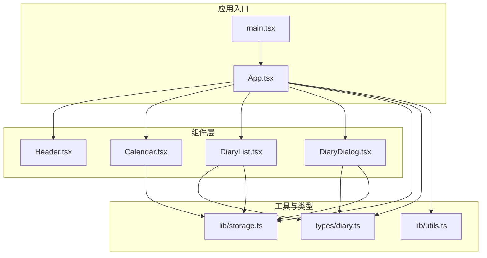
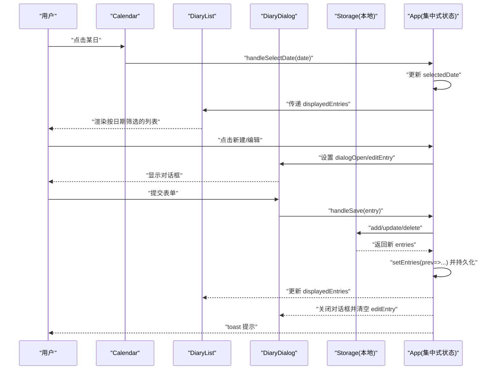
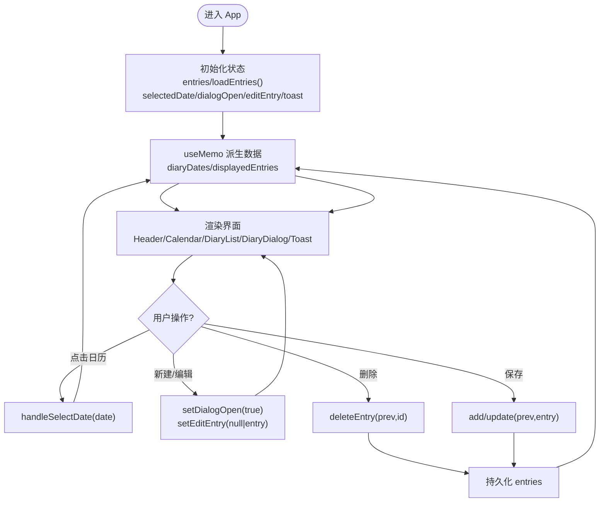
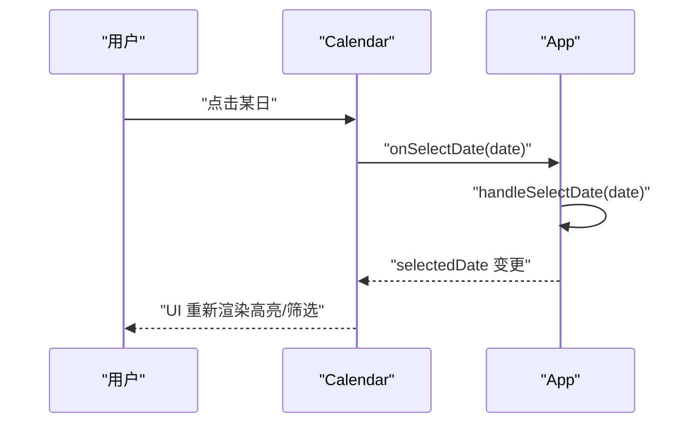
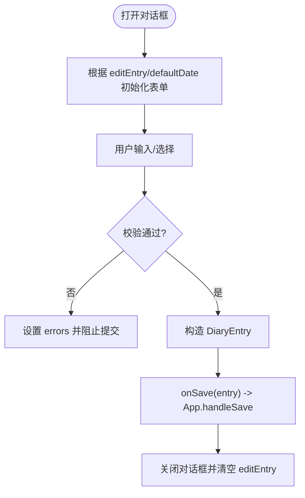
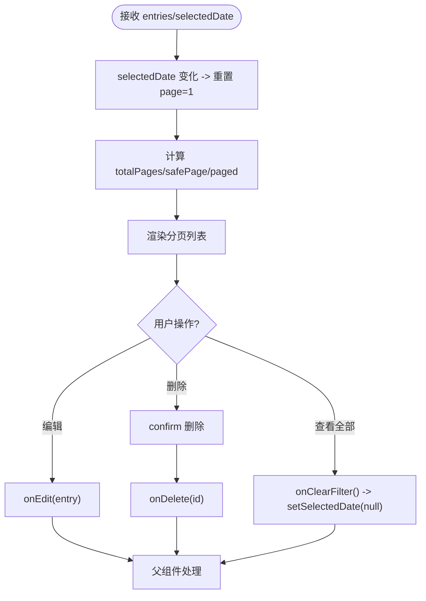
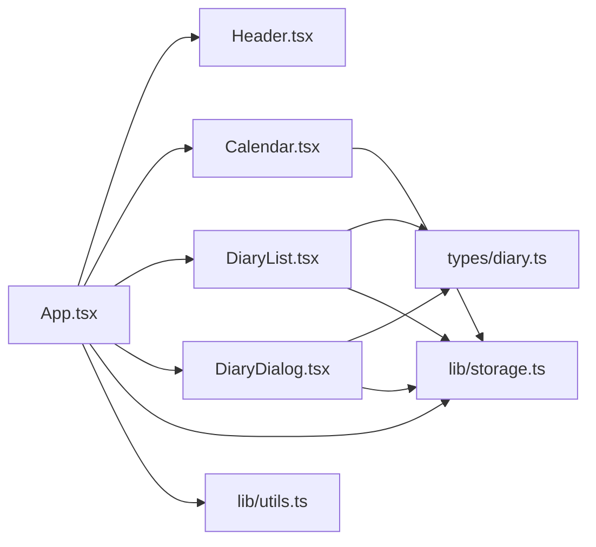
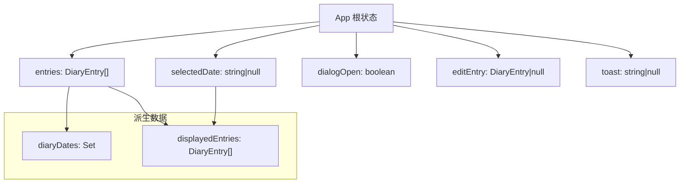
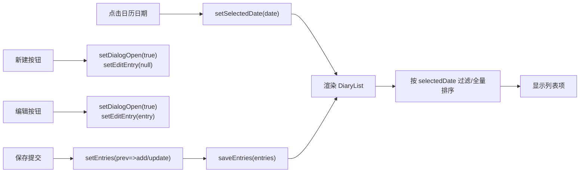

# 状态管理

<cite>
**本文引用的文件**
- [src/App.tsx](file://src/App.tsx)
- [src/main.tsx](file://src/main.tsx)
- [src/types/diary.ts](file://src/types/diary.ts)
- [src/lib/storage.ts](file://src/lib/storage.ts)
- [src/components/Calendar.tsx](file://src/components/Calendar.tsx)
- [src/components/DiaryDialog.tsx](file://src/components/DiaryDialog.tsx)
- [src/components/DiaryList.tsx](file://src/components/DiaryList.tsx)
- [src/components/Header.tsx](file://src/components/Header.tsx)
- [src/lib/utils.ts](file://src/lib/utils.ts)
- [package.json](file://package.json)
- [vite.config.ts](file://vite.config.ts)
- [tailwind.config.ts](file://tailwind.config.ts)
</cite>

## 目录
1. [简介](#简介)
2. [项目结构](#项目结构)
3. [核心组件与状态](#核心组件与状态)
4. [架构总览](#架构总览)
5. [详细组件分析](#详细组件分析)
6. [依赖关系分析](#依赖关系分析)
7. [性能考量](#性能考量)
8. [故障排查指南](#故障排查指南)
9. [结论](#结论)
10. [附录](#附录)

## 简介
本文件围绕 My-Diary 的集中式状态管理模式进行系统性梳理，重点解释 useState、useMemo 等 Hooks 在状态管理中的应用策略；阐明应用状态的层次结构（entries、selectedDate、dialogOpen、editEntry、toast），以及它们的作用域与生命周期；阐述从用户操作到状态变更再到 UI 更新的完整数据流；最后总结状态管理最佳实践与性能优化技巧，并提供状态流转图与状态树结构图，帮助开发者高效理解与维护复杂状态。

## 项目结构
My-Diary 采用以功能模块划分的目录组织方式：
- 组件层：Calendar、DiaryDialog、DiaryList、Header
- 类型与工具：types/diary.ts、lib/utils.ts、lib/storage.ts
- 应用入口与全局样式：main.tsx、App.tsx、tailwind.config.ts、vite.config.ts

图表来源
- [src/main.tsx:1-11](file://src/main.tsx#L1-L11)
- [src/App.tsx:1-170](file://src/App.tsx#L1-L170)
- [src/components/Calendar.tsx:1-159](file://src/components/Calendar.tsx#L1-L159)
- [src/components/DiaryDialog.tsx:1-232](file://src/components/DiaryDialog.tsx#L1-L232)
- [src/components/DiaryList.tsx:1-200](file://src/components/DiaryList.tsx#L1-L200)
- [src/components/Header.tsx:1-32](file://src/components/Header.tsx#L1-L32)
- [src/types/diary.ts:1-22](file://src/types/diary.ts#L1-L22)
- [src/lib/utils.ts:1-7](file://src/lib/utils.ts#L1-L7)
- [src/lib/storage.ts:1-58](file://src/lib/storage.ts#L1-L58)

章节来源
- [src/main.tsx:1-11](file://src/main.tsx#L1-L11)
- [src/App.tsx:1-170](file://src/App.tsx#L1-L170)
- [src/types/diary.ts:1-22](file://src/types/diary.ts#L1-L22)
- [src/lib/storage.ts:1-58](file://src/lib/storage.ts#L1-L58)
- [src/lib/utils.ts:1-7](file://src/lib/utils.ts#L1-L7)
- [vite.config.ts:1-13](file://vite.config.ts#L1-L13)
- [tailwind.config.ts:1-102](file://tailwind.config.ts#L1-L102)

## 核心组件与状态
本应用采用集中式状态管理模式，所有核心状态集中在根组件 App.tsx 中，通过 props 向子组件传递，实现“自顶向下”的数据流。

- 状态清单与作用域
  - entries：应用级日记条目集合，类型为 DiaryEntry[]，用于驱动日记列表与日历标记。
  - selectedDate：当前选中日期（字符串或空），控制按日期筛选与列表视图切换。
  - dialogOpen：对话框开关状态，控制新建/编辑对话框显示。
  - editEntry：当前编辑的日记条目，若为空则表示新建模式。
  - toast：轻提示消息，用于保存/删除后的反馈。

- 生命周期与更新策略
  - entries：初始值来自本地存储；每次新增、更新、删除均通过函数式更新保证幂等与一致性，并持久化到 localStorage。
  - selectedDate：点击日历日期切换；双击同日可取消筛选。
  - dialogOpen/editEntry：由“新建/编辑”按钮触发，打开对话框并传入默认日期或编辑条目；关闭时清空。
  - toast：调用 showToast 后自动定时清除，避免手动复位。

- useMemo 的使用
  - diaryDates：基于 entries 计算，避免日历重复计算。
  - displayedEntries：根据 selectedDate 动态返回当日条目或按更新时间倒序的全量列表，减少不必要的排序与过滤。

章节来源
- [src/App.tsx:18-72](file://src/App.tsx#L18-L72)
- [src/lib/storage.ts:19-43](file://src/lib/storage.ts#L19-L43)

## 架构总览
My-Diary 的状态管理遵循“集中式 + 函数式更新 + 本地持久化”的设计原则。用户交互触发事件回调，回调通过 useState 更新应用状态，useMemo 优化派生数据，最终驱动 UI 重新渲染。

图表来源
- [src/App.tsx:40-71](file://src/App.tsx#L40-L71)
- [src/components/Calendar.tsx:115-126](file://src/components/Calendar.tsx#L115-L126)
- [src/components/DiaryList.tsx:23-131](file://src/components/DiaryList.tsx#L23-L131)
- [src/components/DiaryDialog.tsx:66-80](file://src/components/DiaryDialog.tsx#L66-L80)
- [src/lib/storage.ts:19-35](file://src/lib/storage.ts#L19-L35)

## 详细组件分析

### App 组件：集中式状态与数据流
- 状态声明与初始化
  - entries：从本地存储加载初始值，确保刷新后不丢失。
  - selectedDate、dialogOpen、editEntry、toast：分别控制筛选、对话框、编辑上下文与提示。
- 派生数据
  - diaryDates：基于 entries 快速构建 Set，供日历高亮使用。
  - displayedEntries：根据 selectedDate 返回当日条目或全量倒序列表。
- 用户交互处理
  - 新建/编辑：打开对话框并准备默认日期或编辑条目。
  - 删除：函数式更新 entries 并提示。
  - 保存：区分新建与编辑，调用对应存储函数，更新 entries 并提示。
  - 日期选择：切换 selectedDate，支持双击取消。
- 提示系统
  - showToast：设置消息并在定时器后清除，避免手动复位。

图表来源
- [src/App.tsx:18-72](file://src/App.tsx#L18-L72)
- [src/lib/storage.ts:15-35](file://src/lib/storage.ts#L15-L35)

章节来源
- [src/App.tsx:18-145](file://src/App.tsx#L18-L145)
- [src/lib/storage.ts:5-17](file://src/lib/storage.ts#L5-L17)

### Calendar 组件：日期选择与日历标记
- 局部状态
  - viewYear/viewMonth：控制日历视图月份，不影响应用级状态。
- 输入与输出
  - 接收 selectedDate、diaryDates、onSelectDate。
  - 点击有效日期触发 onSelectDate(date)，由父组件统一处理。
- 性能注意
  - 日历渲染逻辑复杂，但仅在 viewYear/viewMonth 或 props 变化时更新，避免频繁重算。

图表来源
- [src/components/Calendar.tsx:17-126](file://src/components/Calendar.tsx#L17-L126)
- [src/App.tsx:67-69](file://src/App.tsx#L67-L69)

章节来源
- [src/components/Calendar.tsx:17-159](file://src/components/Calendar.tsx#L17-L159)

### DiaryDialog 组件：表单状态与校验
- 局部状态
  - date、weather、customWeather、title、content、errors：表单字段与错误状态。
- 生命周期
  - 打开时根据 open 与 editEntry 初始化表单；ESC 键盘事件关闭。
- 校验与提交
  - validate 收集错误；handleSubmit 构造 DiaryEntry 并调用 onSave。
- 与 App 的协作
  - 通过 props 接收 open、editEntry、defaultDate；通过 onSave 回传保存结果。

图表来源
- [src/components/DiaryDialog.tsx:16-80](file://src/components/DiaryDialog.tsx#L16-L80)
- [src/components/DiaryDialog.tsx:27-46](file://src/components/DiaryDialog.tsx#L27-L46)
- [src/App.tsx:55-65](file://src/App.tsx#L55-L65)

章节来源
- [src/components/DiaryDialog.tsx:16-232](file://src/components/DiaryDialog.tsx#L16-L232)

### DiaryList 组件：分页与筛选
- 局部状态
  - page：当前页码，随 selectedDate 变化重置为第一页。
- 数据处理
  - 计算 totalPages、安全页码、分页切片；支持“查看全部”按钮清除筛选。
- 交互
  - 编辑/删除：通过 onEdit/onDelete 回调交由父组件处理。

图表来源
- [src/components/DiaryList.tsx:23-131](file://src/components/DiaryList.tsx#L23-L131)

章节来源
- [src/components/DiaryList.tsx:23-200](file://src/components/DiaryList.tsx#L23-L200)

### Header 组件：只读展示
- 接收 totalCount 与 today，用于展示统计与日期。
- 不涉及状态管理，保持纯展示职责。

章节来源
- [src/components/Header.tsx:8-31](file://src/components/Header.tsx#L8-L31)

## 依赖关系分析
- 组件间依赖
  - App 作为根容器，依赖 Calendar、DiaryList、DiaryDialog、Header。
  - DiaryList 依赖 DiaryDialog（通过回调）、Storage（查询与格式化）。
  - Calendar 依赖 Storage（日期标记）。
  - DiaryDialog 依赖类型定义与 Storage（生成 ID、日期工具）。
- 外部依赖
  - React 生态：React、React DOM、lucide-react、clsx、tailwind-merge。
  - 构建与样式：Vite、TailwindCSS、PostCSS、tailwindcss-animate。

图表来源
- [src/App.tsx:1-16](file://src/App.tsx#L1-L16)
- [src/components/DiaryDialog.tsx:3-6](file://src/components/DiaryDialog.tsx#L3-L6)
- [src/components/DiaryList.tsx:2-5](file://src/components/DiaryList.tsx#L2-L5)
- [src/components/Calendar.tsx:1-3](file://src/components/Calendar.tsx#L1-L3)
- [src/lib/storage.ts:1](file://src/lib/storage.ts#L1)
- [src/lib/utils.ts:1-7](file://src/lib/utils.ts#L1-L7)

章节来源
- [package.json:11-27](file://package.json#L11-L27)
- [vite.config.ts:5-12](file://vite.config.ts#L5-L12)
- [tailwind.config.ts:1-102](file://tailwind.config.ts#L1-L102)

## 性能考量
- 使用 useMemo 优化派生数据
  - diaryDates：基于 entries 构建 Set，避免日历每次渲染都重复计算。
  - displayedEntries：按 selectedDate 条件分支，减少不必要的排序与过滤。
- 函数式更新 entries
  - 避免闭包陷阱与竞态条件，保证状态更新的幂等性与可预测性。
- 本地持久化与批量写入
  - 每次 add/update/delete 后统一保存，减少多次 IO。
- 组件局部状态最小化
  - Calendar 与 DiaryList 的内部状态仅限于视图与分页，不污染应用级状态。
- 渲染粒度控制
  - DiaryList 采用分页，避免一次性渲染大量条目导致卡顿。

章节来源
- [src/App.tsx:26-33](file://src/App.tsx#L26-L33)
- [src/lib/storage.ts:19-35](file://src/lib/storage.ts#L19-L35)

## 故障排查指南
- 问题：点击保存后列表未更新
  - 检查 handleSave 是否正确调用 setEntries(prev => ...) 并持久化。
  - 确认 displayedEntries 的 memo 依赖是否包含 entries。
- 问题：删除后提示未消失
  - 检查 showToast 的定时器是否执行，确认 toast 状态被正确清除。
- 问题：日历高亮不生效
  - 检查 diaryDates 的 memo 依赖是否包含 entries。
  - 确认 getDatesWithDiary 返回的 Set 与日期字符串格式一致。
- 问题：编辑对话框无法关闭
  - 检查 onClose 回调是否同时清空 dialogOpen 与 editEntry。
  - 确认 ESC 键盘事件监听是否在 open 变化时正确绑定/解绑。
- 问题：分页状态异常
  - 确认 selectedDate 变化时是否重置 page 为 1。
  - 检查 totalPages 与 safePage 的边界处理。

章节来源
- [src/App.tsx:35-38](file://src/App.tsx#L35-L38)
- [src/App.tsx:50-65](file://src/App.tsx#L50-L65)
- [src/components/DiaryDialog.tsx:48-54](file://src/components/DiaryDialog.tsx#L48-L54)
- [src/components/DiaryList.tsx:24-33](file://src/components/DiaryList.tsx#L24-L33)

## 结论
My-Diary 的状态管理以集中式为核心，结合 useMemo 与函数式更新，实现了清晰的数据流与良好的性能表现。通过明确的状态边界（应用级 entries 与组件级表单/视图状态）与严格的父子通信约定，系统具备良好的可维护性与扩展性。建议在后续迭代中持续关注：
- 将 localStorage 抽象为独立服务，便于测试与替换。
- 对 entries 增加去重与校验，提升数据质量。
- 引入轻量级状态库（如 Zustand）以应对更复杂的跨组件共享需求。

## 附录

### 状态树结构图

图表来源
- [src/App.tsx:18-33](file://src/App.tsx#L18-L33)
- [src/lib/storage.ts:37-43](file://src/lib/storage.ts#L37-L43)

### 状态流转图（关键路径）

图表来源
- [src/App.tsx:40-71](file://src/App.tsx#L40-L71)
- [src/components/DiaryDialog.tsx:66-80](file://src/components/DiaryDialog.tsx#L66-L80)
- [src/lib/storage.ts:19-35](file://src/lib/storage.ts#L19-L35)