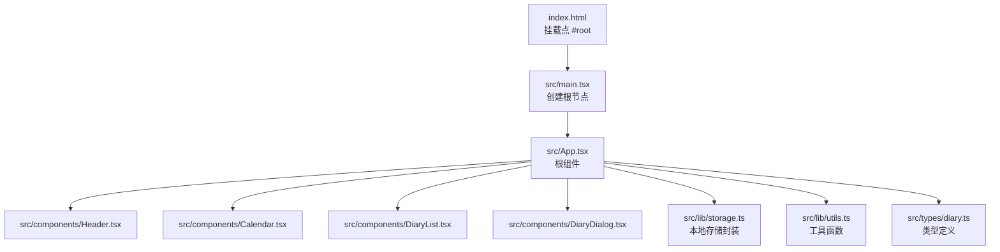
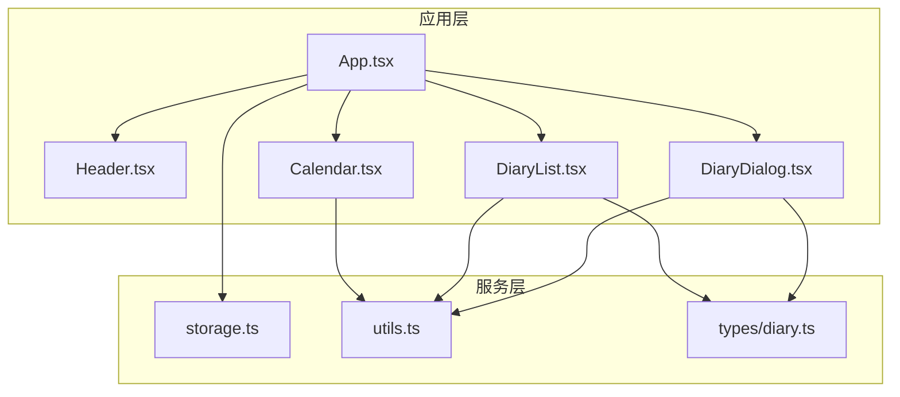
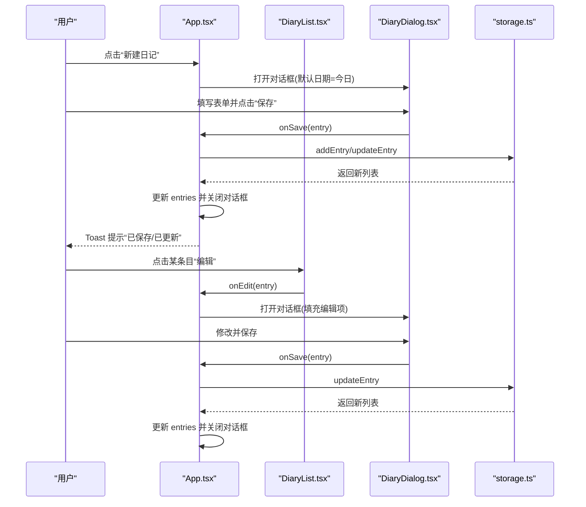
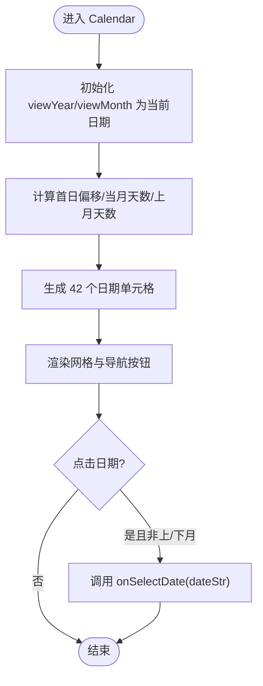
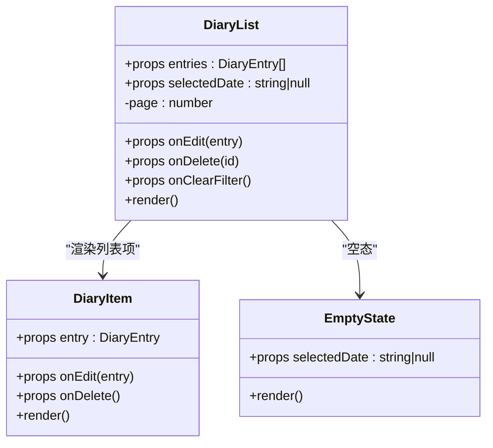
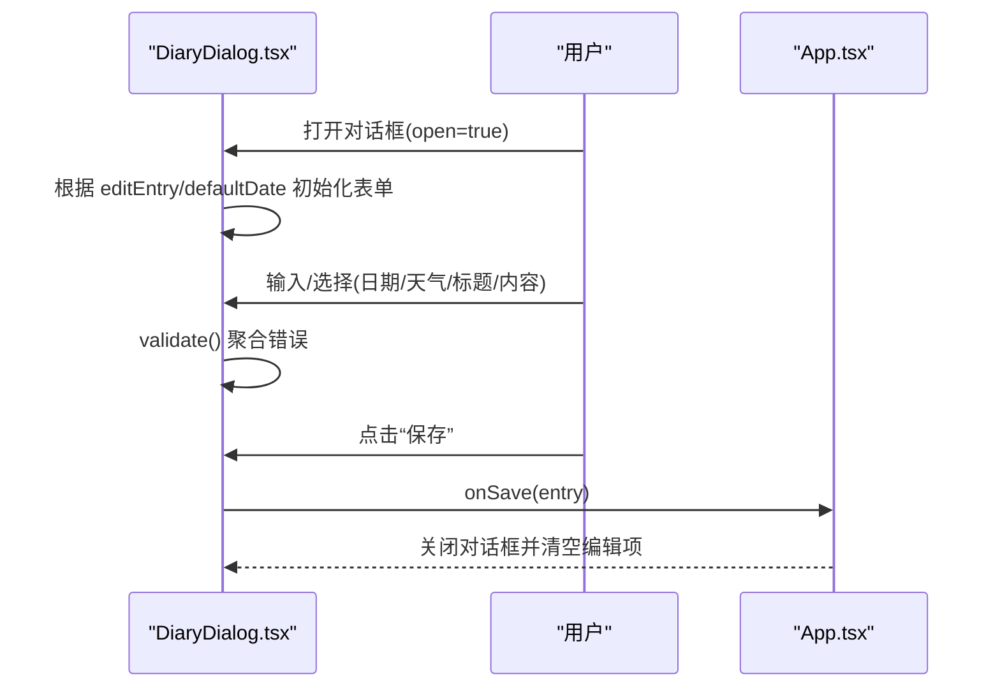
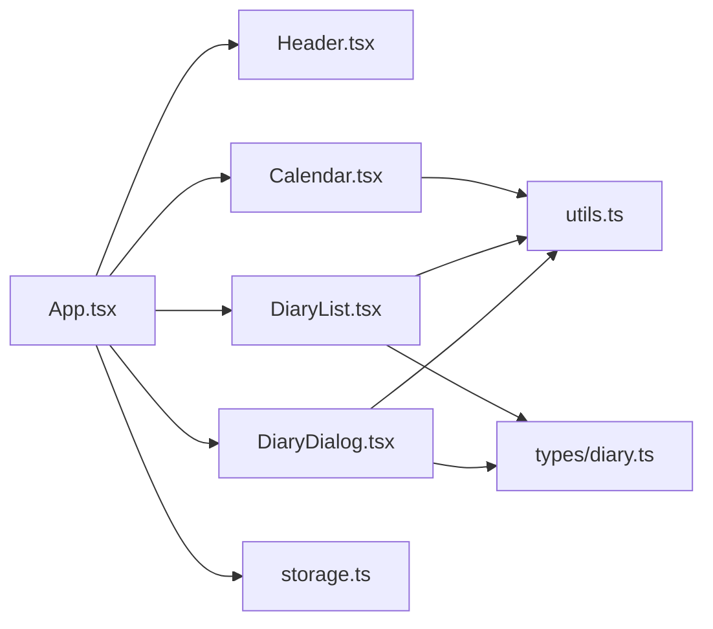
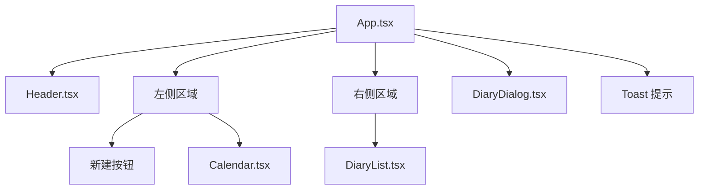
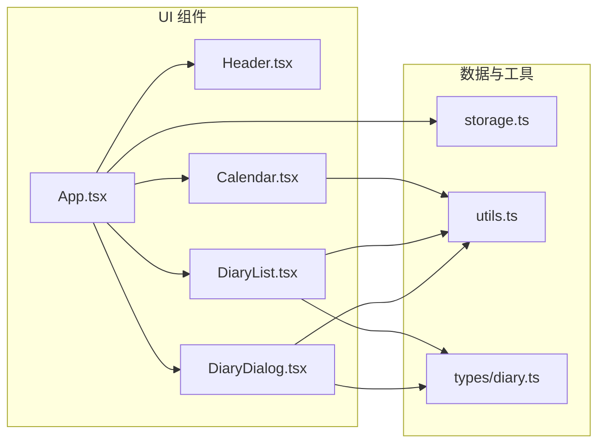

# 组件架构

<cite>
**本文引用的文件**
- [src/App.tsx](file://src/App.tsx)
- [src/components/Header.tsx](file://src/components/Header.tsx)
- [src/components/Calendar.tsx](file://src/components/Calendar.tsx)
- [src/components/DiaryList.tsx](file://src/components/DiaryList.tsx)
- [src/components/DiaryDialog.tsx](file://src/components/DiaryDialog.tsx)
- [src/lib/storage.ts](file://src/lib/storage.ts)
- [src/lib/utils.ts](file://src/lib/utils.ts)
- [src/types/diary.ts](file://src/types/diary.ts)
- [src/main.tsx](file://src/main.tsx)
- [index.html](file://index.html)
- [package.json](file://package.json)
</cite>

## 目录
1. [简介](#简介)
2. [项目结构](#项目结构)
3. [核心组件](#核心组件)
4. [架构总览](#架构总览)
5. [详细组件分析](#详细组件分析)
6. [依赖分析](#依赖分析)
7. [性能考量](#性能考量)
8. [故障排查指南](#故障排查指南)
9. [结论](#结论)
10. [附录](#附录)

## 简介
本文件系统性梳理 My-Diary 的组件架构与设计模式，重点围绕根组件 App.tsx 如何协调 Header、Calendar、DiaryList、DiaryDialog 等核心子组件展开；阐述 props 传递机制、事件冒泡与状态提升策略；给出组件层次结构图与关系图，帮助开发者理解并维护扩展该组件体系。

## 项目结构
项目采用以功能域为中心的组织方式，核心入口位于 src/main.tsx，通过 ReactDOM 渲染根组件 App。样式与主题通过 TailwindCSS 与 CSS 变量实现，数据持久化使用 localStorage，并通过独立的 lib 层进行封装。

图表来源
- [src/main.tsx:1-11](file://src/main.tsx#L1-L11)
- [src/App.tsx:1-170](file://src/App.tsx#L1-L170)
- [src/components/Header.tsx:1-32](file://src/components/Header.tsx#L1-L32)
- [src/components/Calendar.tsx:1-159](file://src/components/Calendar.tsx#L1-L159)
- [src/components/DiaryList.tsx:1-200](file://src/components/DiaryList.tsx#L1-L200)
- [src/components/DiaryDialog.tsx:1-232](file://src/components/DiaryDialog.tsx#L1-L232)
- [src/lib/storage.ts:1-58](file://src/lib/storage.ts#L1-L58)
- [src/lib/utils.ts:1-7](file://src/lib/utils.ts#L1-L7)
- [src/types/diary.ts:1-22](file://src/types/diary.ts#L1-L22)
- [index.html:1-16](file://index.html#L1-L16)

章节来源
- [src/main.tsx:1-11](file://src/main.tsx#L1-L11)
- [index.html:1-16](file://index.html#L1-L16)

## 核心组件
- App：全局状态容器与调度中心，负责：
  - 维护日记条目列表、选中日期、对话框开关、编辑项、Toast 提示
  - 计算日历标记集与当前展示列表
  - 提供新建、编辑、删除、保存等动作回调
  - 渲染 Header、Calendar、DiaryList、DiaryDialog 以及 Toast
- Header：展示应用标题、总记录数与今日日期
- Calendar：交互式日历，支持切换月份、回到今天、选择日期
- DiaryList：日记列表，支持按日期筛选、分页、编辑/删除操作
- DiaryDialog：新建/编辑对话框，包含表单校验与保存逻辑

章节来源
- [src/App.tsx:18-145](file://src/App.tsx#L18-L145)
- [src/components/Header.tsx:8-31](file://src/components/Header.tsx#L8-L31)
- [src/components/Calendar.tsx:17-158](file://src/components/Calendar.tsx#L17-L158)
- [src/components/DiaryList.tsx:23-131](file://src/components/DiaryList.tsx#L23-L131)
- [src/components/DiaryDialog.tsx:16-231](file://src/components/DiaryDialog.tsx#L16-L231)

## 架构总览
My-Diary 采用“自顶向下”的单向数据流与“状态提升”策略：
- App 维持全局状态与派发动作
- Calendar 仅负责展示与选择日期，通过回调向上汇报
- DiaryList 仅负责展示与交互，通过回调向上汇报
- DiaryDialog 仅负责表单与校验，通过回调向上汇报
- storage.ts 提供统一的数据读写接口，避免各组件直接耦合存储细节

图表来源
- [src/App.tsx:1-170](file://src/App.tsx#L1-L170)
- [src/components/Calendar.tsx:1-159](file://src/components/Calendar.tsx#L1-L159)
- [src/components/DiaryList.tsx:1-200](file://src/components/DiaryList.tsx#L1-L200)
- [src/components/DiaryDialog.tsx:1-232](file://src/components/DiaryDialog.tsx#L1-L232)
- [src/lib/storage.ts:1-58](file://src/lib/storage.ts#L1-L58)
- [src/lib/utils.ts:1-7](file://src/lib/utils.ts#L1-L7)
- [src/types/diary.ts:1-22](file://src/types/diary.ts#L1-L22)

## 详细组件分析

### App.tsx：根组件与状态协调者
- 状态管理
  - entries：日记条目数组，来源于 localStorage 初始化
  - selectedDate：当前筛选日期或 null
  - dialogOpen/editEntry：控制对话框与编辑项
  - toast：轻提示消息
- 计算属性
  - diaryDates：基于 entries 计算的日期集合，用于 Calendar 标记
  - displayedEntries：根据是否选中日期返回当日或全量按更新时间倒序列表
- 动作回调
  - handleNewDiary/handleEdit：打开对话框并设置编辑项
  - handleDelete：调用 storage 删除后刷新 entries
  - handleSave：区分新增/更新，调用 storage 后刷新 entries 并关闭对话框
  - handleSelectDate：切换/取消日期筛选
  - showToast：2.2 秒自动消失的提示
- 结构布局
  - 左侧：新建按钮 + Calendar 卡片 + 使用提示
  - 右侧：DiaryList 卡片，空态时渲染欢迎横幅
  - 底部：DiaryDialog 对话框
  - 固定底部 Toast

图表来源
- [src/App.tsx:40-65](file://src/App.tsx#L40-L65)
- [src/components/DiaryList.tsx:76-83](file://src/components/DiaryList.tsx#L76-L83)
- [src/components/DiaryDialog.tsx:66-80](file://src/components/DiaryDialog.tsx#L66-L80)
- [src/lib/storage.ts:19-29](file://src/lib/storage.ts#L19-L29)

章节来源
- [src/App.tsx:18-145](file://src/App.tsx#L18-L145)

### Header.tsx：只读展示组件
- 接收参数：totalCount、today
- 渲染应用标题、记录总数、今日日期
- 设计原则：纯展示、无副作用、无内部状态

章节来源
- [src/components/Header.tsx:8-31](file://src/components/Header.tsx#L8-L31)

### Calendar.tsx：交互式日历
- 接收参数：selectedDate、diaryDates(Set)、onSelectDate
- 内部状态：viewYear、viewMonth（当前视图年月）
- 交互能力：上一月/下一月、回到今天、选择日期
- 渲染策略：构建 6×7 的日期网格，区分上/当/下月、周末、今日、选中、有日记等视觉状态
- 设计原则：内部状态最小化、纯函数日期转换、通过回调暴露交互

图表来源
- [src/components/Calendar.tsx:17-158](file://src/components/Calendar.tsx#L17-L158)

章节来源
- [src/components/Calendar.tsx:17-158](file://src/components/Calendar.tsx#L17-L158)

### DiaryList.tsx：列表与分页
- 接收参数：entries、selectedDate、onEdit、onDelete、onClearFilter
- 内部状态：page（分页），随 selectedDate 变化重置
- 功能特性：
  - 标题显示：选中日期格式化或“全部日记”，并显示数量徽标
  - 空态：根据是否有筛选条件渲染不同提示
  - 分页：每页固定数量，支持前后翻页与页码跳转
  - 悬停显隐操作按钮：编辑/删除
- 设计原则：内部状态局部化、分页逻辑清晰、交互反馈明确

图表来源
- [src/components/DiaryList.tsx:23-131](file://src/components/DiaryList.tsx#L23-L131)
- [src/components/DiaryList.tsx:137-185](file://src/components/DiaryList.tsx#L137-L185)
- [src/components/DiaryList.tsx:187-199](file://src/components/DiaryList.tsx#L187-L199)

章节来源
- [src/components/DiaryList.tsx:23-131](file://src/components/DiaryList.tsx#L23-L131)

### DiaryDialog.tsx：表单与校验
- 接收参数：open、editEntry、defaultDate、onClose、onSave
- 内部状态：date、weather、customWeather、title、content、errors
- 生命周期行为：
  - 打开时根据 editEntry 或 defaultDate 初始化表单，并聚焦标题输入框
  - ESC 键盘事件监听，支持关闭
- 校验规则：日期必填、标题必填、内容必填、自定义天气需填写
- 设计原则：表单受控、错误聚合、ESC 关闭、保存时生成完整 DiaryEntry

图表来源
- [src/components/DiaryDialog.tsx:16-231](file://src/components/DiaryDialog.tsx#L16-L231)
- [src/App.tsx:127-133](file://src/App.tsx#L127-L133)

章节来源
- [src/components/DiaryDialog.tsx:16-231](file://src/components/DiaryDialog.tsx#L16-L231)

## 依赖分析
- 组件间依赖
  - App 依赖 Header、Calendar、DiaryList、DiaryDialog
  - Calendar 依赖 utils 工具函数
  - DiaryList 依赖 types 类型与 utils 工具函数
  - DiaryDialog 依赖 types 类型与 utils 工具函数
- 数据依赖
  - App 通过 storage.ts 读写 localStorage，避免组件直接耦合存储
- 外部依赖
  - React、lucide-react、clsx、tailwind-merge、tailwindcss-animate

图表来源
- [src/App.tsx:1-170](file://src/App.tsx#L1-L170)
- [src/components/Calendar.tsx:1-159](file://src/components/Calendar.tsx#L1-L159)
- [src/components/DiaryList.tsx:1-200](file://src/components/DiaryList.tsx#L1-L200)
- [src/components/DiaryDialog.tsx:1-232](file://src/components/DiaryDialog.tsx#L1-L232)
- [src/lib/storage.ts:1-58](file://src/lib/storage.ts#L1-L58)
- [src/lib/utils.ts:1-7](file://src/lib/utils.ts#L1-L7)
- [src/types/diary.ts:1-22](file://src/types/diary.ts#L1-L22)

章节来源
- [package.json:11-28](file://package.json#L11-L28)

## 性能考量
- 计算缓存
  - App 使用 useMemo 缓存 diaryDates 与 displayedEntries，避免不必要的重排
- 渲染优化
  - Calendar 通过类名组合与条件渲染减少 DOM 重绘
  - DiaryList 采用分页，限制单次渲染项数
- 存储访问
  - storage.ts 将 localStorage 读写集中封装，避免重复解析/序列化
- 建议
  - DiaryList 可考虑虚拟滚动以进一步优化长列表
  - Calendar 可引入节流/防抖处理频繁切换月份

[本节为通用建议，不直接分析具体文件]

## 故障排查指南
- 对话框无法关闭
  - 检查 App.tsx 中 onClose 回调是否正确设置 dialogOpen 与 editEntry
  - 确认 DiaryDialog.tsx 的 ESC 监听是否生效
- 日期筛选无效
  - 确认 App.tsx 中 handleSelectDate 是否被传入 Calendar
  - 检查 displayedEntries 的计算逻辑是否依赖 selectedDate
- 删除确认未触发
  - 确认 DiaryList.tsx 的 confirmDelete 是否调用 onDelete
  - 检查 storage.ts 的 deleteEntry 是否执行
- 表单校验失败
  - 检查 DiaryDialog.tsx 的 validate 逻辑与错误字段映射
  - 确认 onSave 是否在 validate 通过后调用

章节来源
- [src/App.tsx:40-65](file://src/App.tsx#L40-L65)
- [src/components/DiaryList.tsx:39-43](file://src/components/DiaryList.tsx#L39-L43)
- [src/components/DiaryDialog.tsx:56-80](file://src/components/DiaryDialog.tsx#L56-L80)
- [src/lib/storage.ts:31-35](file://src/lib/storage.ts#L31-L35)

## 结论
My-Diary 的组件架构遵循“单一职责、状态提升、单向数据流”的设计原则。App 作为协调者，将交互与状态收敛于一处，子组件专注于各自领域的展示与交互。通过 storage.ts 抽象数据访问，组件间耦合度低、可测试性强。整体结构清晰、易于维护与扩展。

[本节为总结，不直接分析具体文件]

## 附录

### 组件层次结构图

图表来源
- [src/App.tsx:73-144](file://src/App.tsx#L73-L144)
- [src/components/Header.tsx:8-31](file://src/components/Header.tsx#L8-L31)
- [src/components/Calendar.tsx:17-158](file://src/components/Calendar.tsx#L17-L158)
- [src/components/DiaryList.tsx:23-131](file://src/components/DiaryList.tsx#L23-L131)
- [src/components/DiaryDialog.tsx:16-231](file://src/components/DiaryDialog.tsx#L16-L231)

### 组件关系与数据流图

图表来源
- [src/App.tsx:1-170](file://src/App.tsx#L1-L170)
- [src/components/Calendar.tsx:1-159](file://src/components/Calendar.tsx#L1-L159)
- [src/components/DiaryList.tsx:1-200](file://src/components/DiaryList.tsx#L1-L200)
- [src/components/DiaryDialog.tsx:1-232](file://src/components/DiaryDialog.tsx#L1-L232)
- [src/lib/storage.ts:1-58](file://src/lib/storage.ts#L1-L58)
- [src/lib/utils.ts:1-7](file://src/lib/utils.ts#L1-L7)
- [src/types/diary.ts:1-22](file://src/types/diary.ts#L1-L22)

### Props 传递与事件冒泡
- App -> Calendar：selectedDate、diaryDates、onSelectDate
- App -> DiaryList：entries、selectedDate、onEdit、onDelete、onClearFilter
- App -> DiaryDialog：open、editEntry、defaultDate、onClose、onSave
- 事件冒泡：子组件通过回调向上汇报，App 统一处理并更新状态，避免跨层级直接通信

章节来源
- [src/App.tsx:94-98](file://src/App.tsx#L94-L98)
- [src/App.tsx:113-119](file://src/App.tsx#L113-L119)
- [src/App.tsx:127-133](file://src/App.tsx#L127-L133)

### 复用策略与可扩展性
- 复用策略
  - Header：纯展示，可复用于其他页面
  - Calendar：可抽取为通用日历组件，支持多语言与主题定制
  - DiaryList：可抽取为通用列表组件，支持排序、过滤、加载更多
  - DiaryDialog：可抽取为通用表单对话框，支持动态 schema
- 可扩展性
  - storage.ts 支持替换为 IndexedDB 或后端 API
  - types/diary.ts 可扩展字段（如标签、图片、位置）
  - utils.ts 可增加更多样式/动画工具函数

章节来源
- [src/lib/storage.ts:1-58](file://src/lib/storage.ts#L1-L58)
- [src/types/diary.ts:1-22](file://src/types/diary.ts#L1-L22)
- [src/lib/utils.ts:1-7](file://src/lib/utils.ts#L1-L7)