# 设计模式

<cite>
**本文档引用的文件**
- [App.tsx](file://src/App.tsx)
- [Calendar.tsx](file://src/components/Calendar.tsx)
- [DiaryDialog.tsx](file://src/components/DiaryDialog.tsx)
- [DiaryList.tsx](file://src/components/DiaryList.tsx)
- [Header.tsx](file://src/components/Header.tsx)
- [storage.ts](file://src/lib/storage.ts)
- [utils.ts](file://src/lib/utils.ts)
- [diary.ts](file://src/types/diary.ts)
- [tokens.css](file://src/styles/tokens.css)
- [components.css](file://src/styles/components.css)
</cite>

## 目录
1. [引言](#引言)
2. [项目结构](#项目结构)
3. [核心组件](#核心组件)
4. [架构概览](#架构概览)
5. [详细组件分析](#详细组件分析)
6. [依赖关系分析](#依赖关系分析)
7. [性能考虑](#性能考虑)
8. [故障排除指南](#故障排除指南)
9. [结论](#结论)

## 引言

My-Diary是一个基于React的日记应用，采用TypeScript构建。该项目展示了多种设计模式的实际应用，包括组件模式、工厂模式、观察者模式、策略模式等。通过深入分析这些设计模式的实现，开发者可以更好地理解如何在实际项目中应用这些模式来提高代码的可维护性和扩展性。

## 项目结构

My-Diary项目采用模块化的文件组织方式，主要分为以下几个层次：

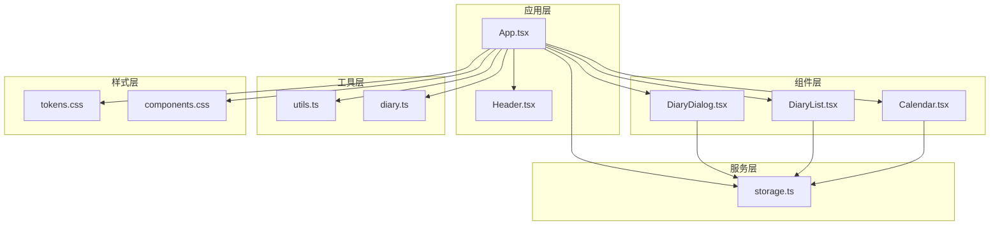

**图表来源**
- [App.tsx:1-170](file://src/App.tsx#L1-L170)
- [Calendar.tsx:1-159](file://src/components/Calendar.tsx#L1-L159)
- [DiaryDialog.tsx:1-232](file://src/components/DiaryDialog.tsx#L1-L232)
- [DiaryList.tsx:1-200](file://src/components/DiaryList.tsx#L1-L200)
- [storage.ts:1-58](file://src/lib/storage.ts#L1-L58)

**章节来源**
- [App.tsx:1-170](file://src/App.tsx#L1-L170)
- [Calendar.tsx:1-159](file://src/components/Calendar.tsx#L1-L159)
- [DiaryDialog.tsx:1-232](file://src/components/DiaryDialog.tsx#L1-L232)
- [DiaryList.tsx:1-200](file://src/components/DiaryList.tsx#L1-L200)
- [storage.ts:1-58](file://src/lib/storage.ts#L1-L58)

## 核心组件

My-Diary的核心组件遵循React组件模式，每个组件都有明确的职责分工：

### 组件职责分配

| 组件 | 主要职责 | 数据流 |
|------|----------|--------|
| App | 应用主控制器，管理全局状态 | 状态提升，回调传递 |
| Calendar | 日历视图组件，日期选择 | 事件回调，状态更新 |
| DiaryList | 日记列表组件，分页显示 | 数据过滤，用户交互 |
| DiaryDialog | 对话框组件，表单处理 | 表单验证，数据提交 |
| Header | 应用头部组件，信息展示 | 纯展示组件 |

### 状态管理模式

应用采用React的状态管理模式，通过useState和useMemo实现高效的状态管理：

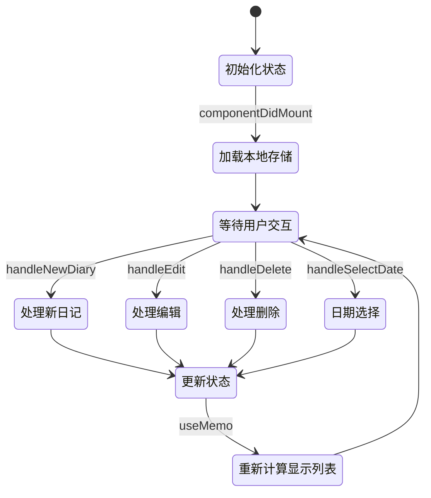

**图表来源**
- [App.tsx:18-71](file://src/App.tsx#L18-L71)
- [App.tsx:29-33](file://src/App.tsx#L29-L33)

**章节来源**
- [App.tsx:18-71](file://src/App.tsx#L18-L71)
- [App.tsx:29-33](file://src/App.tsx#L29-L33)

## 架构概览

My-Diary采用分层架构设计，各层之间职责清晰，耦合度低：

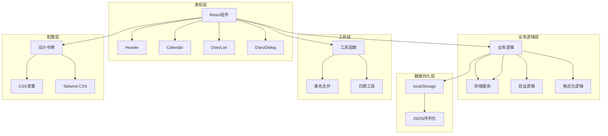

**图表来源**
- [App.tsx:1-170](file://src/App.tsx#L1-L170)
- [storage.ts:1-58](file://src/lib/storage.ts#L1-L58)
- [utils.ts:1-7](file://src/lib/utils.ts#L1-L7)
- [tokens.css:1-57](file://src/styles/tokens.css#L1-L57)

## 详细组件分析

### 组件模式分析

#### App组件 - 主控制器模式

App组件采用了主控制器模式，负责协调各个子组件的工作：

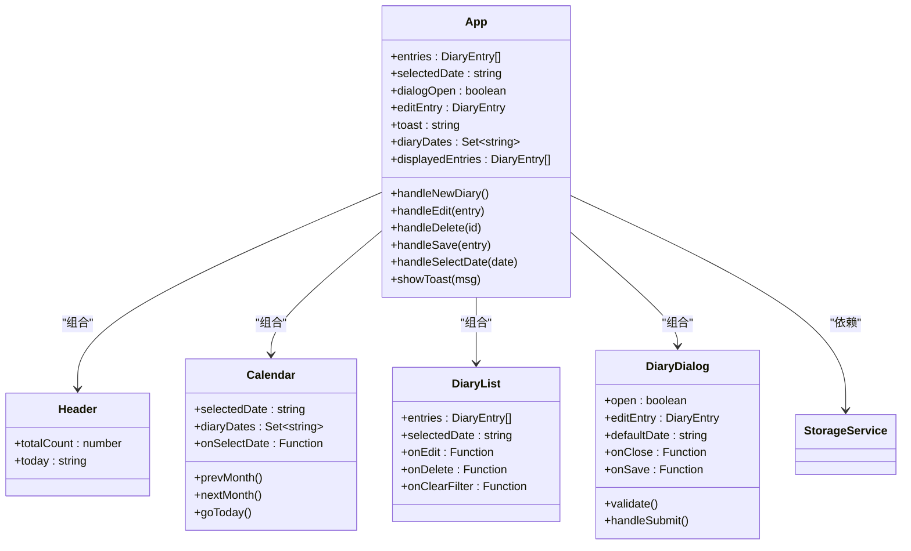

**图表来源**
- [App.tsx:18-145](file://src/App.tsx#L18-L145)
- [Header.tsx:8-31](file://src/components/Header.tsx#L8-L31)
- [Calendar.tsx:17-158](file://src/components/Calendar.tsx#L17-L158)
- [DiaryList.tsx:23-131](file://src/components/DiaryList.tsx#L23-L131)
- [DiaryDialog.tsx:16-232](file://src/components/DiaryDialog.tsx#L16-L232)

#### 回调函数模式在组件通信中的应用

组件间的通信主要通过回调函数实现，这是React中推荐的组件通信模式：

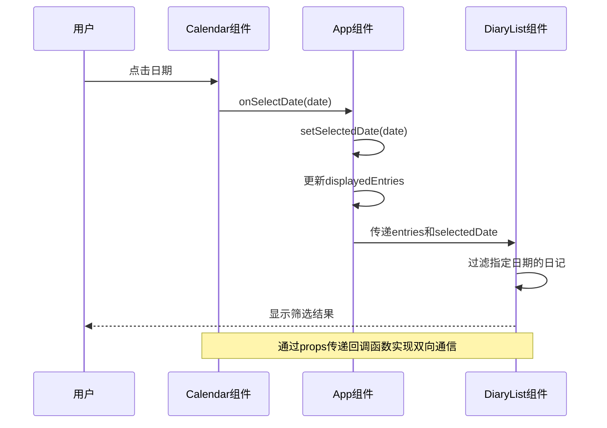

**图表来源**
- [Calendar.tsx:124-126](file://src/components/Calendar.tsx#L124-L126)
- [App.tsx:67-69](file://src/App.tsx#L67-L69)
- [DiaryList.tsx:23-131](file://src/components/DiaryList.tsx#L23-L131)

**章节来源**
- [App.tsx:18-145](file://src/App.tsx#L18-L145)
- [Calendar.tsx:17-158](file://src/components/Calendar.tsx#L17-L158)
- [DiaryList.tsx:23-131](file://src/components/DiaryList.tsx#L23-L131)

### 工厂模式的应用

虽然My-Diary中没有显式的工厂类，但在数据处理方面体现了工厂模式的思想：

#### 数据创建工厂

```mermaid
flowchart TD
Start([开始]) --> CheckEditMode{"是否编辑模式?"}
CheckEditMode --> |是| EditMode[使用现有entry.id]
CheckEditMode --> |否| NewMode[生成新ID]
EditMode --> SetDate[设置日期]
NewMode --> GenerateId[generateId()生成新ID]
SetDate --> SetWeather[设置天气]
GenerateId --> SetWeather
SetWeather --> SetTitle[设置标题]
SetTitle --> SetContent[设置内容]
SetContent --> SetTimestamps[设置时间戳]
SetTimestamps --> ReturnEntry[返回DiaryEntry]
ReturnEntry --> End([结束])
```

**图表来源**
- [DiaryDialog.tsx:66-80](file://src/components/DiaryDialog.tsx#L66-L80)
- [storage.ts:55-57](file://src/lib/storage.ts#L55-L57)

**章节来源**
- [DiaryDialog.tsx:66-80](file://src/components/DiaryDialog.tsx#L66-L80)
- [storage.ts:55-57](file://src/lib/storage.ts#L55-L57)

### 观察者模式的实现

My-Diary通过React的生命周期和状态变化实现了观察者模式：

#### 状态变化观察

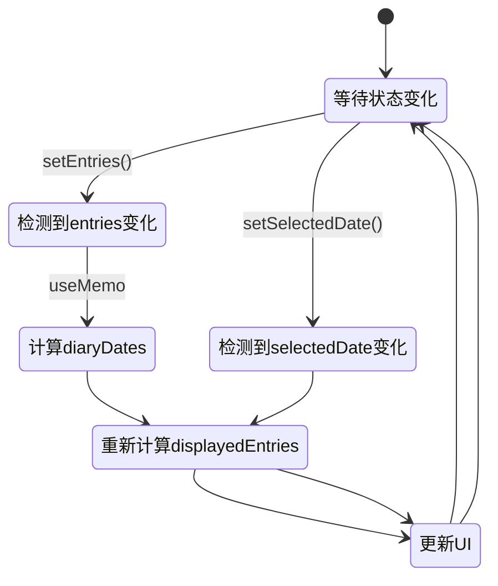

**图表来源**
- [App.tsx:26-33](file://src/App.tsx#L26-L33)
- [App.tsx:19-23](file://src/App.tsx#L19-L23)

**章节来源**
- [App.tsx:26-33](file://src/App.tsx#L26-L33)
- [App.tsx:19-23](file://src/App.tsx#L19-L23)

### 策略模式在数据处理中的体现

My-Diary在数据处理中体现了策略模式，通过不同的函数实现不同的数据操作策略：

#### 数据操作策略

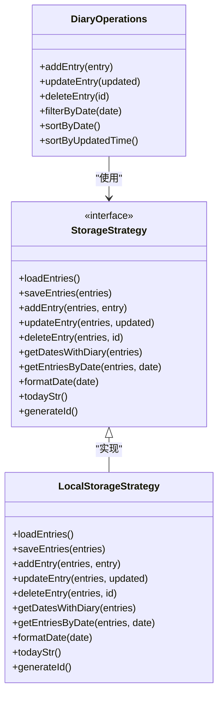

**图表来源**
- [storage.ts:5-58](file://src/lib/storage.ts#L5-L58)
- [App.tsx:8-16](file://src/App.tsx#L8-L16)

#### 策略选择流程

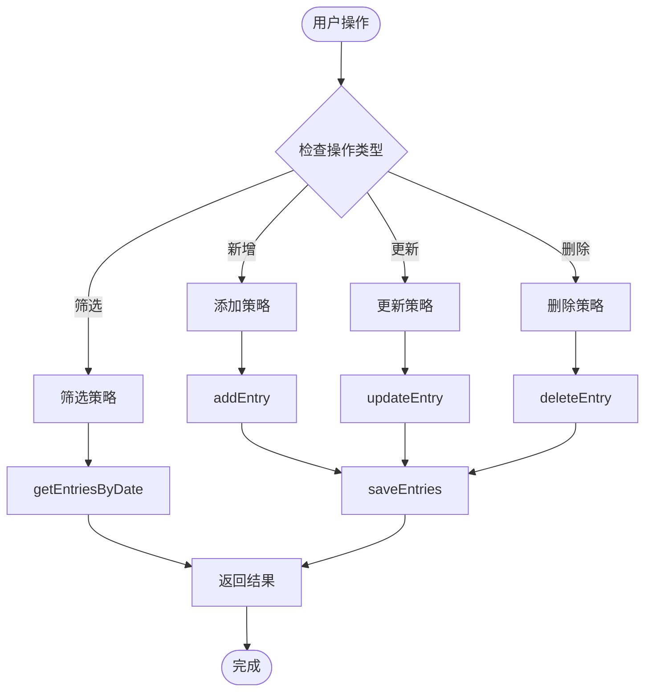

**图表来源**
- [storage.ts:19-35](file://src/lib/storage.ts#L19-L35)
- [storage.ts:41-43](file://src/lib/storage.ts#L41-L43)

**章节来源**
- [storage.ts:5-58](file://src/lib/storage.ts#L5-L58)
- [App.tsx:8-16](file://src/App.tsx#L8-L16)

### 分页策略模式

DiaryList组件实现了分页功能，体现了策略模式在界面展示中的应用：

#### 分页策略

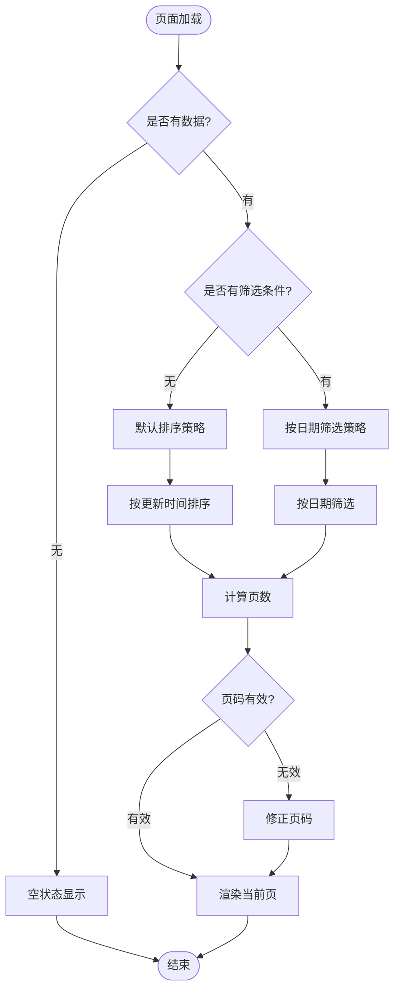

**图表来源**
- [DiaryList.tsx:23-131](file://src/components/DiaryList.tsx#L23-L131)
- [DiaryList.tsx:15-16](file://src/components/DiaryList.tsx#L15-L16)

**章节来源**
- [DiaryList.tsx:23-131](file://src/components/DiaryList.tsx#L23-L131)
- [DiaryList.tsx:15-16](file://src/components/DiaryList.tsx#L15-L16)

### 事件驱动设计思想

My-Diary完全基于事件驱动架构，所有用户交互都通过事件处理器响应：

#### 事件处理流程

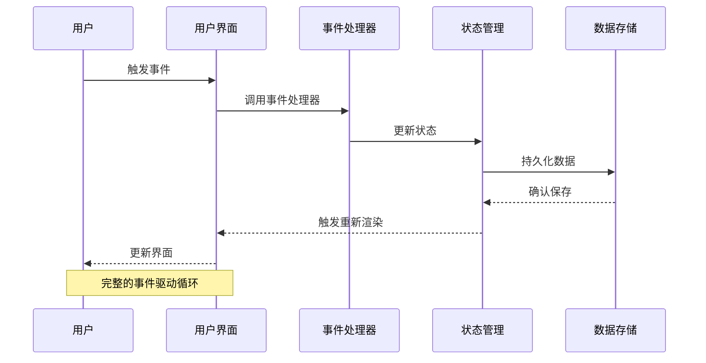

**图表来源**
- [App.tsx:39-65](file://src/App.tsx#L39-L65)
- [DiaryDialog.tsx:66-80](file://src/components/DiaryDialog.tsx#L66-L80)

**章节来源**
- [App.tsx:39-65](file://src/App.tsx#L39-L65)
- [DiaryDialog.tsx:66-80](file://src/components/DiaryDialog.tsx#L66-L80)

## 依赖关系分析

### 组件依赖关系

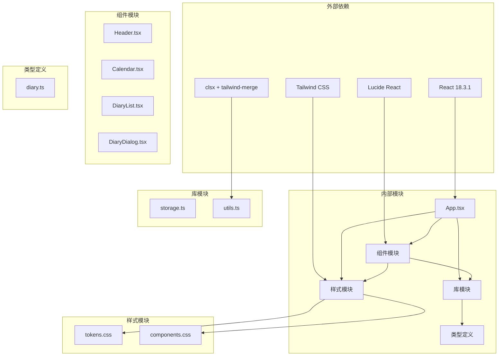

**图表来源**
- [App.tsx:1-16](file://src/App.tsx#L1-L16)
- [Calendar.tsx:1-3](file://src/components/Calendar.tsx#L1-L3)
- [DiaryDialog.tsx:1-6](file://src/components/DiaryDialog.tsx#L1-L6)
- [utils.ts:1-6](file://src/lib/utils.ts#L1-L6)

### 数据流依赖

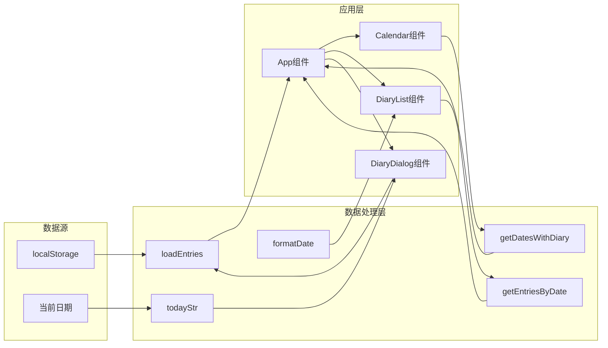

**图表来源**
- [storage.ts:5-58](file://src/lib/storage.ts#L5-L58)
- [App.tsx:8-16](file://src/App.tsx#L8-L16)
- [DiaryList.tsx:4-4](file://src/components/DiaryList.tsx#L4-L4)

**章节来源**
- [storage.ts:5-58](file://src/lib/storage.ts#L5-L58)
- [App.tsx:8-16](file://src/App.tsx#L8-L16)
- [DiaryList.tsx:4-4](file://src/components/DiaryList.tsx#L4-L4)

## 性能考虑

### Memoization优化

My-Diary充分利用了React的useMemo进行性能优化：

#### 计算属性缓存

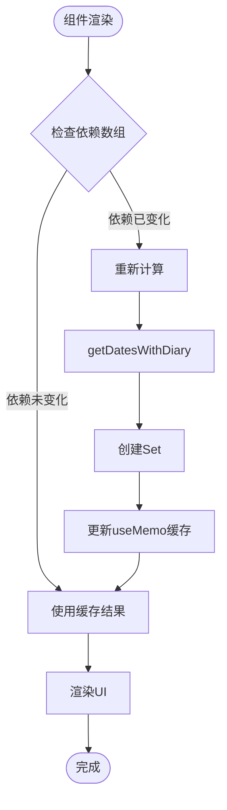

**图表来源**
- [App.tsx:26-26](file://src/App.tsx#L26-L26)
- [App.tsx:29-33](file://src/App.tsx#L29-L33)

### 事件处理优化

#### 防抖和节流策略

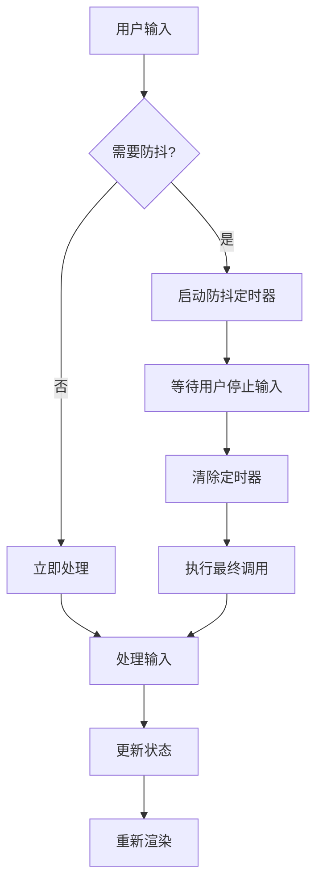

**图表来源**
- [App.tsx:35-38](file://src/App.tsx#L35-L38)

**章节来源**
- [App.tsx:26-38](file://src/App.tsx#L26-L38)

## 故障排除指南

### 常见问题及解决方案

#### 状态不同步问题

**问题描述**: 组件间状态不同步导致的数据不一致

**解决方案**:
1. 使用状态提升模式，将共享状态提升到最近的公共祖先
2. 通过回调函数确保状态更新的原子性
3. 使用useMemo避免不必要的重新计算

#### 性能问题

**问题描述**: 大量数据渲染导致的性能下降

**解决方案**:
1. 实现虚拟滚动或分页加载
2. 使用React.memo优化子组件渲染
3. 合理使用useCallback缓存函数引用

#### 数据持久化失败

**问题描述**: localStorage存储失败或数据丢失

**解决方案**:
1. 添加错误边界处理
2. 实现数据备份机制
3. 提供数据导入导出功能

**章节来源**
- [App.tsx:35-38](file://src/App.tsx#L35-L38)
- [storage.ts:5-13](file://src/lib/storage.ts#L5-L13)

## 结论

My-Diary项目成功地将多种设计模式应用于实际开发中，展现了良好的软件架构设计：

### 设计模式应用总结

1. **组件模式**: 通过清晰的组件职责划分和组合模式，实现了高内聚低耦合的架构
2. **回调函数模式**: 通过props传递回调函数，实现了组件间的松耦合通信
3. **策略模式**: 在数据处理中体现了策略模式，支持灵活的数据操作策略
4. **观察者模式**: 通过React的状态变化实现了自动化的界面更新
5. **工厂模式**: 在数据创建过程中体现了工厂模式的思想

### 最佳实践建议

1. **保持单一职责**: 每个组件只负责一个特定的功能
2. **状态集中管理**: 将共享状态提升到合适的层级
3. **合理使用缓存**: 利用useMemo和useCallback优化性能
4. **事件驱动设计**: 采用事件驱动的方式处理用户交互
5. **错误处理**: 实现完善的错误边界和异常处理机制

### 适用性分析

这些设计模式在My-Diary项目中具有很高的适用性：
- **项目规模适中**: 适合采用这些设计模式来提高代码质量
- **用户体验要求高**: 设计模式有助于提供更好的用户体验
- **可维护性要求**: 设计模式提高了代码的可维护性和可扩展性
- **团队协作需求**: 清晰的架构有利于团队协作开发

通过深入理解和应用这些设计模式，开发者可以在实际项目中构建更加健壮、可维护和高性能的应用程序。