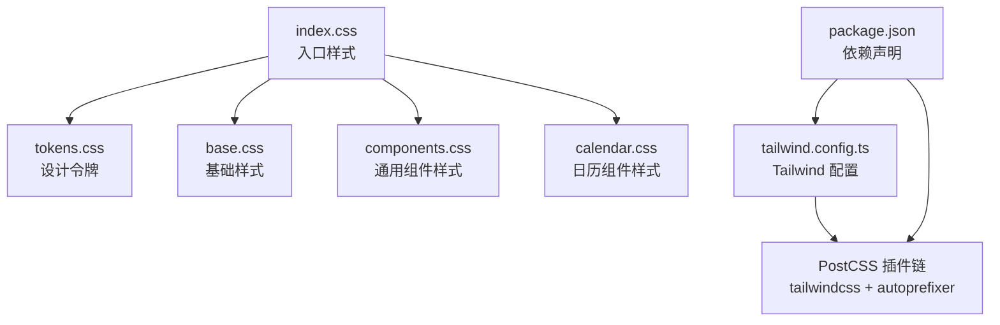
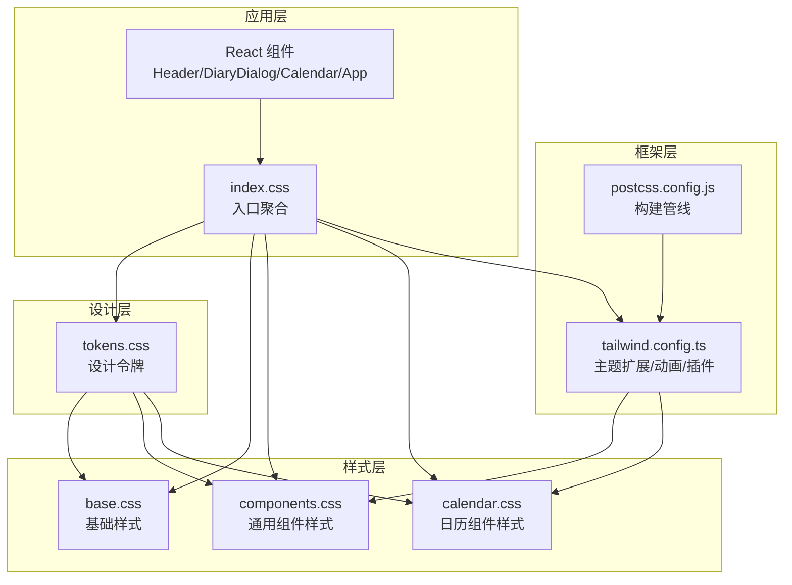
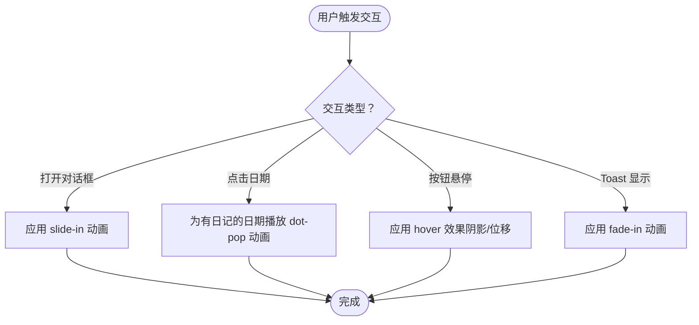
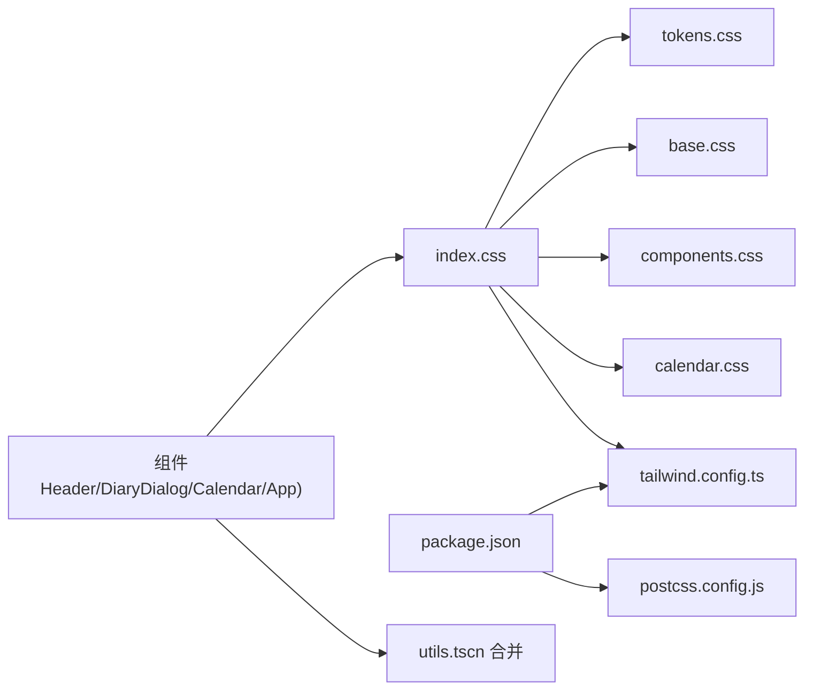

# 样式系统

<cite>
**本文引用的文件**
- [tailwind.config.ts](file://tailwind.config.ts)
- [postcss.config.js](file://postcss.config.js)
- [tokens.css](file://src/styles/tokens.css)
- [base.css](file://src/styles/base.css)
- [components.css](file://src/styles/components.css)
- [calendar.css](file://src/styles/calendar.css)
- [index.css](file://src/index.css)
- [package.json](file://package.json)
- [Header.tsx](file://src/components/Header.tsx)
- [DiaryDialog.tsx](file://src/components/DiaryDialog.tsx)
- [Calendar.tsx](file://src/components/Calendar.tsx)
- [App.tsx](file://src/App.tsx)
- [utils.ts](file://src/lib/utils.ts)
- [diary.ts](file://src/types/diary.ts)
</cite>

## 目录
1. [简介](#简介)
2. [项目结构](#项目结构)
3. [核心组件](#核心组件)
4. [架构总览](#架构总览)
5. [详细组件分析](#详细组件分析)
6. [依赖关系分析](#依赖关系分析)
7. [性能考量](#性能考量)
8. [故障排查指南](#故障排查指南)
9. [结论](#结论)
10. [附录](#附录)

## 简介
本文件系统性梳理 My-Diary 的样式系统，围绕 Tailwind CSS 配置与定制、主题变量设计与使用、样式的分层架构（全局、基础、组件、工具类）、响应式策略、动画与过渡、主题切换机制展开；并提供样式定制最佳实践、性能优化技巧与维护建议，辅以具体示例与自定义方法，帮助开发者快速理解并扩展项目的视觉设计系统。

## 项目结构
样式系统由“设计令牌 + 层级样式 + Tailwind 配置”三层构成：
- 设计令牌：集中定义颜色、圆角、阴影、渐变、过渡等变量，统一视觉语言。
- 层级样式：按 Layer 组织 base、components、utilities，确保覆盖顺序与可维护性。
- Tailwind 配置：扩展字体、颜色、圆角、阴影、动画等，引入插件增强交互体验。

图表来源
- [index.css:1-9](file://src/index.css#L1-L9)
- [tokens.css:1-69](file://src/styles/tokens.css#L1-L69)
- [base.css:1-29](file://src/styles/base.css#L1-L29)
- [components.css:1-138](file://src/styles/components.css#L1-L138)
- [calendar.css:1-57](file://src/styles/calendar.css#L1-L57)
- [tailwind.config.ts:1-102](file://tailwind.config.ts#L1-L102)
- [postcss.config.js:1-4](file://postcss.config.js#L1-L4)
- [package.json:1-30](file://package.json#L1-L30)

章节来源
- [index.css:1-9](file://src/index.css#L1-L9)
- [tailwind.config.ts:1-102](file://tailwind.config.ts#L1-L102)
- [postcss.config.js:1-4](file://postcss.config.js#L1-L4)
- [package.json:1-30](file://package.json#L1-L30)

## 核心组件
- 设计令牌（Design Tokens）
  - 定义于 tokens.css 的 :root，涵盖背景、前景、主次强调色、边框、输入、环形光晕、圆角半径、日记专属色、渐变、阴影、过渡等，通过 CSS 变量驱动主题。
  - 在 Tailwind 配置中以 hsl(var(--token)) 形式映射到颜色空间，支持明暗模式切换。
- 基础样式（Base）
  - 在 base.css 中重置边框继承、设置页面字体族、背景渐变、最小高度与抗锯齿；为滚动条提供浅色主题样式。
- 通用组件样式（Components）
  - 在 components.css 中定义卡片、主按钮、输入框、天气标签、对话框遮罩、日记条目、分页按钮等通用组件类，统一交互与视觉风格。
- 日历组件样式（Calendar）
  - 在 calendar.css 中定义日期单元格、今日高亮、选中态、非当月日期、带日记标记等状态样式，结合动画实现点状提示。
- Tailwind 配置（Theme & Plugins）
  - 在 tailwind.config.ts 中启用 class 模式暗色模式、扫描范围、容器配置、字体扩展、颜色映射、圆角与阴影扩展、关键帧与动画扩展，并引入 tailwindcss-animate 插件。

章节来源
- [tokens.css:1-69](file://src/styles/tokens.css#L1-L69)
- [base.css:1-29](file://src/styles/base.css#L1-L29)
- [components.css:1-138](file://src/styles/components.css#L1-L138)
- [calendar.css:1-57](file://src/styles/calendar.css#L1-L57)
- [tailwind.config.ts:1-102](file://tailwind.config.ts#L1-L102)

## 架构总览
样式系统采用“设计令牌驱动 + Tailwind 扩展 + 层级样式”的分层架构，确保：
- 可维护性：所有颜色与尺寸来自 tokens.css，避免硬编码。
- 可扩展性：通过 Tailwind theme.extend 添加新颜色、动画与阴影。
- 可复用性：components.css 与 calendar.css 提供可复用的组件类。
- 可定制性：通过 cn 合并工具与 Tailwind 工具类灵活组合。

图表来源
- [tokens.css:1-69](file://src/styles/tokens.css#L1-L69)
- [base.css:1-29](file://src/styles/base.css#L1-L29)
- [components.css:1-138](file://src/styles/components.css#L1-L138)
- [calendar.css:1-57](file://src/styles/calendar.css#L1-L57)
- [index.css:1-9](file://src/index.css#L1-L9)
- [tailwind.config.ts:1-102](file://tailwind.config.ts#L1-L102)
- [postcss.config.js:1-4](file://postcss.config.js#L1-L4)
- [Header.tsx:1-32](file://src/components/Header.tsx#L1-L32)
- [DiaryDialog.tsx:1-232](file://src/components/DiaryDialog.tsx#L1-L232)
- [Calendar.tsx:1-159](file://src/components/Calendar.tsx#L1-L159)
- [App.tsx:1-170](file://src/App.tsx#L1-L170)

## 详细组件分析

### 设计令牌（tokens.css）
- 设计思想
  - 使用 HSL 角度与百分比定义色彩，便于在明暗模式下通过变量切换。
  - 为日记场景新增专属色系（暖色纸张、墨水、笔迹、淡色），形成一致的阅读与书写体验。
  - 定义多组渐变与阴影，用于 Hero 区域、卡片、对话框等关键区域。
- 使用方式
  - 在 tokens.css 中集中声明变量，在 base.css、components.css、calendar.css 与组件内通过 hsl(var(--token)) 或 var(--gradient-*) 使用。
- 自定义建议
  - 如需调整主色调，优先修改 --primary 及其派生变量；如需更换字体，修改 tailwind.config.ts 的 fontFamily 扩展。

章节来源
- [tokens.css:1-69](file://src/styles/tokens.css#L1-L69)
- [tailwind.config.ts:14-55](file://tailwind.config.ts#L14-L55)

### 基础样式（base.css）
- 核心要点
  - 统一边框继承，避免重复声明。
  - 设置页面字体族与背景渐变，提升首屏质感。
  - 为滚动条提供浅色主题样式，兼顾可用性与美观。
- 与设计令牌联动
  - 背景、前景、边框等均来自 tokens.css 的变量，保证与主题一致。

章节来源
- [base.css:1-29](file://src/styles/base.css#L1-L29)
- [tokens.css:3-67](file://src/styles/tokens.css#L3-L67)

### 通用组件样式（components.css）
- 卡片（diary-card）
  - 统一背景、边框、圆角与阴影，hover 时轻微上浮与阴影增强，transition 使用统一的 --transition-base。
- 主按钮（diary-btn-primary）
  - 使用 --gradient-primary 作为背景，悬停时降低位移并增强阴影，保持稳定反馈。
- 输入框（diary-input）
  - 使用日记专属浅色背景与墨水色文本，聚焦态添加主色边框与环形光晕。
- 天气标签（weather-tag）
  - 支持普通、悬停、激活三种状态，激活态使用主色与强调色组合。
- 对话框遮罩（dialog-overlay）
  - 使用半透明背景与模糊滤镜，提升焦点与层次感。
- 日记条目（diary-item）
  - 与卡片一致的边框与阴影，hover 时强调主色边框与阴影。
- 分页按钮（page-btn）
  - 统一尺寸与过渡，激活态使用渐变与高对比文本。

章节来源
- [components.css:1-138](file://src/styles/components.css#L1-L138)
- [tokens.css:37-67](file://src/styles/tokens.css#L37-L67)

### 日历组件样式（calendar.css）
- 日期单元格（cal-day）
  - 统一尺寸、圆角与过渡；悬停态在非“其他月”与非“选中”时显示强调色背景。
- 今日高亮（cal-day--today）
  - 使用主色强调，突出当前日期。
- 选中态（cal-day--selected）
  - 使用渐变背景与高对比文本，配合阴影强化选中反馈。
- 非当月日期（cal-day--other）
  - 降低不活跃日期的可见性，避免干扰。
- 带日记标记（cal-day--has-diary）
  - 使用点状动画（dot-pop）提示该日存在日记，选中态下使用反色以保证可读性。

章节来源
- [calendar.css:1-57](file://src/styles/calendar.css#L1-L57)
- [tailwind.config.ts:66-95](file://tailwind.config.ts#L66-L95)

### Tailwind 配置（tailwind.config.ts）
- 模式与扫描
  - 启用 class 模式暗色模式，扫描 HTML 与 src 下 TS/TSX 文件，确保未使用类被清理。
- 主题扩展
  - 字体：中文字体集（Noto Sans SC、Noto Serif SC）。
  - 颜色：基于 tokens.css 的 hsl(var(--token)) 映射，含日记专属色系。
  - 圆角：基于 --radius 变量，lg/md/sm 递减。
  - 阴影：卡片、对话框、内嵌阴影等专用阴影。
  - 动画：手风琴展开/收起、淡入、滑入、点弹等关键帧与动画别名。
- 插件
  - tailwindcss-animate：提供便捷的动画工具类，减少重复定义。

章节来源
- [tailwind.config.ts:1-102](file://tailwind.config.ts#L1-L102)
- [package.json:11-28](file://package.json#L11-L28)

### PostCSS 与构建管线（postcss.config.js）
- 插件链
  - tailwindcss：解析与生成样式。
  - autoprefixer：自动添加浏览器前缀，提升兼容性。
- 与 Tailwind 的协作
  - 通过 tailwind.config.ts 的 content 控制扫描范围，确保按需生成。

章节来源
- [postcss.config.js:1-4](file://postcss.config.js#L1-L4)
- [tailwind.config.ts:4-5](file://tailwind.config.ts#L4-L5)

### React 组件中的样式使用
- Header.tsx
  - 使用 hsl(var(--token)) 与 var(--gradient-*) 实现品牌徽标与背景，配合 backdrop-blur 与半透明白底提升层级感。
- DiaryDialog.tsx
  - 使用通用组件类（diary-input、weather-tag、diary-btn-primary）与动画类（animate-slide-in、animate-fade-in）组合，实现一致的交互体验。
- Calendar.tsx
  - 使用 cal-day 及其变体类（--today、--selected、--other、--has-diary）与 cn 合并工具，动态组合类名。
- App.tsx
  - 在根容器与欢迎横幅中直接使用 var(--gradient-*) 与 hsl(var(--token))，确保整体背景与卡片阴影一致。

章节来源
- [Header.tsx:1-32](file://src/components/Header.tsx#L1-L32)
- [DiaryDialog.tsx:1-232](file://src/components/DiaryDialog.tsx#L1-L232)
- [Calendar.tsx:1-159](file://src/components/Calendar.tsx#L1-L159)
- [App.tsx:1-170](file://src/App.tsx#L1-L170)
- [utils.ts:1-7](file://src/lib/utils.ts#L1-L7)

### 动画与过渡流程

图表来源
- [tailwind.config.ts:66-95](file://tailwind.config.ts#L66-L95)
- [DiaryDialog.tsx:84-94](file://src/components/DiaryDialog.tsx#L84-L94)
- [Calendar.tsx:40-51](file://src/components/Calendar.tsx#L40-L51)
- [App.tsx:135-142](file://src/App.tsx#L135-L142)

## 依赖关系分析
- 样式入口
  - index.css 聚合 tokens.css、base.css、components.css、calendar.css，并引入 Tailwind 的 base、components、utilities 三个 Layer。
- 构建链路
  - package.json 声明 tailwindcss、autoprefixer、tailwindcss-animate 等依赖；postcss.config.js 配置插件链；tailwind.config.ts 提供主题与扫描范围。
- 组件与样式的耦合
  - 组件通过类名（通用组件类 + Tailwind 工具类）与 cn 合并工具实现样式组合；同时直接使用 tokens.css 的 CSS 变量以获得更强的一致性与可定制性。

图表来源
- [index.css:1-9](file://src/index.css#L1-L9)
- [tokens.css:1-69](file://src/styles/tokens.css#L1-L69)
- [base.css:1-29](file://src/styles/base.css#L1-L29)
- [components.css:1-138](file://src/styles/components.css#L1-L138)
- [calendar.css:1-57](file://src/styles/calendar.css#L1-L57)
- [tailwind.config.ts:1-102](file://tailwind.config.ts#L1-L102)
- [postcss.config.js:1-4](file://postcss.config.js#L1-L4)
- [package.json:1-30](file://package.json#L1-L30)
- [utils.ts:1-7](file://src/lib/utils.ts#L1-L7)
- [Header.tsx:1-32](file://src/components/Header.tsx#L1-L32)
- [DiaryDialog.tsx:1-232](file://src/components/DiaryDialog.tsx#L1-L232)
- [Calendar.tsx:1-159](file://src/components/Calendar.tsx#L1-L159)
- [App.tsx:1-170](file://src/App.tsx#L1-L170)

章节来源
- [index.css:1-9](file://src/index.css#L1-L9)
- [package.json:1-30](file://package.json#L1-L30)
- [utils.ts:1-7](file://src/lib/utils.ts#L1-L7)

## 性能考量
- 按需生成与清理
  - tailwind.config.ts 的 content 控制扫描范围，避免生成冗余样式；class 模式暗色模式仅在需要时生效。
- 变量驱动与复用
  - tokens.css 的变量统一管理颜色与尺寸，减少重复定义与体积膨胀。
- 动画与过渡
  - 使用 CSS 变量与 tailwindcss-animate 插件，避免在组件内重复定义关键帧，提升复用性与体积控制。
- 构建优化
  - PostCSS 自动前缀与 Tailwind 按需生成，配合 Vite 快速热更新与生产构建。

章节来源
- [tailwind.config.ts:4-5](file://tailwind.config.ts#L4-L5)
- [postcss.config.js:1-4](file://postcss.config.js#L1-L4)
- [tokens.css:3-67](file://src/styles/tokens.css#L3-L67)

## 故障排查指南
- 样式未生效或覆盖异常
  - 检查 index.css 的 Layer 顺序是否正确（base → components → utilities）。
  - 确认 tokens.css 是否被正确导入且变量值有效。
- 动画不生效
  - 确认 tailwind.config.ts 的 keyframes 与 animation 是否正确定义，且组件中使用了正确的动画类名。
- 暗色模式无效
  - 确认 HTML 或根元素上已添加暗色模式 class，Tailwind 配置中 darkMode 已设为 class。
- 类名冲突或堆叠过多
  - 使用 utils.ts 中的 cn 合并工具，避免重复类名与冲突；必要时拆分组件类，减少复杂组合。

章节来源
- [index.css:6-9](file://src/index.css#L6-L9)
- [tailwind.config.ts:4-98](file://tailwind.config.ts#L4-L98)
- [utils.ts:1-7](file://src/lib/utils.ts#L1-L7)

## 结论
My-Diary 的样式系统以设计令牌为核心，通过 Tailwind CSS 的主题扩展与层级样式组织，实现了高一致性、强可复用与易维护的视觉体系。配合动画与过渡、渐变与阴影，营造出温暖、舒适的阅读与书写体验。遵循本文的最佳实践与维护建议，可进一步提升开发效率与产品质感。

## 附录

### 响应式设计策略
- 移动优先：在 tokens.css 与组件样式中优先考虑小屏表现，再通过 Tailwind 工具类在大屏扩展。
- 组件断点：在组件中使用 sm、md、lg 等断点类控制布局与间距，确保在不同设备上的可读性与可用性。
- 字体与排版：在 base.css 中统一字体族，配合组件内语义化标题与段落，保证层次清晰。

章节来源
- [base.css:14-16](file://src/styles/base.css#L14-L16)
- [Header.tsx:20-26](file://src/components/Header.tsx#L20-L26)
- [App.tsx:78-123](file://src/App.tsx#L78-L123)

### 主题切换机制
- 模式控制
  - Tailwind 配置启用 class 模式暗色模式，通过在根元素添加或移除对应 class 切换主题。
- 变量驱动
  - tokens.css 中的颜色变量随模式变化而改变，组件通过 hsl(var(--token)) 与 var(--gradient-*) 获取最新值。
- 扩展建议
  - 可在应用入口监听系统偏好或用户设置，动态切换 class 并持久化选择。

章节来源
- [tailwind.config.ts:4-5](file://tailwind.config.ts#L4-L5)
- [tokens.css:3-67](file://src/styles/tokens.css#L3-L67)

### 样式定制最佳实践
- 使用 tokens.css 管理所有设计变量，避免硬编码颜色与尺寸。
- 优先使用组件类（components.css、calendar.css）与 Tailwind 工具类组合，减少重复定义。
- 使用 cn 合并工具处理条件类名，避免类名冲突与冗余。
- 通过 tailwind.config.ts 扩展颜色、动画与阴影，保持全局一致性。
- 在组件中直接使用 CSS 变量（如 var(--gradient-*)）以获得更强的可定制性与主题联动。

章节来源
- [components.css:1-138](file://src/styles/components.css#L1-L138)
- [calendar.css:1-57](file://src/styles/calendar.css#L1-L57)
- [utils.ts:1-7](file://src/lib/utils.ts#L1-L7)
- [tailwind.config.ts:13-95](file://tailwind.config.ts#L13-L95)

### 动画与过渡配置
- 关键帧与动画别名
  - accordion-down/up、fade-in、slide-in、dot-pop 等已在 tailwind.config.ts 中定义，组件可直接使用对应动画类。
- 组件使用示例
  - 对话框使用 slide-in，Toast 使用 fade-in，日历的“有日记”使用 dot-pop。
- 自定义建议
  - 如需新增动画，先在 keyframes 中定义，再在 animation 中绑定别名，最后在组件中使用。

章节来源
- [tailwind.config.ts:66-95](file://tailwind.config.ts#L66-L95)
- [DiaryDialog.tsx:89-94](file://src/components/DiaryDialog.tsx#L89-L94)
- [Calendar.tsx:40-51](file://src/components/Calendar.tsx#L40-L51)
- [App.tsx:135-142](file://src/App.tsx#L135-L142)