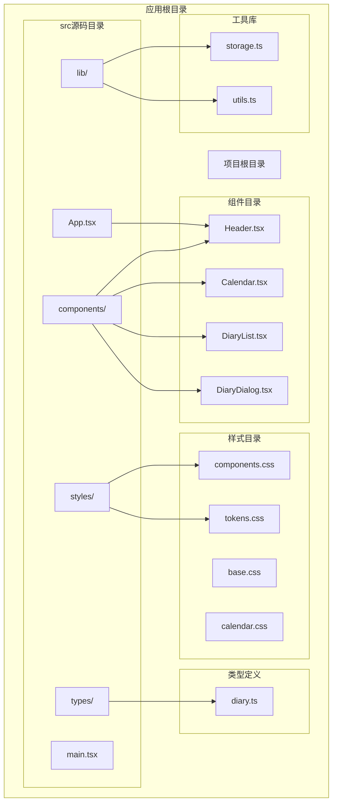
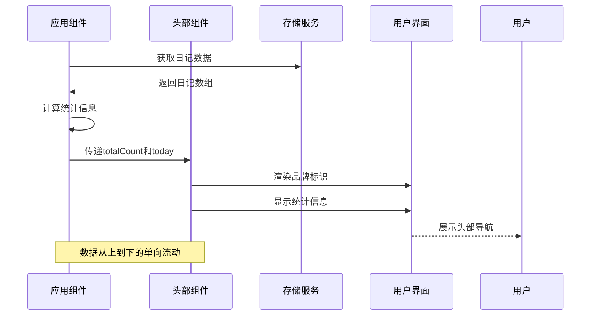
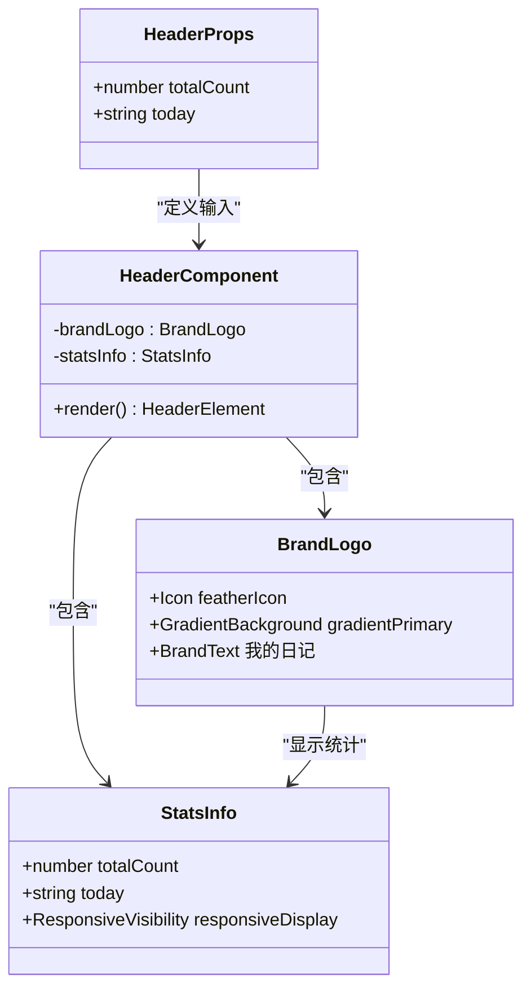
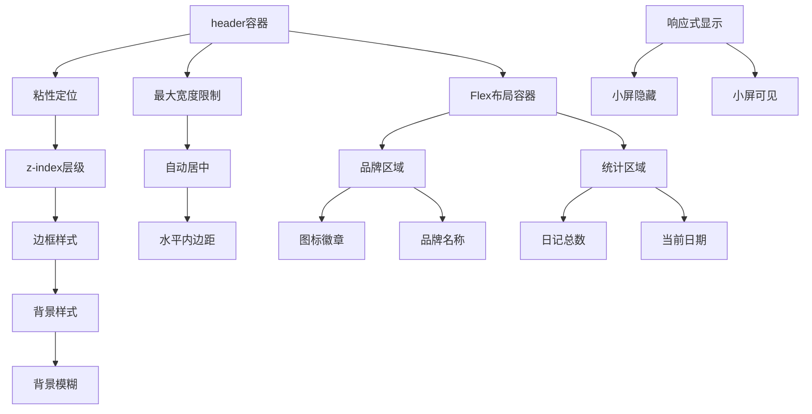
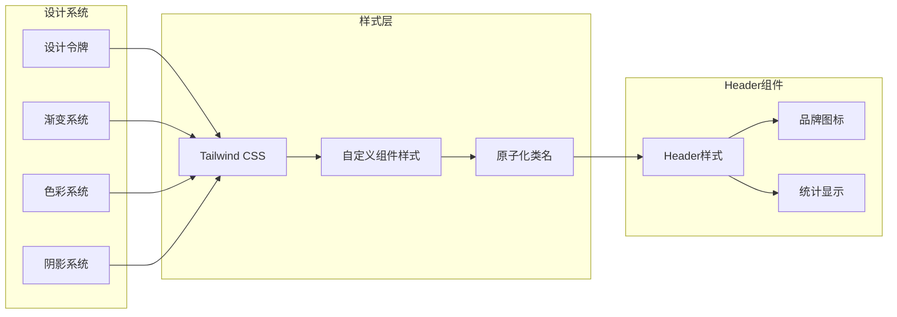
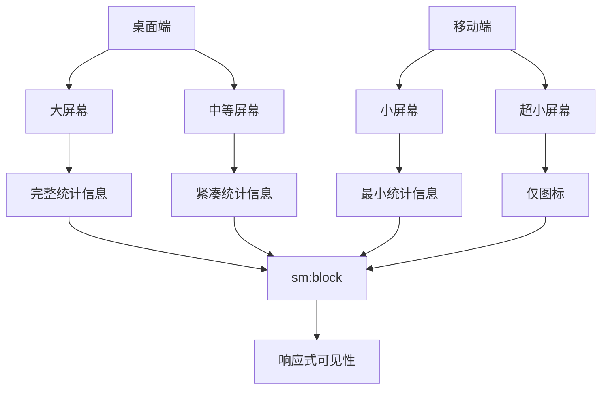
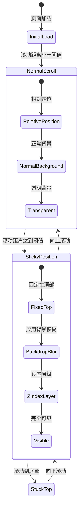
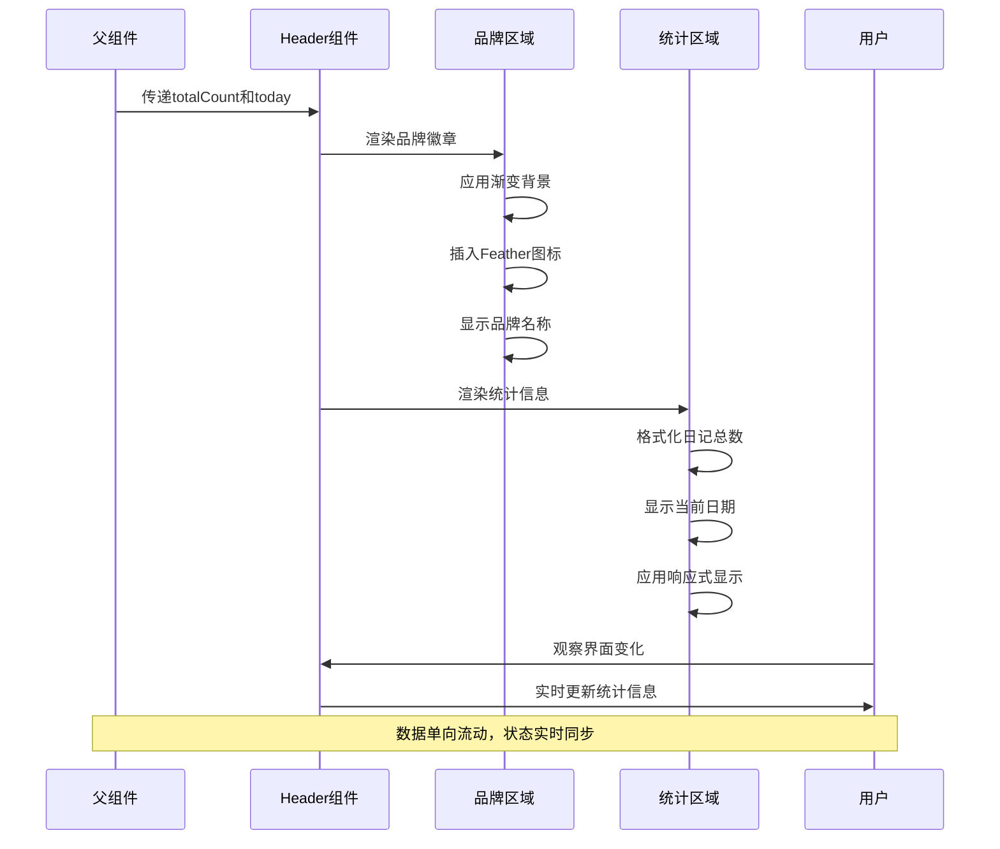
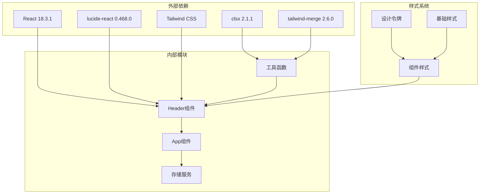

# 头部导航组件

<cite>
**本文档引用的文件**
- [Header.tsx](file://src/components/Header.tsx)
- [App.tsx](file://src/App.tsx)
- [components.css](file://src/styles/components.css)
- [tokens.css](file://src/styles/tokens.css)
- [diary.ts](file://src/types/diary.ts)
- [utils.ts](file://src/lib/utils.ts)
- [tailwind.config.ts](file://tailwind.config.ts)
- [package.json](file://package.json)
</cite>

## 目录
1. [简介](#简介)
2. [项目结构](#项目结构)
3. [核心组件](#核心组件)
4. [架构概览](#架构概览)
5. [详细组件分析](#详细组件分析)
6. [依赖关系分析](#依赖关系分析)
7. [性能考虑](#性能考虑)
8. [故障排除指南](#故障排除指南)
9. [结论](#结论)

## 简介

Header头部导航组件是My Diary日记应用的核心界面元素，负责显示应用的品牌标识、统计信息和当前日期。该组件采用现代化的响应式设计，集成了粘性定位和背景模糊效果，为用户提供流畅的视觉体验。

组件通过TypeScript接口定义了清晰的Props接口，支持动态传入日记总数和当前日期等状态信息。整体设计遵循渐变色彩系统和原子化CSS类名原则，确保了良好的可维护性和扩展性。

## 项目结构

My Diary项目采用模块化的组件架构，Header组件位于components目录中，与应用的主要逻辑分离。项目使用React 18作为核心框架，配合Tailwind CSS进行样式管理，实现了高度模块化的前端架构。

**图表来源**
- [Header.tsx:1-32](file://src/components/Header.tsx#L1-L32)
- [App.tsx:1-170](file://src/App.tsx#L1-L170)

**章节来源**
- [Header.tsx:1-32](file://src/components/Header.tsx#L1-L32)
- [App.tsx:1-170](file://src/App.tsx#L1-L170)

## 核心组件

Header组件是一个纯函数式组件，接收两个关键属性：
- `totalCount`: number 类型，表示日记条目的总数
- `today`: string 类型，表示当前日期字符串

组件内部实现了完整的品牌标识展示，包括定制的图标徽章和品牌名称。统计信息区域动态显示日记总数和当前日期，支持响应式显示控制。

**章节来源**
- [Header.tsx:3-6](file://src/components/Header.tsx#L3-L6)
- [Header.tsx:8-31](file://src/components/Header.tsx#L8-L31)

## 架构概览

Header组件在整个应用架构中扮演着关键的角色，作为应用的顶部导航栏，它与主应用组件紧密协作，实现了状态的单向数据流。

**图表来源**
- [App.tsx:18-75](file://src/App.tsx#L18-L75)
- [Header.tsx:8-31](file://src/components/Header.tsx#L8-L31)

**章节来源**
- [App.tsx:18-75](file://src/App.tsx#L18-L75)
- [Header.tsx:8-31](file://src/components/Header.tsx#L8-L31)

## 详细组件分析

### Props接口定义

Header组件的Props接口设计简洁而功能明确，采用了TypeScript的强类型约束：

**图表来源**
- [Header.tsx:3-6](file://src/components/Header.tsx#L3-L6)
- [Header.tsx:12-26](file://src/components/Header.tsx#L12-L26)

组件的Props接口具有以下特点：
- 类型安全：使用TypeScript确保参数类型正确
- 最小化：只包含必要的状态信息
- 明确性：每个属性都有清晰的用途定义

**章节来源**
- [Header.tsx:3-6](file://src/components/Header.tsx#L3-L6)

### 组件结构设计

Header组件采用了语义化的HTML结构，确保了良好的可访问性和SEO优化：

**图表来源**
- [Header.tsx:10-29](file://src/components/Header.tsx#L10-L29)

组件结构的关键特性：
- **粘性定位**：使用`sticky top-0`实现滚动时的固定效果
- **层级管理**：通过`z-40`确保头部在其他内容之上
- **响应式布局**：利用`hidden sm:block`实现不同屏幕尺寸的显示控制
- **居中对齐**：通过`max-w-6xl mx-auto`实现内容居中

**章节来源**
- [Header.tsx:10-29](file://src/components/Header.tsx#L10-L29)

### 样式系统集成

Header组件深度集成了Tailwind CSS和自定义设计令牌系统，实现了统一的视觉风格：

**图表来源**
- [tokens.css:44-55](file://src/styles/tokens.css#L44-L55)
- [tailwind.config.ts:18-55](file://src/styles/tokens.css#L18-L55)

样式系统的核心优势：
- **一致性**：通过设计令牌确保所有组件使用相同的色彩和间距
- **可维护性**：集中式的样式管理减少了重复代码
- **可扩展性**：模块化的样式结构便于添加新功能

**章节来源**
- [tokens.css:44-55](file://src/styles/tokens.css#L44-L55)
- [tailwind.config.ts:18-55](file://src/styles/tokens.css#L18-L55)

### 响应式布局实现

Header组件实现了完整的响应式设计，能够适应不同屏幕尺寸的设备：

**图表来源**
- [Header.tsx:20-26](file://src/components/Header.tsx#L20-L26)

响应式策略的具体实现：
- **断点控制**：使用`sm:`前缀实现小屏隐藏，大屏显示
- **弹性布局**：通过Flexbox实现内容的智能排列
- **字体缩放**：使用`text-xs`确保在小屏幕上的可读性

**章节来源**
- [Header.tsx:20-26](file://src/components/Header.tsx#L20-L26)

### 粘性定位和背景模糊效果

Header组件实现了先进的视觉效果，包括粘性定位和背景模糊：

**图表来源**
- [Header.tsx:10](file://src/components/Header.tsx#L10)

这些效果的技术实现：
- **粘性定位**：`sticky top-0`确保组件在滚动时保持在视窗顶部
- **背景模糊**：`backdrop-blur-md`实现毛玻璃效果
- **半透明背景**：`bg-[hsl(var(--background)/0.85)]`提供柔和的遮罩
- **层级管理**：`z-40`确保头部始终在其他内容之上

**章节来源**
- [Header.tsx:10](file://src/components/Header.tsx#L10)

### 品牌标识和统计信息渲染

Header组件的渲染逻辑体现了精心设计的用户体验：

**图表来源**
- [App.tsx:71-75](file://src/App.tsx#L71-L75)
- [Header.tsx:12-26](file://src/components/Header.tsx#L12-L26)

渲染流程的关键细节：
- **品牌徽章**：使用CSS变量`var(--gradient-primary)`实现动态渐变
- **图标系统**：集成Lucide React的Feather图标，提供矢量图形
- **文本处理**：使用`font-serif`和`tracking-wide`增强品牌感
- **状态同步**：通过props传递实现父子组件间的数据通信

**章节来源**
- [App.tsx:71-75](file://src/App.tsx#L71-L75)
- [Header.tsx:12-26](file://src/components/Header.tsx#L12-L26)

## 依赖关系分析

Header组件的依赖关系相对简单但功能完整，主要依赖于外部库和内部模块：

**图表来源**
- [package.json:11-17](file://package.json#L11-L17)
- [Header.tsx:1](file://src/components/Header.tsx#L1)

依赖关系的特点：
- **轻量级**：仅依赖必要的外部库，减少包体积
- **类型安全**：通过TypeScript确保依赖的正确使用
- **模块化**：清晰的模块边界便于测试和维护

**章节来源**
- [package.json:11-17](file://package.json#L11-L17)
- [Header.tsx:1](file://src/components/Header.tsx#L1)

## 性能考虑

Header组件在设计时充分考虑了性能优化，采用了多种策略确保最佳的用户体验：

### 渲染优化
- **纯函数组件**：避免不必要的状态管理开销
- **最小化DOM节点**：通过合理的结构设计减少DOM层次
- **CSS动画**：使用硬件加速的CSS属性实现流畅动画

### 内存管理
- **无状态设计**：不维护本地状态，减少内存占用
- **事件处理**：通过父组件传递回调函数，避免事件监听器泄漏

### 加载性能
- **按需加载**：图标组件按需加载，减少初始包大小
- **缓存策略**：利用浏览器缓存机制提升二次加载速度

## 故障排除指南

### 常见问题及解决方案

**问题1：粘性定位失效**
- **症状**：滚动时头部不跟随页面移动
- **原因**：CSS变量未正确配置或z-index层级冲突
- **解决**：检查`--background`和`--border`变量定义，确认z-index值

**问题2：背景模糊效果异常**
- **症状**：背景模糊效果不生效或显示异常
- **原因**：浏览器兼容性或CSS属性拼写错误
- **解决**：验证`backdrop-blur-md`类名正确性，检查浏览器支持情况

**问题3：响应式显示问题**
- **症状**：统计信息在某些屏幕尺寸下显示异常
- **原因**：断点设置不当或媒体查询冲突
- **解决**：调整`hidden sm:block`类名的断点配置

**问题4：图标显示问题**
- **症状**：Feather图标不显示或显示异常
- **原因**：Lucide React版本不兼容或图标导入错误
- **解决**：检查lucide-react版本，确认图标导入路径

**章节来源**
- [Header.tsx:10-29](file://src/components/Header.tsx#L10-L29)
- [tokens.css:44-55](file://src/styles/tokens.css#L44-L55)

## 结论

Header头部导航组件展现了现代React应用开发的最佳实践。通过精心设计的Props接口、响应式布局和先进的视觉效果，该组件为My Diary应用提供了优秀的用户体验。

组件的核心优势包括：
- **类型安全**：完整的TypeScript支持确保开发时的类型安全
- **响应式设计**：适配各种屏幕尺寸，提供一致的用户体验
- **性能优化**：轻量级实现和高效的渲染策略
- **可维护性**：模块化的架构便于后续扩展和维护

该组件的设计思路为类似的应用提供了很好的参考模板，展示了如何在保持简洁的同时实现丰富的功能和良好的用户体验。