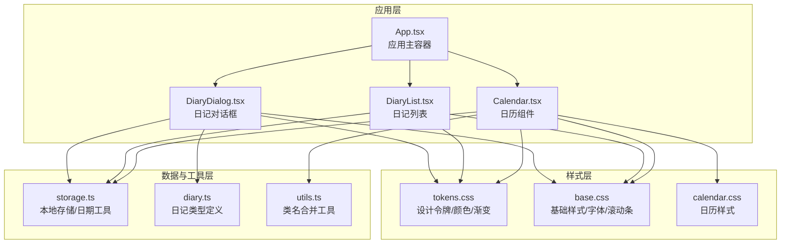
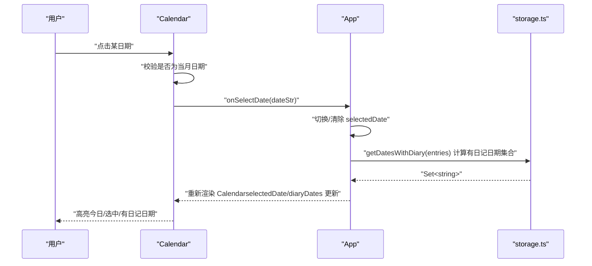
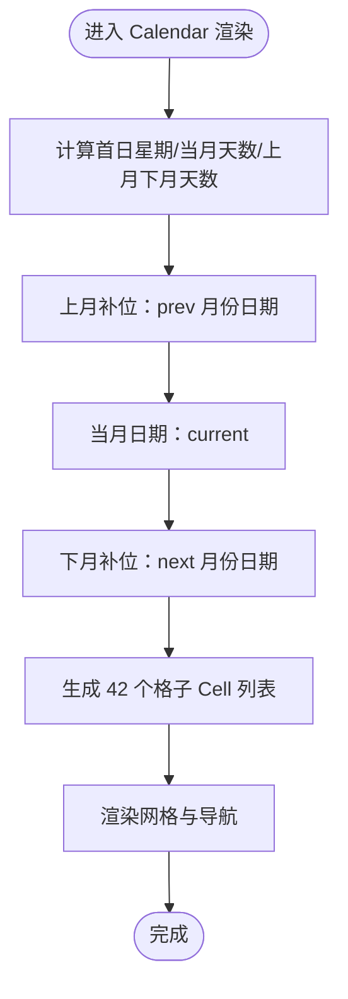
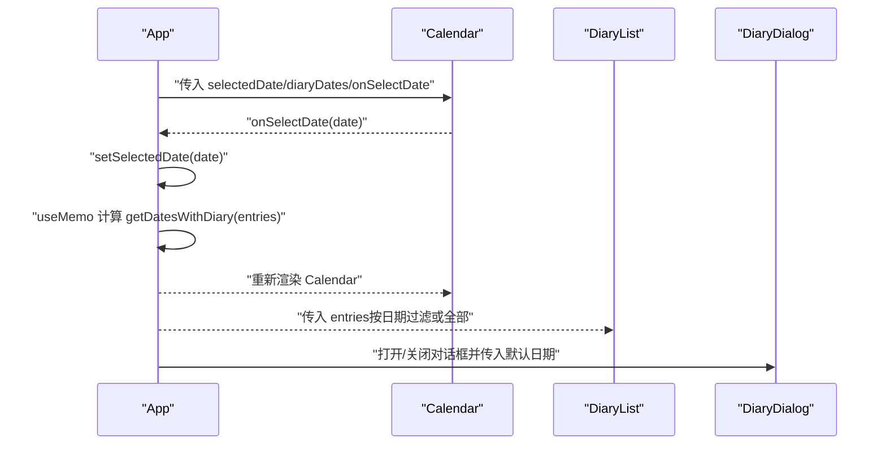
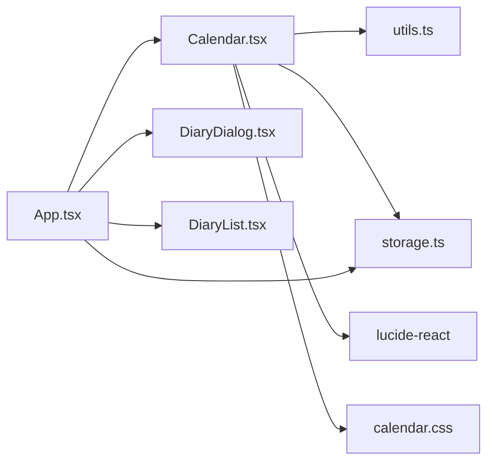

# 日历组件

<cite>
**本文引用的文件**
- [Calendar.tsx](file://src/components/Calendar.tsx)
- [App.tsx](file://src/App.tsx)
- [storage.ts](file://src/lib/storage.ts)
- [utils.ts](file://src/lib/utils.ts)
- [diary.ts](file://src/types/diary.ts)
- [calendar.css](file://src/styles/calendar.css)
- [tokens.css](file://src/styles/tokens.css)
- [base.css](file://src/styles/base.css)
- [DiaryList.tsx](file://src/components/DiaryList.tsx)
- [DiaryDialog.tsx](file://src/components/DiaryDialog.tsx)
</cite>

## 目录
1. [简介](#简介)
2. [项目结构](#项目结构)
3. [核心组件](#核心组件)
4. [架构总览](#架构总览)
5. [详细组件分析](#详细组件分析)
6. [依赖关系分析](#依赖关系分析)
7. [性能考量](#性能考量)
8. [故障排查指南](#故障排查指南)
9. [结论](#结论)
10. [附录](#附录)

## 简介
本技术文档围绕 Calendar 日历组件展开，系统性解析其日期计算算法、月份导航机制、日期选择事件处理与日记标记功能；深入阐述组件的状态管理策略、日期格式化处理、用户交互响应与视觉反馈机制；提供组件的完整 Props 接口说明、事件回调定义与使用示例，并总结日历渲染优化技巧、性能考虑因素以及常见问题的解决方案。

## 项目结构
日历组件位于 src/components/Calendar.tsx，与应用主入口 App.tsx 协作，通过 storage.ts 提供的日记数据与日期工具函数进行数据驱动渲染。样式方面，日历格子与交互态由 calendar.css 定义，整体设计令牌与渐变色由 tokens.css 提供，基础字体与滚动条由 base.css 统一。

图表来源
- [Calendar.tsx:1-159](file://src/components/Calendar.tsx#L1-L159)
- [App.tsx:1-170](file://src/App.tsx#L1-L170)
- [storage.ts:1-58](file://src/lib/storage.ts#L1-L58)
- [diary.ts:1-22](file://src/types/diary.ts#L1-L22)
- [utils.ts:1-7](file://src/lib/utils.ts#L1-L7)
- [calendar.css:1-57](file://src/styles/calendar.css#L1-L57)
- [tokens.css:1-69](file://src/styles/tokens.css#L1-L69)
- [base.css:1-29](file://src/styles/base.css#L1-L29)

章节来源
- [Calendar.tsx:1-159](file://src/components/Calendar.tsx#L1-L159)
- [App.tsx:1-170](file://src/App.tsx#L1-L170)
- [storage.ts:1-58](file://src/lib/storage.ts#L1-L58)
- [diary.ts:1-22](file://src/types/diary.ts#L1-L22)
- [utils.ts:1-7](file://src/lib/utils.ts#L1-L7)
- [calendar.css:1-57](file://src/styles/calendar.css#L1-L57)
- [tokens.css:1-69](file://src/styles/tokens.css#L1-L69)
- [base.css:1-29](file://src/styles/base.css#L1-L29)

## 核心组件
- Calendar 日历组件：负责渲染日历网格、处理月份导航、根据 selectedDate 与 diaryDates 状态高亮今日、选中日期与带日记的日期，并触发 onSelectDate 回调。
- App 应用主容器：维护 entries、selectedDate、dialogOpen 等状态，计算 diaryDates 并传递给 Calendar；处理日期选择、保存/更新日记等业务逻辑。
- storage.ts：提供本地存储、日期格式化、生成 ID、计算“有日记的日期集合”等工具方法。
- utils.ts：提供 cn 类名合并工具，统一 Tailwind 与 clsx 的类名处理。
- diary.ts：定义天气类型与日记实体结构，提供天气选项。
- calendar.css：定义日历格子的尺寸、交互态、今日/选中/其他月份/有日记标记等样式。
- tokens.css/base.css：提供全局设计令牌、颜色变量、渐变与基础排版。

章节来源
- [Calendar.tsx:1-159](file://src/components/Calendar.tsx#L1-L159)
- [App.tsx:1-170](file://src/App.tsx#L1-L170)
- [storage.ts:1-58](file://src/lib/storage.ts#L1-L58)
- [utils.ts:1-7](file://src/lib/utils.ts#L1-L7)
- [diary.ts:1-22](file://src/types/diary.ts#L1-L22)
- [calendar.css:1-57](file://src/styles/calendar.css#L1-L57)
- [tokens.css:1-69](file://src/styles/tokens.css#L1-L69)
- [base.css:1-29](file://src/styles/base.css#L1-L29)

## 架构总览
Calendar 作为纯展示型组件，接收外部传入的 selectedDate、diaryDates 与 onSelectDate，内部仅维护视图年月（viewYear/viewMonth）。App 通过 useMemo 计算 diaryDates，将当前选中日期与日记集合传递给 Calendar，从而实现“点击日历日期 -> 切换筛选 -> 展示对应日记”的闭环。

图表来源
- [Calendar.tsx:17-159](file://src/components/Calendar.tsx#L17-L159)
- [App.tsx:25-70](file://src/App.tsx#L25-L70)
- [storage.ts:37-39](file://src/lib/storage.ts#L37-L39)

## 详细组件分析

### Calendar 组件
- Props 接口
  - selectedDate: string | null —— 当前选中的日期字符串（'YYYY-MM-DD'）
  - diaryDates: Set<string> —— 有日记的日期集合
  - onSelectDate: (date: string) => void —— 日期选择回调
- 状态管理
  - 使用 useState 维护 viewYear/viewMonth，控制当前显示的月份视图
  - 通过 toDateStr 统一生成日期字符串，避免格式不一致
- 日期计算与网格构建
  - 计算当月第一天是星期几（firstDay），上月补位数量为 firstDay - 1
  - 计算当月天数与下月补位数量，确保 6 行 7 列共 42 个格子
  - 为每个格子标注 day/type/dateStr，type 区分 prev/current/next
- 交互与视觉反馈
  - 导航按钮：上月/下月/goToday；goToday 将视图重置到今天
  - 格子样式：根据 isOther/isToday/isSelected/hasDiary/isWeekend 动态类名
  - 有日记日期通过伪元素在底部绘制小圆点标记，选中态下该标记颜色调整
- 无障碍与可访问性
  - 导航按钮提供 aria-label
  - 通过禁用非当月日期按钮阻止无效交互

图表来源
- [Calendar.tsx:40-66](file://src/components/Calendar.tsx#L40-L66)

章节来源
- [Calendar.tsx:5-159](file://src/components/Calendar.tsx#L5-L159)
- [calendar.css:4-56](file://src/styles/calendar.css#L4-L56)

### App 与日历联动
- 状态与计算
  - entries 来源于本地存储，通过 useMemo 计算 diaryDates，避免每次渲染都重建 Set
  - selectedDate 控制日历选中态与右侧日记列表筛选
- 事件处理
  - handleSelectDate：切换或清除选中日期
  - 通过 DiaryList 与 DiaryDialog 实现日记的增删改查
- 与 Calendar 的集成
  - Calendar 接收 selectedDate、diaryDates、onSelectDate
  - 选中日期变化后，右侧 DiaryList 自动按日期过滤显示

图表来源
- [App.tsx:18-145](file://src/App.tsx#L18-L145)
- [storage.ts:37-43](file://src/lib/storage.ts#L37-L43)

章节来源
- [App.tsx:18-145](file://src/App.tsx#L18-L145)
- [storage.ts:37-43](file://src/lib/storage.ts#L37-L43)

### 日期格式化与工具
- todayStr：生成今天的日期字符串（'YYYY-MM-DD'）
- formatDate：将日期字符串格式化为中文长日期（年-月-日 星期）
- getDatesWithDiary：从 entries 中提取所有日期，返回 Set 用于快速判断某日期是否有日记
- generateId：生成唯一日记 ID

章节来源
- [storage.ts:45-58](file://src/lib/storage.ts#L45-L58)

### 样式与主题
- 设计令牌：tokens.css 定义了主色、次色、强调色、日记专属色值与多处渐变
- 日历样式：calendar.css 定义了 cal-day 及其交互态（hover、today、selected、other、has-diary），并通过伪元素实现“有日记”标记动画
- 基础样式：base.css 设置全局字体、滚动条与背景渐变

章节来源
- [tokens.css:1-69](file://src/styles/tokens.css#L1-L69)
- [calendar.css:1-57](file://src/styles/calendar.css#L1-L57)
- [base.css:1-29](file://src/styles/base.css#L1-L29)

## 依赖关系分析
- Calendar 依赖
  - utils.ts：cn 类名合并工具
  - storage.ts：toDateStr（内部使用）、todayStr（用于 todayStr）
  - lucide-react：ChevronLeft/ChevronRight 图标
  - tokens.css/base.css：颜色与渐变变量
- App 与 Calendar 的耦合
  - App 通过 props 向 Calendar 注入 selectedDate、diaryDates、onSelectDate
  - App 通过 useMemo 将 diaryDates 作为稳定依赖注入，降低 Calendar 重渲染频率
- 与 DiaryList/DiaryDialog 的协作
  - App 负责状态管理与数据流，Calendar 仅负责展示与交互

图表来源
- [Calendar.tsx:1-4](file://src/components/Calendar.tsx#L1-L4)
- [App.tsx:1-16](file://src/App.tsx#L1-L16)
- [storage.ts:1-17](file://src/lib/storage.ts#L1-L17)
- [utils.ts:1-7](file://src/lib/utils.ts#L1-L7)

章节来源
- [Calendar.tsx:1-159](file://src/components/Calendar.tsx#L1-L159)
- [App.tsx:1-170](file://src/App.tsx#L1-L170)
- [storage.ts:1-58](file://src/lib/storage.ts#L1-L58)
- [utils.ts:1-7](file://src/lib/utils.ts#L1-L7)

## 性能考量
- 渲染优化
  - Calendar 内部仅维护 viewYear/viewMonth 两个状态，避免不必要的深层重渲染
  - App 使用 useMemo 计算 diaryDates，减少 Set 重建成本与依赖变更
- 数据结构
  - diaryDates 使用 Set<string>，contains 操作 O(1)，提升标记效率
- DOM 结构
  - 42 个格子一次性渲染，避免频繁插入/删除节点
- 交互反馈
  - hover、selected 等状态切换使用 CSS 过渡，避免 JS 动画带来的卡顿
- 建议
  - 若 entries 规模较大，可在 App 层对 entries 做分页或懒加载
  - 如需支持跨月滚动，可考虑虚拟化列表（当前场景下无需）

[本节为通用性能建议，不直接分析具体文件]

## 故障排查指南
- 日期未正确高亮
  - 检查 selectedDate 是否为 'YYYY-MM-DD' 格式且与 cells.dateStr 一致
  - 确认 App 传入的 diaryDates 是通过 getDatesWithDiary(entries) 计算得到的 Set
- “有日记”标记不显示
  - 确认 calendar.css 中 .cal-day--has-diary 伪元素规则存在且未被覆盖
  - 确认 hasDiary 条件为 true（diaryDates.has(dateStr)）
- 导航异常
  - prevMonth/nextMonth 边界处理：1 月减一年/12 月加一年；确认 viewMonth 与 viewYear 同步更新
- 无障碍问题
  - 导航按钮应具备 aria-label；若屏幕阅读器无法识别，请检查 aria-label 是否正确设置

章节来源
- [Calendar.tsx:24-37](file://src/components/Calendar.tsx#L24-L37)
- [Calendar.tsx:115-140](file://src/components/Calendar.tsx#L115-L140)
- [storage.ts:37-39](file://src/lib/storage.ts#L37-L39)

## 结论
Calendar 日历组件通过简洁的状态管理与高效的日期计算，实现了直观的月份导航、精确的日期选择与“有日记”标记功能。配合 App 的数据流与样式系统，形成从交互到视觉的一体化体验。建议在大规模数据场景下进一步引入缓存与分页策略，以保持界面流畅。

[本节为总结性内容，不直接分析具体文件]

## 附录

### Props 接口与事件
- Calendar Props
  - selectedDate: string | null
  - diaryDates: Set<string>
  - onSelectDate: (date: string) => void
- 事件回调
  - onSelectDate(date: string)：当用户点击当月日期时触发，传入日期字符串

章节来源
- [Calendar.tsx:5-9](file://src/components/Calendar.tsx#L5-L9)

### 使用示例（步骤说明）
- 在 App 中维护 entries 与 selectedDate
- 通过 useMemo 计算 diaryDates：const diaryDates = useMemo(() => getDatesWithDiary(entries), [entries])
- 将 selectedDate、diaryDates、onSelectDate 传入 Calendar
- 在 onSelectDate 中切换 selectedDate，从而驱动右侧 DiaryList 的筛选

章节来源
- [App.tsx:19-70](file://src/App.tsx#L19-L70)
- [storage.ts:37-43](file://src/lib/storage.ts#L37-L43)

### 样式与主题参考
- 设计令牌：主色、次色、强调色、日记专属色与多处渐变
- 日历样式：格子尺寸、交互态、今日/选中/其他月份/有日记标记
- 基础样式：全局字体、滚动条与背景渐变

章节来源
- [tokens.css:1-69](file://src/styles/tokens.css#L1-L69)
- [calendar.css:1-57](file://src/styles/calendar.css#L1-L57)
- [base.css:1-29](file://src/styles/base.css#L1-L29)