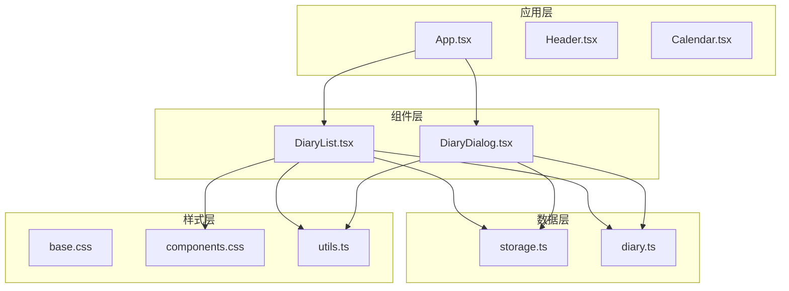
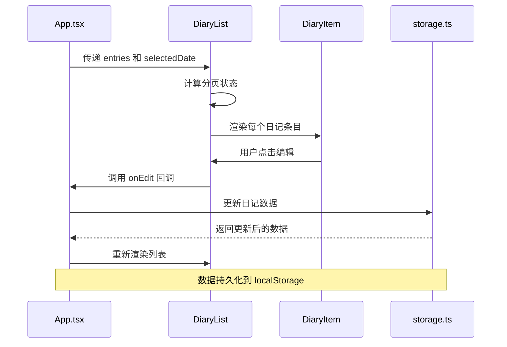
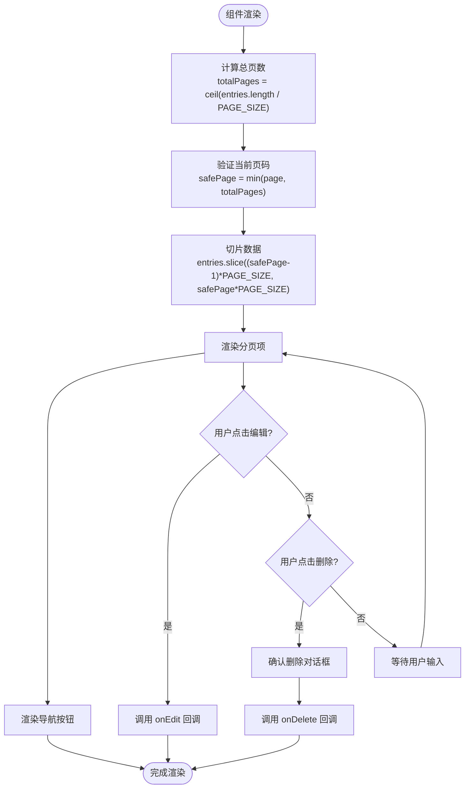
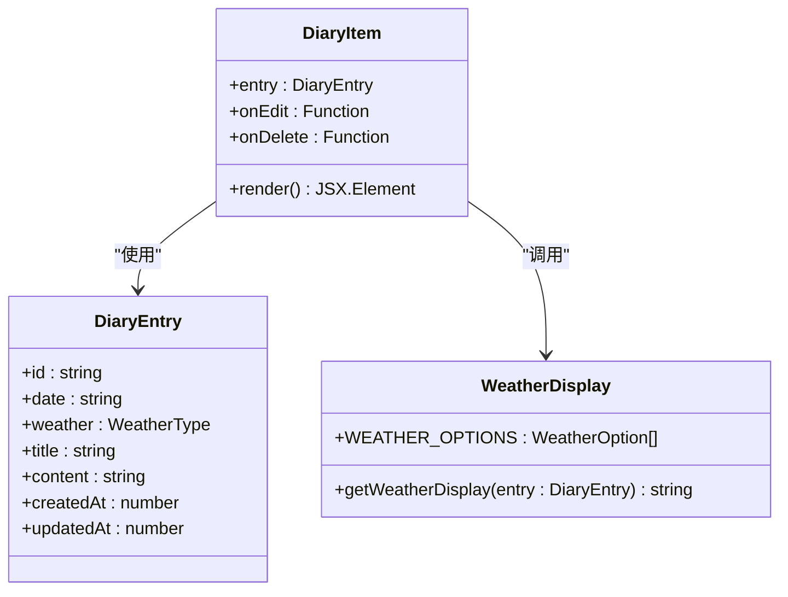
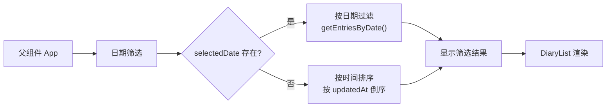
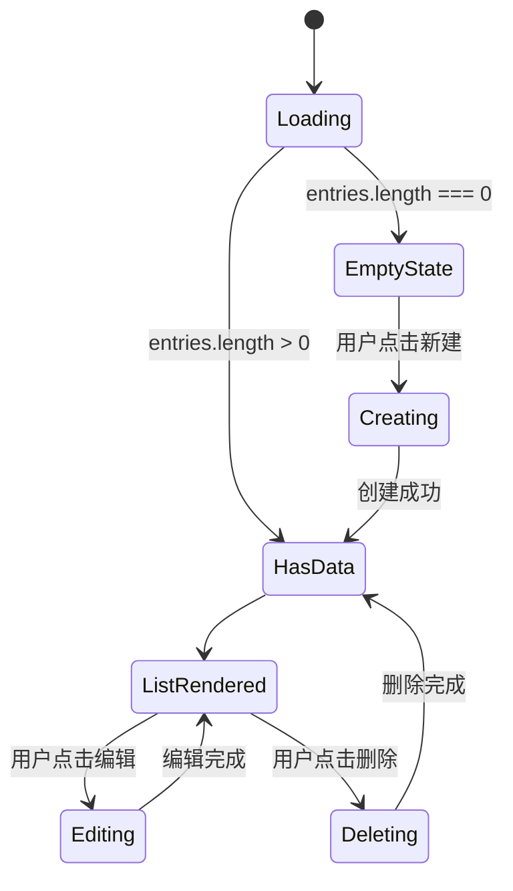
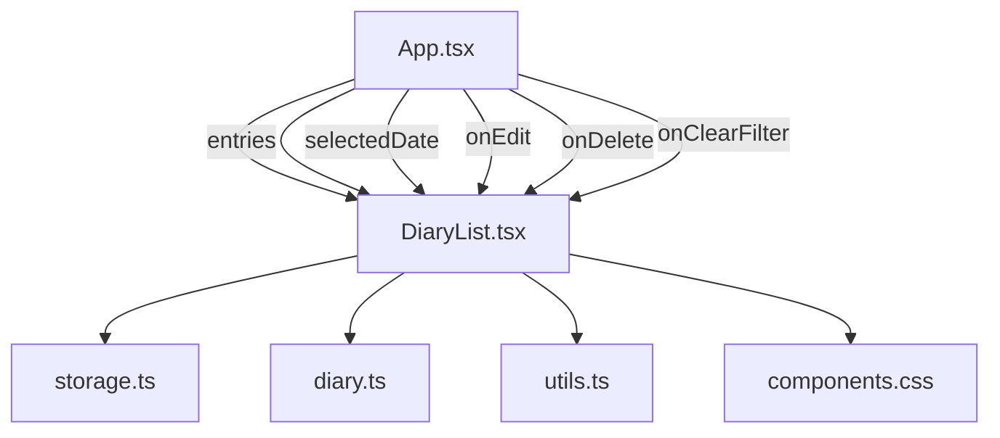

# 日记列表组件

<cite>
**本文档引用的文件**
- [src/components/DiaryList.tsx](file://src/components/DiaryList.tsx)
- [src/types/diary.ts](file://src/types/diary.ts)
- [src/lib/storage.ts](file://src/lib/storage.ts)
- [src/lib/utils.ts](file://src/lib/utils.ts)
- [src/components/DiaryDialog.tsx](file://src/components/DiaryDialog.tsx)
- [src/App.tsx](file://src/App.tsx)
- [src/styles/components.css](file://src/styles/components.css)
- [src/styles/base.css](file://src/styles/base.css)
</cite>

## 目录
1. [简介](#简介)
2. [项目结构](#项目结构)
3. [核心组件](#核心组件)
4. [架构概览](#架构概览)
5. [详细组件分析](#详细组件分析)
6. [依赖关系分析](#依赖关系分析)
7. [性能考虑](#性能考虑)
8. [故障排除指南](#故障排除指南)
9. [结论](#结论)
10. [附录](#附录)

## 简介

DiaryList 是一个专门用于展示日记条目的 React 组件，采用轻量级设计和高效的渲染策略。该组件支持分页显示、条件筛选、交互式操作和响应式布局，为用户提供流畅的日记浏览体验。

组件的核心特性包括：
- 基于本地存储的数据持久化
- 实时分页导航
- 条目级别的编辑和删除操作
- 智能的空状态处理
- 优雅的动画过渡效果

## 项目结构

该项目采用模块化的组件架构，DiaryList 作为核心展示组件位于组件目录中，与类型定义、工具函数和样式系统紧密集成。



**图表来源**
- [src/App.tsx:18-145](file://src/App.tsx#L18-L145)
- [src/components/DiaryList.tsx:23-131](file://src/components/DiaryList.tsx#L23-L131)
- [src/components/DiaryDialog.tsx:16-232](file://src/components/DiaryDialog.tsx#L16-L232)

**章节来源**
- [src/App.tsx:18-145](file://src/App.tsx#L18-L145)
- [src/components/DiaryList.tsx:1-200](file://src/components/DiaryList.tsx#L1-L200)

## 核心组件

### Props 接口定义

DiaryList 组件通过明确的 Props 接口定义了其对外的契约：

```typescript
interface DiaryListProps {
  entries: DiaryEntry[]
  selectedDate: string | null
  onEdit: (entry: DiaryEntry) => void
  onDelete: (id: string) => void
  onClearFilter: () => void
}
```

**参数说明：**
- `entries`: 日记条目数组，作为组件的主要数据源
- `selectedDate`: 当前选中的日期过滤器，支持按日期筛选
- `onEdit`: 编辑回调函数，接收被编辑的日记条目
- `onDelete`: 删除回调函数，接收要删除的日记 ID
- `onClearFilter`: 清除筛选器回调函数

### 数据模型

日记条目采用强类型定义，确保数据结构的一致性和可维护性：

```typescript
export interface DiaryEntry {
  id: string
  date: string        // 'YYYY-MM-DD'
  weather: WeatherType
  customWeather?: string
  title: string
  content: string
  createdAt: number
  updatedAt: number
}
```

**关键字段解释：**
- `id`: 唯一标识符，用于列表项的稳定渲染
- `date`: 日记日期，格式为 YYYY-MM-DD
- `weather`: 天气类型，支持预定义和自定义选项
- `customWeather`: 自定义天气描述，当 weather 为 'custom' 时使用
- `title`: 日记标题，支持空标题显示
- `content`: 日记正文内容
- `createdAt/updatedAt`: 时间戳，用于排序和状态追踪

**章节来源**
- [src/components/DiaryList.tsx:7-13](file://src/components/DiaryList.tsx#L7-L13)
- [src/types/diary.ts:4-13](file://src/types/diary.ts#L4-L13)

## 架构概览

DiaryList 采用自上而下的数据流设计，从父组件接收数据并通过回调函数处理用户交互。



**图表来源**
- [src/App.tsx:29-65](file://src/App.tsx#L29-L65)
- [src/components/DiaryList.tsx:23-131](file://src/components/DiaryList.tsx#L23-L131)
- [src/lib/storage.ts:5-35](file://src/lib/storage.ts#L5-L35)

## 详细组件分析

### 分页实现策略

DiaryList 采用客户端分页策略，通过固定页面大小实现高效的数据展示：



**图表来源**
- [src/components/DiaryList.tsx:15](file://src/components/DiaryList.tsx#L15)
- [src/components/DiaryList.tsx:35-37](file://src/components/DiaryList.tsx#L35-L37)
- [src/components/DiaryList.tsx:87-126](file://src/components/DiaryList.tsx#L87-L126)

### 列表项交互处理

每个日记条目都具备完整的交互能力，包括编辑、删除和悬停效果：



**图表来源**
- [src/components/DiaryList.tsx:137-185](file://src/components/DiaryList.tsx#L137-L185)
- [src/components/DiaryList.tsx:17-21](file://src/components/DiaryList.tsx#L17-L21)
- [src/types/diary.ts:15-21](file://src/types/diary.ts#L15-L21)

### 过滤筛选功能

组件支持基于日期的智能筛选，通过 selectedDate 属性实现动态过滤：



**图表来源**
- [src/App.tsx:29-33](file://src/App.tsx#L29-L33)
- [src/lib/storage.ts:41-43](file://src/lib/storage.ts#L41-L43)

### 加载状态管理

组件通过条件渲染优雅地处理空状态：



**图表来源**
- [src/components/DiaryList.tsx:71-73](file://src/components/DiaryList.tsx#L71-L73)
- [src/components/DiaryList.tsx:187-199](file://src/components/DiaryList.tsx#L187-L199)

**章节来源**
- [src/components/DiaryList.tsx:23-131](file://src/components/DiaryList.tsx#L23-L131)
- [src/App.tsx:29-33](file://src/App.tsx#L29-L33)

## 依赖关系分析

### 组件间依赖

DiaryList 与应用层存在直接依赖关系，通过 props 接口进行解耦：



**图表来源**
- [src/App.tsx:113-119](file://src/App.tsx#L113-L119)
- [src/components/DiaryList.tsx:23-13](file://src/components/DiaryList.tsx#L23-L13)

### 外部依赖

组件依赖以下外部库和工具：

- **Lucide React**: 图标库，提供精美的 SVG 图标
- **Tailwind CSS**: 实用优先的 CSS 框架，支持原子化样式
- **clsx/tailwind-merge**: 类名合并工具，优化样式类组合

**章节来源**
- [src/components/DiaryList.tsx:1-5](file://src/components/DiaryList.tsx#L1-L5)
- [src/lib/utils.ts:4-6](file://src/lib/utils.ts#L4-L6)

## 性能考虑

### 渲染优化策略

1. **分页渲染**: 使用固定页面大小 (PAGE_SIZE = 10) 控制单次渲染数量
2. **条件渲染**: 空状态和分页按钮仅在需要时渲染
3. **键值优化**: 使用唯一 id 作为列表项的 key，提升 React diff 效率
4. **懒加载**: 列表内容区域使用 overflow-y-auto 支持滚动加载

### 内存管理

- **状态隔离**: 分页状态独立于外部状态，避免不必要的重渲染
- **引用优化**: 使用 useRef 存储 previous selectedDate，减少比较开销
- **计算缓存**: 通过 useMemo 在父组件中缓存计算结果

### 用户体验优化

- **渐进式增强**: 使用 CSS 动画和过渡效果提升交互质感
- **无障碍支持**: 提供适当的 ARIA 属性和键盘导航支持
- **响应式设计**: 适配不同屏幕尺寸的显示需求

## 故障排除指南

### 常见问题及解决方案

**问题 1: 分页状态不正确**
- **症状**: 切换日期后分页状态未重置
- **原因**: 分页状态依赖 selectedDate 变化
- **解决**: 确保 selectedDate 变化时触发状态重置逻辑

**问题 2: 删除确认对话框不显示**
- **症状**: 点击删除按钮无反应
- **原因**: confirm() 对话框可能被浏览器阻止
- **解决**: 考虑实现自定义确认模态框

**问题 3: 天气显示异常**
- **症状**: 自定义天气显示不正确
- **原因**: customWeather 字段处理逻辑
- **解决**: 检查 getWeatherDisplay 函数的条件判断

**章节来源**
- [src/components/DiaryList.tsx:29-33](file://src/components/DiaryList.tsx#L29-L33)
- [src/components/DiaryList.tsx:39-43](file://src/components/DiaryList.tsx#L39-L43)
- [src/components/DiaryList.tsx:17-21](file://src/components/DiaryList.tsx#L17-L21)

## 结论

DiaryList 组件展现了现代 React 开发的最佳实践，通过清晰的组件分离、合理的状态管理和优雅的用户界面设计，为日记应用提供了可靠的列表展示基础。组件的设计充分考虑了性能优化和用户体验，在保持代码简洁的同时实现了功能完整性。

该组件为后续的功能扩展奠定了良好的基础，包括虚拟滚动、搜索过滤、批量操作等高级特性的集成都具有良好的可扩展性。

## 附录

### 扩展开发指南

**虚拟滚动集成建议**:
- 引入 react-window 或 react-virtualized 库
- 实现 WindowedFlatList 替代现有列表渲染
- 设置合适的 itemSize 和 overscanRowCount 参数

**搜索过滤功能**:
- 添加搜索输入框和过滤逻辑
- 实现标题和内容的全文搜索
- 支持正则表达式和高亮显示

**批量操作**:
- 添加选择模式和批量删除功能
- 实现全选/反选逻辑
- 提供批量操作的确认对话框

**国际化支持**:
- 添加多语言文本资源
- 实现日期格式化和数字本地化
- 支持 RTL 语言布局