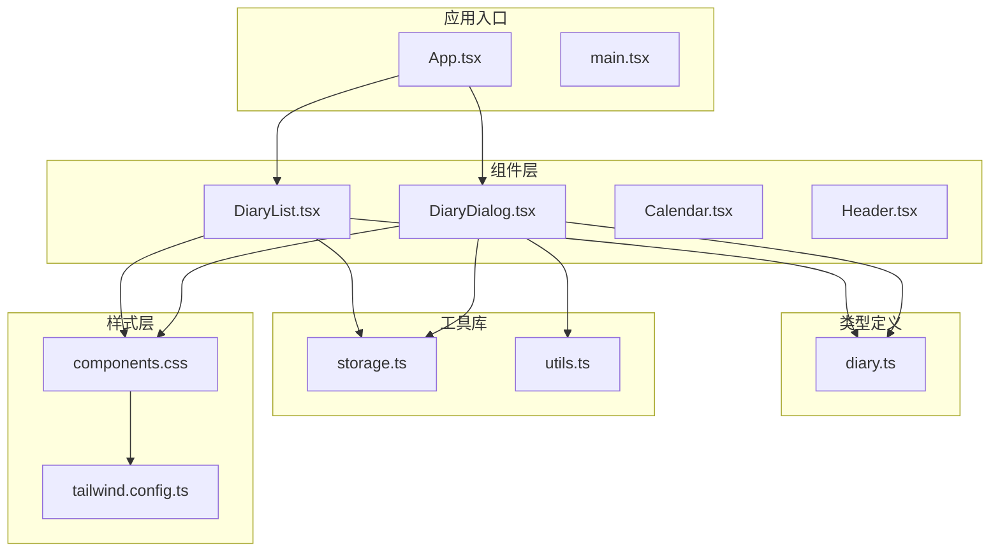
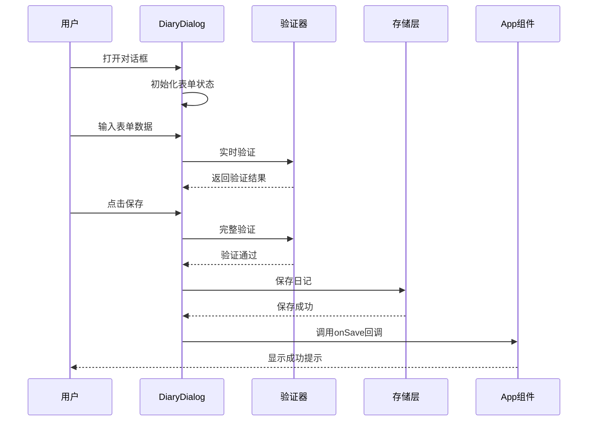
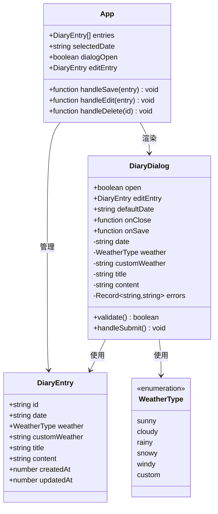
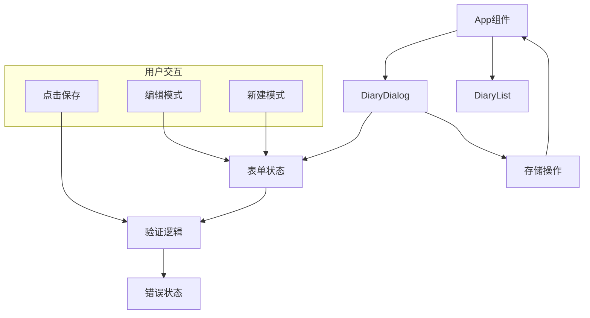
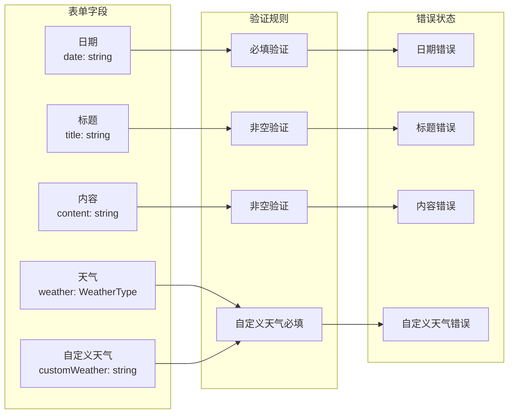
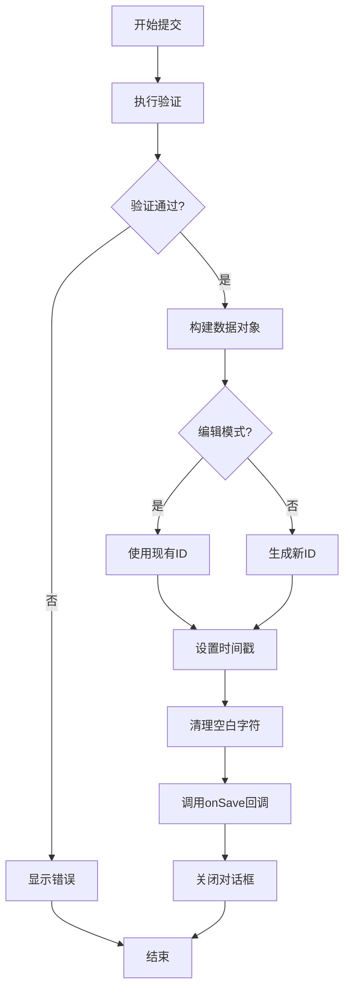
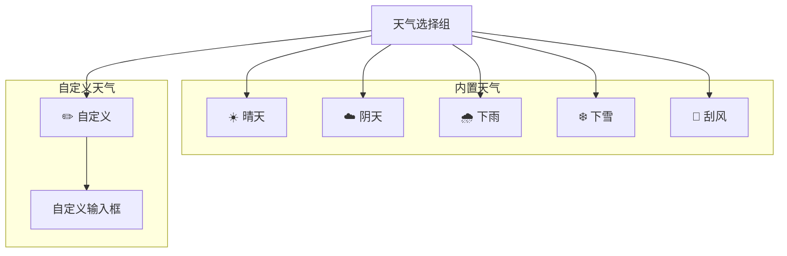
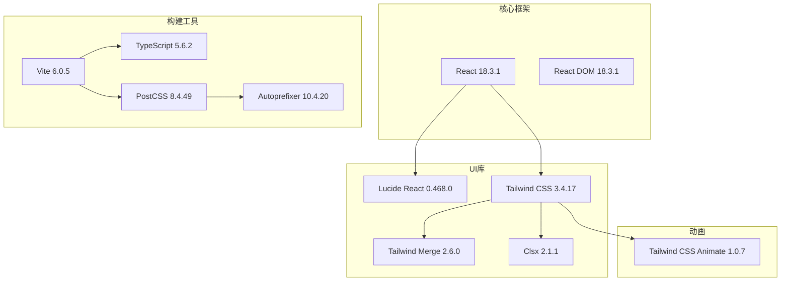
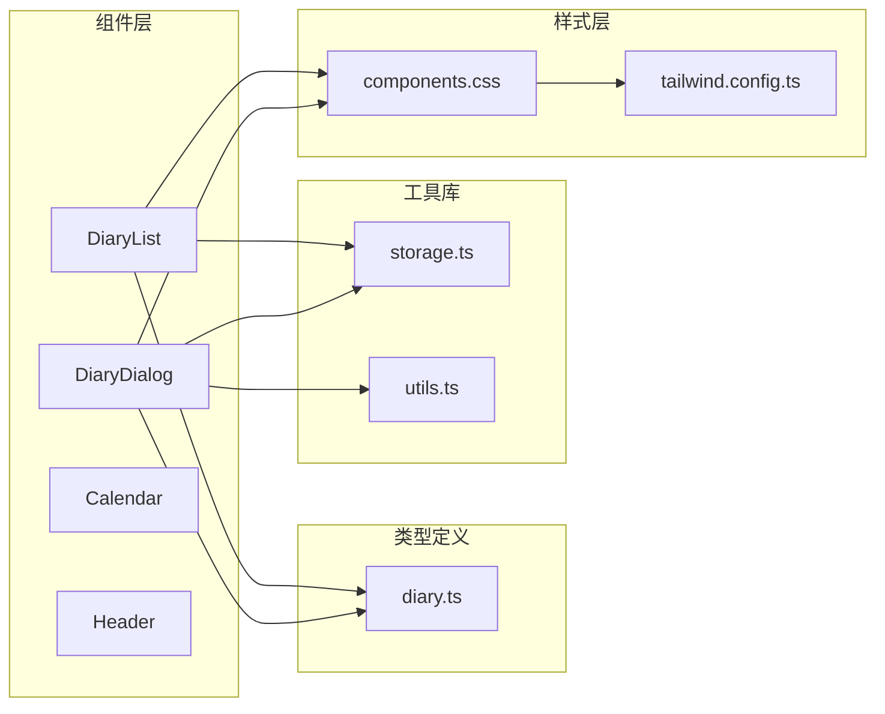

# 日记对话框组件

<cite>
**本文档引用的文件**
- [DiaryDialog.tsx](file://src/components/DiaryDialog.tsx)
- [diary.ts](file://src/types/diary.ts)
- [storage.ts](file://src/lib/storage.ts)
- [utils.ts](file://src/lib/utils.ts)
- [App.tsx](file://src/App.tsx)
- [DiaryList.tsx](file://src/components/DiaryList.tsx)
- [components.css](file://src/styles/components.css)
- [tailwind.config.ts](file://tailwind.config.ts)
- [package.json](file://package.json)
</cite>

## 目录
1. [简介](#简介)
2. [项目结构](#项目结构)
3. [核心组件](#核心组件)
4. [架构概览](#架构概览)
5. [详细组件分析](#详细组件分析)
6. [依赖关系分析](#依赖关系分析)
7. [性能考量](#性能考量)
8. [故障排除指南](#故障排除指南)
9. [结论](#结论)
10. [附录](#附录)

## 简介

DiaryDialog 是一个功能完整的日记对话框组件，采用 React Hooks 构建，提供了现代化的日记记录体验。该组件集成了完整的表单处理机制、数据验证策略、实时错误反馈和优雅的用户界面交互。

本组件支持多种天气选择模式（内置天气和自定义天气）、实时字数统计、键盘快捷键支持（ESC 关闭）、以及与主应用状态的无缝集成。通过 TypeScript 类型系统确保了类型安全性和开发体验。

## 项目结构

该项目采用模块化的组件架构，主要文件组织如下：



**图表来源**
- [DiaryDialog.tsx:1-232](file://src/components/DiaryDialog.tsx#L1-L232)
- [App.tsx:1-170](file://src/App.tsx#L1-L170)
- [diary.ts:1-22](file://src/types/diary.ts#L1-L22)

**章节来源**
- [package.json:1-30](file://package.json#L1-L30)
- [tailwind.config.ts:1-102](file://tailwind.config.ts#L1-L102)

## 核心组件

### 组件架构设计

DiaryDialog 采用了函数式组件配合 React Hooks 的现代开发模式，实现了以下核心特性：

- **状态管理**：使用 useState 和 useEffect 管理表单状态和生命周期
- **表单验证**：实时验证和错误反馈机制
- **键盘交互**：支持 ESC 键快速关闭对话框
- **无障碍设计**：符合 WAI-ARIA 标准的对话框实现
- **响应式设计**：基于 Tailwind CSS 的自适应布局

### 数据流架构



**图表来源**
- [DiaryDialog.tsx:56-80](file://src/components/DiaryDialog.tsx#L56-L80)
- [storage.ts:15-29](file://src/lib/storage.ts#L15-L29)
- [App.tsx:55-65](file://src/App.tsx#L55-L65)

**章节来源**
- [DiaryDialog.tsx:16-46](file://src/components/DiaryDialog.tsx#L16-L46)
- [DiaryDialog.tsx:56-80](file://src/components/DiaryDialog.tsx#L56-L80)

## 架构概览

### 组件层次结构



**图表来源**
- [DiaryDialog.tsx:8-14](file://src/components/DiaryDialog.tsx#L8-L14)
- [diary.ts:2-13](file://src/types/diary.ts#L2-L13)
- [App.tsx:18-23](file://src/App.tsx#L18-L23)

### 状态管理模式

组件采用集中式状态管理，通过 props 向下传递和回调向上返回的方式实现数据流控制：



**图表来源**
- [App.tsx:127-133](file://src/App.tsx#L127-L133)
- [DiaryDialog.tsx:16-46](file://src/components/DiaryDialog.tsx#L16-L46)

**章节来源**
- [App.tsx:18-65](file://src/App.tsx#L18-L65)
- [DiaryDialog.tsx:16-80](file://src/components/DiaryDialog.tsx#L16-L80)

## 详细组件分析

### 表单处理机制

#### 状态初始化与生命周期

组件在打开时根据传入的参数进行状态初始化：

- **编辑模式**：从 editEntry 中读取现有数据
- **新建模式**：使用 defaultDate 或当前日期作为默认值
- **自动聚焦**：标题输入框自动获得焦点提升用户体验

#### 表单字段映射



**图表来源**
- [DiaryDialog.tsx:17-22](file://src/components/DiaryDialog.tsx#L17-L22)
- [DiaryDialog.tsx:56-64](file://src/components/DiaryDialog.tsx#L56-L64)

#### 实时验证策略

组件实现了多层次的验证机制：

1. **即时验证**：用户输入时清除对应字段的错误状态
2. **提交验证**：完整表单提交时执行严格验证
3. **条件验证**：自定义天气选项的条件性验证

**章节来源**
- [DiaryDialog.tsx:56-64](file://src/components/DiaryDialog.tsx#L56-L64)
- [DiaryDialog.tsx:116-125](file://src/components/DiaryDialog.tsx#L116-L125)
- [DiaryDialog.tsx:176-188](file://src/components/DiaryDialog.tsx#L176-L188)
- [DiaryDialog.tsx:195-209](file://src/components/DiaryDialog.tsx#L195-L209)

### 提交流程控制

#### 数据构建与标准化

提交流程包含数据标准化和 ID 管理：



**图表来源**
- [DiaryDialog.tsx:66-80](file://src/components/DiaryDialog.tsx#L66-L80)
- [storage.ts:55-57](file://src/lib/storage.ts#L55-L57)

#### 错误处理逻辑

组件实现了完善的错误处理机制：

- **字段级错误**：针对具体字段的错误消息
- **实时清除**：用户修正输入时自动清除对应错误
- **视觉反馈**：错误字段的边框颜色变化
- **可访问性**：错误消息的屏幕阅读器支持

**章节来源**
- [DiaryDialog.tsx:22-22](file://src/components/DiaryDialog.tsx#L22-L22)
- [DiaryDialog.tsx:120-123](file://src/components/DiaryDialog.tsx#L120-L123)
- [DiaryDialog.tsx:161-164](file://src/components/DiaryDialog.tsx#L161-L164)

### 用户界面设计

#### 天气选择组件

天气选择采用标签式设计，支持内置天气和自定义天气：



**图表来源**
- [diary.ts:15-21](file://src/types/diary.ts#L15-L21)
- [DiaryDialog.tsx:133-169](file://src/components/DiaryDialog.tsx#L133-L169)

#### 响应式布局

组件采用 Flexbox 布局，支持不同屏幕尺寸：

- **最大宽度**：max-w-lg (768px)
- **垂直滚动**：max-h-[70vh] 支持长内容滚动
- **动画效果**：slide-in 动画提升用户体验

**章节来源**
- [DiaryDialog.tsx:84-231](file://src/components/DiaryDialog.tsx#L84-L231)
- [components.css:91-95](file://src/styles/components.css#L91-L95)

## 依赖关系分析

### 外部依赖

项目使用了现代化的前端技术栈：



**图表来源**
- [package.json:11-28](file://package.json#L11-L28)

### 内部依赖关系



**图表来源**
- [DiaryDialog.tsx:1-6](file://src/components/DiaryDialog.tsx#L1-L6)
- [DiaryList.tsx:1-5](file://src/components/DiaryList.tsx#L1-L5)

**章节来源**
- [package.json:1-30](file://package.json#L1-L30)
- [tailwind.config.ts:1-102](file://tailwind.config.ts#L1-L102)

## 性能考量

### 优化策略

1. **状态最小化**：仅维护必要的表单状态
2. **记忆化计算**：使用 useMemo 优化复杂计算
3. **条件渲染**：避免不必要的重新渲染
4. **事件防抖**：减少频繁的验证调用

### 内存管理

- **事件监听器清理**：组件卸载时自动移除键盘事件
- **定时器清理**：setTimeout 在组件卸载时自动清理
- **引用管理**：useRef 管理 DOM 引用

### 加载性能

- **按需加载**：组件懒加载，减少初始包大小
- **CSS 模块化**：样式按需加载，避免全局污染
- **图标优化**：使用矢量图标，支持任意尺寸缩放

## 故障排除指南

### 常见问题诊断

#### 表单验证问题

**症状**：验证不生效或错误消息不显示
**解决方案**：
1. 检查 validate 函数的返回值
2. 确认错误状态的正确设置
3. 验证 CSS 类名的正确性

#### 数据持久化问题

**症状**：日记无法保存或丢失
**解决方案**：
1. 检查 localStorage 的可用性
2. 验证 JSON 序列化/反序列化
3. 确认存储键名的一致性

#### 事件处理问题

**症状**：键盘事件不响应或重复触发
**解决方案**：
1. 检查事件监听器的添加和移除
2. 验证事件处理器的依赖数组
3. 确认组件的生命周期管理

**章节来源**
- [DiaryDialog.tsx:49-54](file://src/components/DiaryDialog.tsx#L49-L54)
- [storage.ts:5-17](file://src/lib/storage.ts#L5-L17)

### 调试技巧

1. **开发者工具**：使用 React DevTools 检查组件状态
2. **浏览器控制台**：监控错误和警告信息
3. **网络面板**：检查 localStorage 的读写操作
4. **性能面板**：分析组件渲染性能

## 结论

DiaryDialog 组件展现了现代 React 开发的最佳实践，通过精心设计的状态管理、完善的验证机制和优雅的用户界面，为用户提供了一流的日记记录体验。

该组件的主要优势包括：
- **类型安全**：完整的 TypeScript 类型定义
- **用户体验**：流畅的交互和及时的反馈
- **可维护性**：清晰的代码结构和模块化设计
- **可扩展性**：灵活的 API 设计支持功能扩展

未来可以考虑的功能增强：
- 添加富文本编辑器支持
- 实现草稿自动保存
- 增加主题切换功能
- 添加导入导出功能

## 附录

### API 接口说明

#### DiaryDialog Props

| 属性名 | 类型 | 必需 | 默认值 | 描述 |
|--------|------|------|--------|------|
| open | boolean | 是 | - | 控制对话框显示/隐藏 |
| editEntry | DiaryEntry \| null | 否 | null | 编辑的日记条目 |
| defaultDate | string | 否 | today | 默认日期值 |
| onClose | () => void | 是 | - | 关闭对话框回调 |
| onSave | (entry: DiaryEntry) => void | 是 | - | 保存日记回调 |

#### DiaryEntry 接口

| 字段名 | 类型 | 描述 |
|--------|------|------|
| id | string | 唯一标识符 |
| date | string | 日期字符串 (YYYY-MM-DD) |
| weather | WeatherType | 天气类型 |
| customWeather | string | 自定义天气描述 |
| title | string | 标题 |
| content | string | 内容 |
| createdAt | number | 创建时间戳 |
| updatedAt | number | 更新时间戳 |

#### WeatherType 枚举

| 值 | 描述 | 图标 |
|----|------|------|
| sunny | 晴天 | ☀️ |
| cloudy | 阴天 | ☁️ |
| rainy | 下雨 | 🌧️ |
| snowy | 下雪 | ❄️ |
| windy | 刮风 | 💨 |
| custom | 自定义 | ✏️ |

### 事件回调定义

#### 生命周期事件

- **onClose**：对话框关闭时触发
- **onSave**：表单验证通过后触发

#### 用户交互事件

- **键盘事件**：支持 ESC 键快速关闭
- **表单事件**：输入时的实时验证
- **按钮事件**：保存和取消操作

### 集成使用示例

#### 基础集成

```typescript
// 在父组件中使用
function ParentComponent() {
  const [dialogOpen, setDialogOpen] = useState(false)
  const [editEntry, setEditEntry] = useState<DiaryEntry | null>(null)

  const handleSave = (entry: DiaryEntry) => {
    // 处理保存逻辑
    console.log('保存日记:', entry)
  }

  return (
    <>
      <DiaryDialog
        open={dialogOpen}
        editEntry={editEntry}
        onClose={() => setDialogOpen(false)}
        onSave={handleSave}
      />
    </>
  )
}
```

#### 高级集成

```typescript
// 与 App 组件集成
function App() {
  const [entries, setEntries] = useState<DiaryEntry[]>(loadEntries())
  const [dialogOpen, setDialogOpen] = useState(false)
  const [editEntry, setEditEntry] = useState<DiaryEntry | null>(null)

  const handleSave = (entry: DiaryEntry) => {
    if (editEntry) {
      // 更新现有日记
      setEntries(prev => updateEntry(prev, entry))
    } else {
      // 创建新日记
      setEntries(prev => addEntry(prev, entry))
    }
    setDialogOpen(false)
    setEditEntry(null)
  }

  return (
    <div>
      <DiaryDialog
        open={dialogOpen}
        editEntry={editEntry}
        onClose={() => {
          setDialogOpen(false)
          setEditEntry(null)
        }}
        onSave={handleSave}
      />
    </div>
  )
}
```

### 最佳实践建议

#### 表单优化技巧

1. **实时验证**：在用户输入时提供即时反馈
2. **错误分组**：将相关错误信息组合显示
3. **焦点管理**：合理安排输入框的焦点顺序
4. **加载状态**：提交时显示加载指示器

#### 用户体验设计原则

1. **一致性**：保持与其他组件的视觉和交互一致性
2. **可访问性**：确保键盘导航和屏幕阅读器支持
3. **响应性**：适配不同设备和屏幕尺寸
4. **反馈性**：提供明确的操作结果反馈

#### 安全性考虑因素

1. **输入验证**：防止恶意输入和 XSS 攻击
2. **数据清理**：移除不必要的空白字符
3. **权限控制**：确保只有授权用户可以编辑
4. **数据备份**：定期备份重要数据