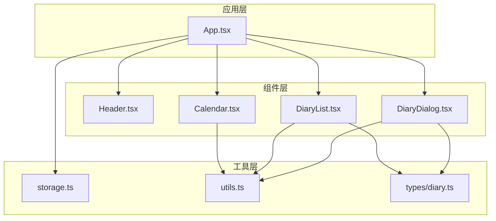
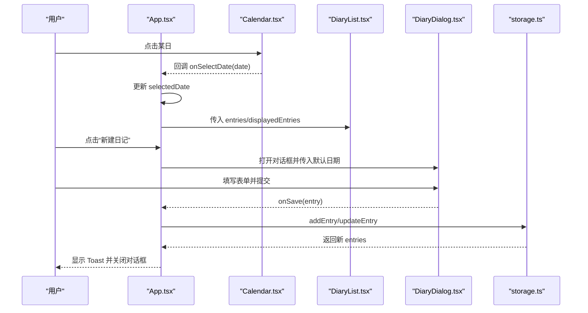
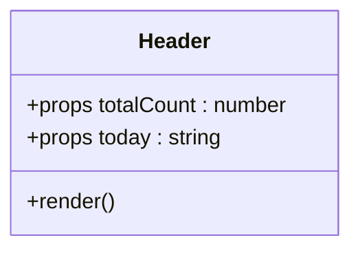
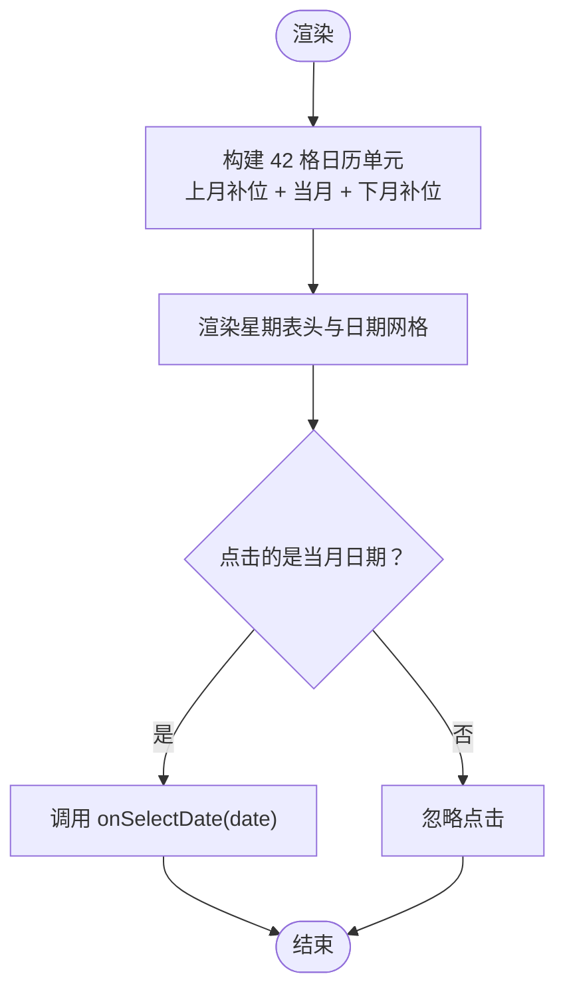
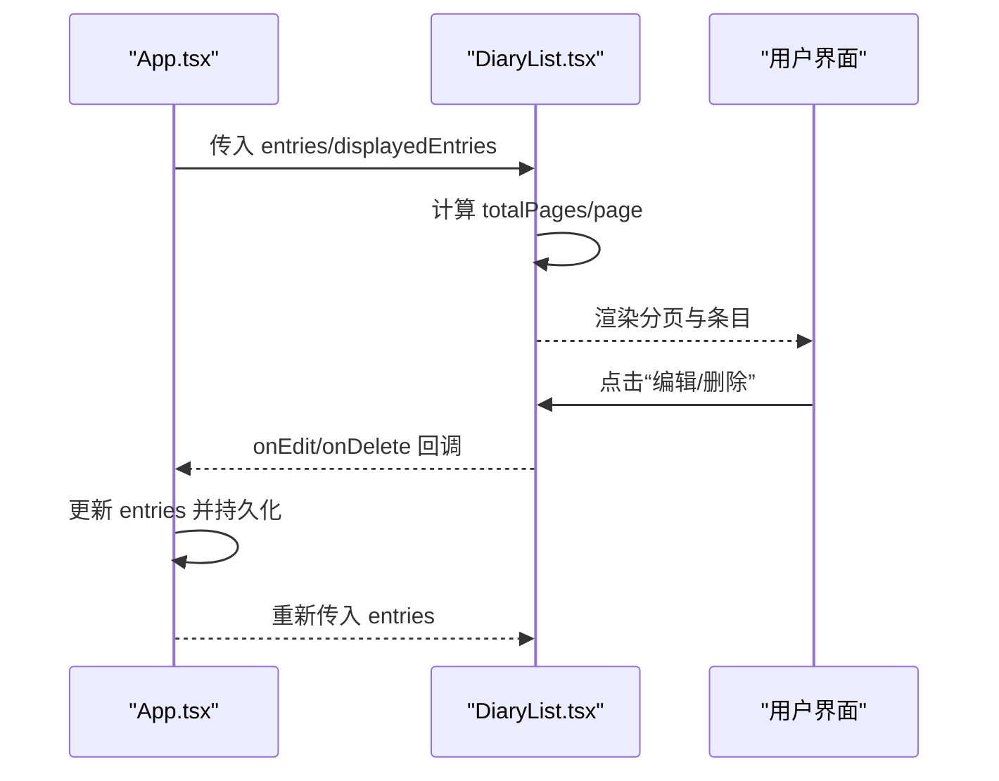
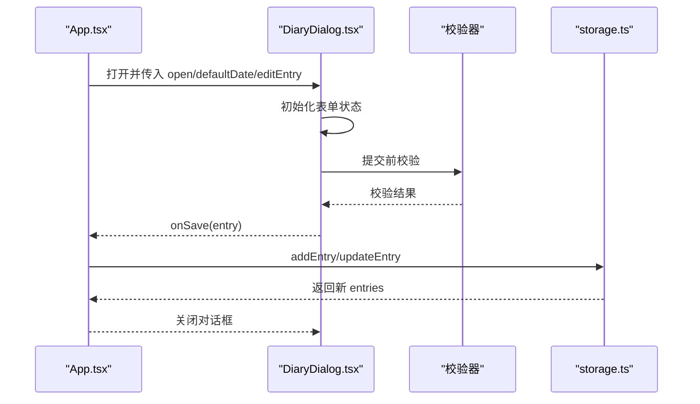
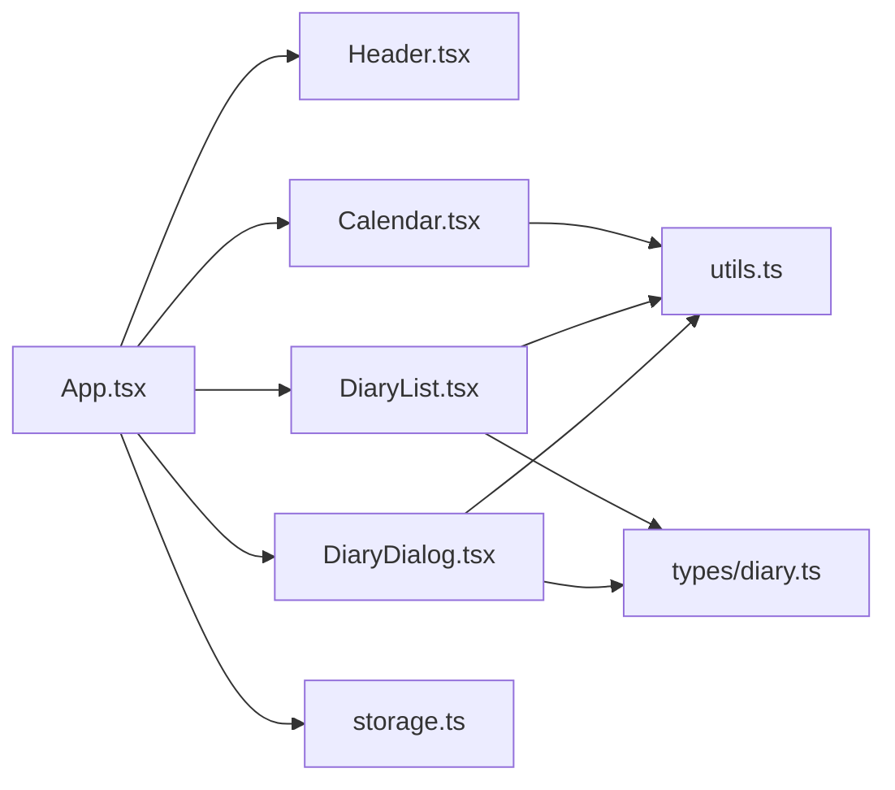

# 核心组件

<cite>
**本文引用的文件**
- [src/components/Header.tsx](file://src/components/Header.tsx)
- [src/components/Calendar.tsx](file://src/components/Calendar.tsx)
- [src/components/DiaryList.tsx](file://src/components/DiaryList.tsx)
- [src/components/DiaryDialog.tsx](file://src/components/DiaryDialog.tsx)
- [src/App.tsx](file://src/App.tsx)
- [src/lib/storage.ts](file://src/lib/storage.ts)
- [src/lib/utils.ts](file://src/lib/utils.ts)
- [src/tokens.css](file://src/styles/tokens.css)
- [src/styles/components.css](file://src/styles/components.css)
- [src/styles/calendar.css](file://src/styles/calendar.css)
- [src/types/diary.ts](file://src/types/diary.ts)
</cite>

## 目录
1. [简介](#简介)
2. [项目结构](#项目结构)
3. [核心组件](#核心组件)
4. [架构总览](#架构总览)
5. [详细组件分析](#详细组件分析)
6. [依赖关系分析](#依赖关系分析)
7. [性能考量](#性能考量)
8. [故障排查指南](#故障排查指南)
9. [结论](#结论)
10. [附录](#附录)

## 简介
本文件聚焦 My-Diary 的四个核心组件：Header 导航栏、Calendar 日历、DiaryList 日记列表、DiaryDialog 对话框。文档从功能职责、实现原理、Props 接口、事件与状态管理、到性能优化与使用场景进行系统化说明，并辅以可视化图示帮助理解与扩展。

## 项目结构
- 组件层：Header、Calendar、DiaryList、DiaryDialog
- 类型层：DiaryEntry、WeatherType、WEATHER_OPTIONS
- 工具层：cn 合并类名、日期格式化、本地存储封装
- 应用入口：App 负责状态管理、数据流调度与组件编排

图表来源
- [src/App.tsx:18-145](file://src/App.tsx#L18-L145)
- [src/components/Header.tsx:1-32](file://src/components/Header.tsx#L1-L32)
- [src/components/Calendar.tsx:1-159](file://src/components/Calendar.tsx#L1-L159)
- [src/components/DiaryList.tsx:1-200](file://src/components/DiaryList.tsx#L1-L200)
- [src/components/DiaryDialog.tsx:1-232](file://src/components/DiaryDialog.tsx#L1-L232)
- [src/lib/storage.ts:1-58](file://src/lib/storage.ts#L1-L58)
- [src/lib/utils.ts:1-7](file://src/lib/utils.ts#L1-L7)
- [src/types/diary.ts:1-22](file://src/types/diary.ts#L1-L22)

章节来源
- [src/App.tsx:18-145](file://src/App.tsx#L18-L145)
- [src/components/Header.tsx:1-32](file://src/components/Header.tsx#L1-L32)
- [src/components/Calendar.tsx:1-159](file://src/components/Calendar.tsx#L1-L159)
- [src/components/DiaryList.tsx:1-200](file://src/components/DiaryList.tsx#L1-L200)
- [src/components/DiaryDialog.tsx:1-232](file://src/components/DiaryDialog.tsx#L1-L232)
- [src/lib/storage.ts:1-58](file://src/lib/storage.ts#L1-L58)
- [src/lib/utils.ts:1-7](file://src/lib/utils.ts#L1-L7)
- [src/types/diary.ts:1-22](file://src/types/diary.ts#L1-L22)

## 核心组件
- Header：显示应用名称、当前日期与总记录数，作为页面顶部导航与信息展示区域。
- Calendar：交互式日历，支持切换月份、回到今天、按日期筛选日记；通过点标记标识有日记的日期。
- DiaryList：日记列表，支持分页、按日期过滤、编辑/删除操作、空态提示。
- DiaryDialog：新建/编辑日记的模态表单，包含日期、天气、标题、正文等字段及校验。

章节来源
- [src/components/Header.tsx:3-31](file://src/components/Header.tsx#L3-L31)
- [src/components/Calendar.tsx:5-159](file://src/components/Calendar.tsx#L5-L159)
- [src/components/DiaryList.tsx:7-131](file://src/components/DiaryList.tsx#L7-L131)
- [src/components/DiaryDialog.tsx:8-232](file://src/components/DiaryDialog.tsx#L8-L232)

## 架构总览
App 作为状态中心，负责：
- 读取/写入本地存储
- 计算日历标记集合
- 决定当前展示的日记列表（全部或按日期）
- 控制对话框打开/关闭与编辑项
- 展示 Toast 提示

图表来源
- [src/App.tsx:67-69](file://src/App.tsx#L67-L69)
- [src/App.tsx:108-123](file://src/App.tsx#L108-L123)
- [src/App.tsx:127-133](file://src/App.tsx#L127-L133)
- [src/lib/storage.ts:19-35](file://src/lib/storage.ts#L19-L35)

## 详细组件分析

### Header 导航组件
- 功能职责
  - 展示应用品牌图标与名称
  - 显示“今日日期”与“总记录数”，用于快速感知当前时间与数据规模
- Props 接口
  - totalCount: number
  - today: string
- 实现要点
  - 使用 Tailwind 变量与 CSS 变量实现主题色统一
  - 使用固定定位与模糊背景增强可读性
- 使用场景
  - 作为页面顶部导航，贯穿所有页面
  - 与 App 状态联动，动态更新 today 与 totalCount

图表来源
- [src/components/Header.tsx:3-31](file://src/components/Header.tsx#L3-L31)

章节来源
- [src/components/Header.tsx:3-31](file://src/components/Header.tsx#L3-L31)

### Calendar 日历组件
- 功能职责
  - 渲染日历网格，支持上月/下月切换与“回到今天”
  - 标识今日、选中日期、周末、有日记的日期
  - 通过回调 onSelectDate 通知父组件选中日期
- Props 接口
  - selectedDate: string | null
  - diaryDates: Set<string>
  - onSelectDate: (date: string) => void
- 日期选择逻辑
  - 仅当点击“当月”日期时才触发 onSelectDate
  - 其他月份日期禁用点击
- 性能与复杂度
  - 每次渲染重新计算当月第一天、当月天数、上月补位天数
  - 时间复杂度 O(1)（固定 42 格），空间复杂度 O(1)
- 样式与交互
  - 使用 CSS 变量控制颜色与阴影
  - 通过类名组合实现不同状态样式

图表来源
- [src/components/Calendar.tsx:44-66](file://src/components/Calendar.tsx#L44-L66)
- [src/components/Calendar.tsx:114-141](file://src/components/Calendar.tsx#L114-L141)

章节来源
- [src/components/Calendar.tsx:5-159](file://src/components/Calendar.tsx#L5-L159)
- [src/styles/calendar.css:4-56](file://src/styles/calendar.css#L4-L56)

### DiaryList 日记列表组件
- 功能职责
  - 展示日记列表，支持按日期过滤与分页
  - 提供编辑/删除操作入口
  - 空态提示与“查看全部”按钮
- Props 接口
  - entries: DiaryEntry[]
  - selectedDate: string | null
  - onEdit: (entry: DiaryEntry) => void
  - onDelete: (id: string) => void
  - onClearFilter: () => void
- 渲染机制
  - 使用固定分页大小 PAGE_SIZE = 10
  - 当 selectedDate 变化时重置到第一页
  - 无数据时渲染 EmptyState
- 事件与状态
  - 删除前确认，避免误删
  - 分页按钮禁用状态随当前页与总页数变化
- 性能优化
  - 仅对当前页数据进行切片渲染
  - 使用 useMemo 优化 App 侧 entries 计算

图表来源
- [src/components/DiaryList.tsx:23-131](file://src/components/DiaryList.tsx#L23-L131)
- [src/App.tsx:29-33](file://src/App.tsx#L29-L33)

章节来源
- [src/components/DiaryList.tsx:7-131](file://src/components/DiaryList.tsx#L7-L131)
- [src/styles/components.css:97-136](file://src/styles/components.css#L97-L136)

### DiaryDialog 对话框组件
- 功能职责
  - 新建/编辑日记的表单对话框
  - 包含日期、天气（含自定义）、标题、正文字段
  - 表单校验与错误提示
- Props 接口
  - open: boolean
  - editEntry?: DiaryEntry | null
  - defaultDate?: string
  - onClose: () => void
  - onSave: (entry: DiaryEntry) => void
- 表单处理
  - 打开时根据 editEntry 或 defaultDate 初始化表单
  - ESC 键关闭对话框
  - 校验规则：日期、标题、正文必填；自定义天气需填写
  - 提交时生成/更新时间戳，调用 onSave
- 无障碍与交互
  - 设置 role="dialog" 与 aria-modal/aria-label
  - 点击遮罩层关闭
  - 自动聚焦标题输入框

图表来源
- [src/components/DiaryDialog.tsx:16-82](file://src/components/DiaryDialog.tsx#L16-L82)
- [src/lib/storage.ts:19-35](file://src/lib/storage.ts#L19-L35)

章节来源
- [src/components/DiaryDialog.tsx:8-232](file://src/components/DiaryDialog.tsx#L8-L232)
- [src/lib/storage.ts:19-35](file://src/lib/storage.ts#L19-L35)

## 依赖关系分析
- 组件间耦合
  - App 作为唯一状态源，向子组件注入 props 与回调
  - Calendar 与 DiaryList 仅消费数据，不直接访问存储
  - DiaryDialog 仅负责表单与校验，保存由 App 调用 storage 完成
- 外部依赖
  - lucide-react 图标库
  - Tailwind CSS + CSS 变量主题系统
  - localStorage 本地持久化

图表来源
- [src/App.tsx:18-145](file://src/App.tsx#L18-L145)
- [src/components/Calendar.tsx:1-4](file://src/components/Calendar.tsx#L1-L4)
- [src/components/DiaryList.tsx:2-5](file://src/components/DiaryList.tsx#L2-L5)
- [src/components/DiaryDialog.tsx:3-6](file://src/components/DiaryDialog.tsx#L3-L6)
- [src/lib/storage.ts:1-58](file://src/lib/storage.ts#L1-L58)
- [src/lib/utils.ts:1-7](file://src/lib/utils.ts#L1-L7)
- [src/types/diary.ts:1-22](file://src/types/diary.ts#L1-L22)

章节来源
- [src/App.tsx:18-145](file://src/App.tsx#L18-L145)
- [src/components/Calendar.tsx:1-4](file://src/components/Calendar.tsx#L1-L4)
- [src/components/DiaryList.tsx:2-5](file://src/components/DiaryList.tsx#L2-L5)
- [src/components/DiaryDialog.tsx:3-6](file://src/components/DiaryDialog.tsx#L3-L6)
- [src/lib/storage.ts:1-58](file://src/lib/storage.ts#L1-L58)
- [src/lib/utils.ts:1-7](file://src/lib/utils.ts#L1-L7)
- [src/types/diary.ts:1-22](file://src/types/diary.ts#L1-L22)

## 性能考量
- 渲染优化
  - DiaryList 使用固定分页大小，仅渲染当前页，避免长列表全量重渲染
  - App 使用 useMemo 缓存 computed 值（如按日期过滤、日历标记集合）
- 事件与状态
  - Calendar 仅在当月日期点击时触发 onSelectDate，减少无效更新
  - DiaryDialog 使用受控表单与即时错误清除，降低重渲染成本
- 样式与动画
  - 使用 CSS 变量与过渡动画，避免频繁 JS 动画
  - 日历“有日记”点采用 CSS after 伪元素，减少 DOM 结构复杂度

章节来源
- [src/components/DiaryList.tsx:15-37](file://src/components/DiaryList.tsx#L15-L37)
- [src/App.tsx:25-33](file://src/App.tsx#L25-L33)
- [src/components/Calendar.tsx:114-141](file://src/components/Calendar.tsx#L114-L141)
- [src/components/DiaryDialog.tsx:26-46](file://src/components/DiaryDialog.tsx#L26-L46)

## 故障排查指南
- 无法保存/更新日记
  - 检查 onSave 回调是否正确传递至 App
  - 确认 storage.ts 的 addEntry/updateEntry 是否被调用
- 日期未生效
  - 确认 Calendar 的 onSelectDate 回调是否被调用
  - 检查 App 侧 selectedDate 是否更新
- 表单校验失败
  - 确认 validate 返回 true 后再调用 onSave
  - 检查错误消息是否被清空
- 本地存储异常
  - 检查 localStorage 权限与容量
  - 确认 JSON 解析/序列化未抛出异常

章节来源
- [src/components/DiaryDialog.tsx:56-82](file://src/components/DiaryDialog.tsx#L56-L82)
- [src/lib/storage.ts:5-17](file://src/lib/storage.ts#L5-L17)
- [src/App.tsx:55-65](file://src/App.tsx#L55-L65)

## 结论
四个核心组件围绕 App 的状态中心协同工作：Header 提供导航与信息，Calendar 提供日期筛选入口，DiaryList 展示与管理日记，DiaryDialog 负责表单与持久化。通过清晰的 Props/回调契约、受控表单与分页渲染，系统在易用性与性能之间取得平衡。建议后续可引入虚拟滚动、缓存策略与更细粒度的错误边界以进一步提升体验。

## 附录

### Props 接口速览
- Header
  - totalCount: number
  - today: string
- Calendar
  - selectedDate: string | null
  - diaryDates: Set<string>
  - onSelectDate: (date: string) => void
- DiaryList
  - entries: DiaryEntry[]
  - selectedDate: string | null
  - onEdit: (entry: DiaryEntry) => void
  - onDelete: (id: string) => void
  - onClearFilter: () => void
- DiaryDialog
  - open: boolean
  - editEntry?: DiaryEntry | null
  - defaultDate?: string
  - onClose: () => void
  - onSave: (entry: DiaryEntry) => void

章节来源
- [src/components/Header.tsx:3-31](file://src/components/Header.tsx#L3-L31)
- [src/components/Calendar.tsx:5-9](file://src/components/Calendar.tsx#L5-L9)
- [src/components/DiaryList.tsx:7-13](file://src/components/DiaryList.tsx#L7-L13)
- [src/components/DiaryDialog.tsx:8-14](file://src/components/DiaryDialog.tsx#L8-L14)

### 数据模型
- DiaryEntry
  - id: string
  - date: string
  - weather: WeatherType
  - customWeather?: string
  - title: string
  - content: string
  - createdAt: number
  - updatedAt: number
- WeatherType
  - 'sunny' | 'cloudy' | 'rainy' | 'snowy' | 'windy' | 'custom'

章节来源
- [src/types/diary.ts:4-13](file://src/types/diary.ts#L4-L13)
- [src/types/diary.ts:2-2](file://src/types/diary.ts#L2-L2)

### 样式与主题
- 组件样式
  - 卡片、按钮、输入框、天气标签、分页按钮、对话框遮罩等
- 日历样式
  - 日期单元格状态：今日、选中、非当月、有日记
- 主题变量
  - 使用 CSS 变量与 Tailwind 变量实现统一配色与过渡

章节来源
- [src/styles/components.css:1-138](file://src/styles/components.css#L1-L138)
- [src/styles/calendar.css:1-57](file://src/styles/calendar.css#L1-L57)
- [src/styles/tokens.css](file://src/styles/tokens.css)