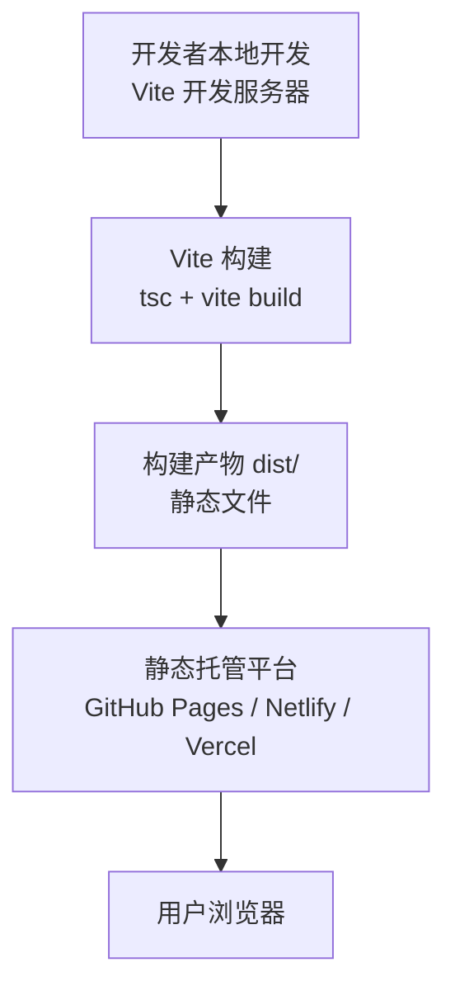
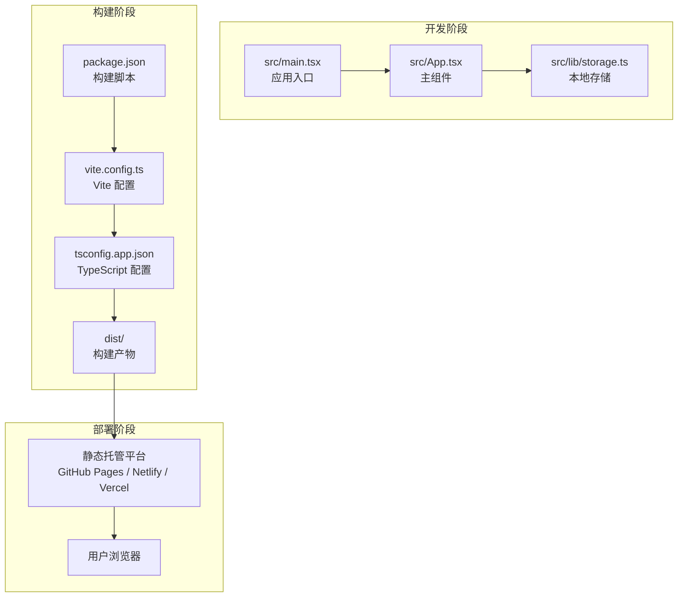
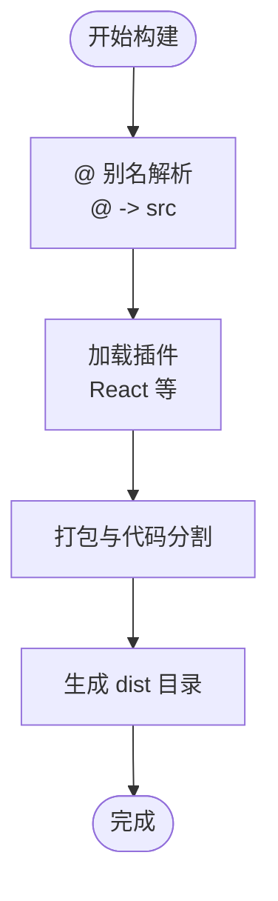
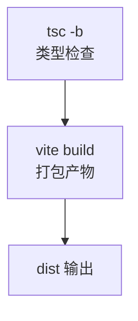
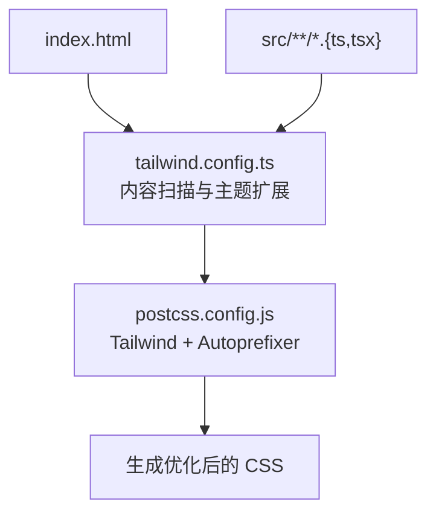
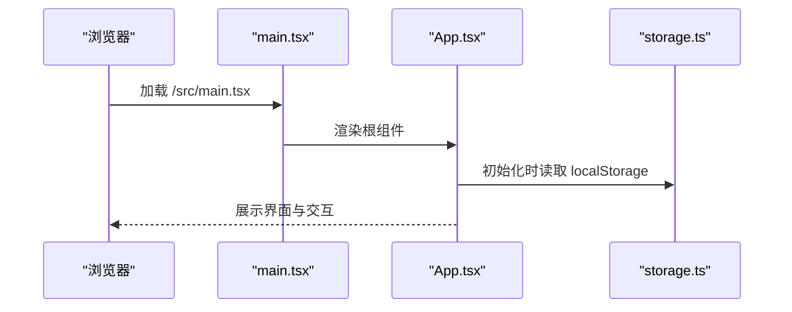
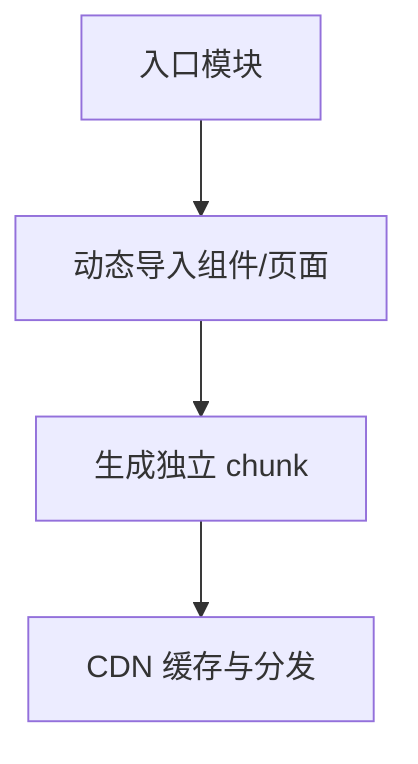
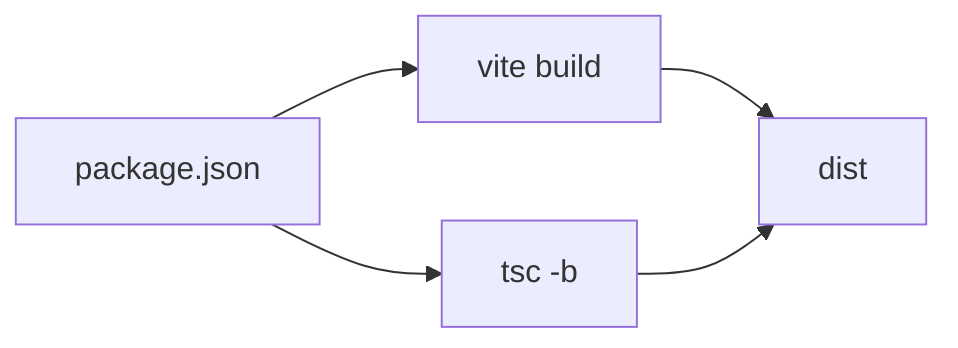

# 部署指南

<cite>
**本文档引用的文件**
- [vite.config.ts](file://vite.config.ts)
- [package.json](file://package.json)
- [index.html](file://index.html)
- [tailwind.config.ts](file://tailwind.config.ts)
- [postcss.config.js](file://postcss.config.js)
- [tsconfig.json](file://tsconfig.json)
- [tsconfig.app.json](file://tsconfig.app.json)
- [.gitignore](file://.gitignore)
- [src/main.tsx](file://src/main.tsx)
- [src/App.tsx](file://src/App.tsx)
- [src/lib/storage.ts](file://src/lib/storage.ts)
</cite>

## 目录
1. [简介](#简介)
2. [项目结构](#项目结构)
3. [核心组件](#核心组件)
4. [架构总览](#架构总览)
5. [详细组件分析](#详细组件分析)
6. [依赖分析](#依赖分析)
7. [性能考虑](#性能考虑)
8. [故障排除指南](#故障排除指南)
9. [结论](#结论)
10. [附录](#附录)

## 简介
本指南面向 My-Diary 项目的生产环境部署，覆盖 Vite 构建配置优化、静态资源与代码分割策略、多平台（GitHub Pages、Netlify、Vercel）部署配置、性能优化（缓存、CDN、压缩）、安全最佳实践（HTTPS、域名绑定），以及部署后的监控与分析工具使用建议。文档基于仓库现有配置文件进行分析，并提供可操作的步骤与可视化图示。

## 项目结构
My-Diary 是一个基于 React + TypeScript + Vite 的单页应用（SPA）。前端通过 Vite 进行开发与打包，TailwindCSS 负责样式体系，PostCSS/Autoprefixer 处理样式后处理，TypeScript 提供类型安全保障。构建产物默认输出到 dist 目录，该目录已被 .gitignore 排除，适合在 CI/CD 或静态托管平台部署。

图表来源
- [package.json:8-8](file://package.json#L8-L8)
- [vite.config.ts:5-12](file://vite.config.ts#L5-L12)
- [.gitignore:2-2](file://.gitignore#L2-L2)

章节来源
- [package.json:1-30](file://package.json#L1-L30)
- [.gitignore:1-7](file://.gitignore#L1-L7)

## 核心组件
- 构建与打包
  - 使用 Vite 进行开发与生产构建，脚本定义在 package.json 中。
  - TypeScript 与 Vite 协同工作，确保类型安全与快速构建。
- 样式系统
  - TailwindCSS 配置集中于 tailwind.config.ts，支持暗色模式、动画与主题变量。
  - PostCSS 与 Autoprefixer 在 postcss.config.js 中启用，保证跨浏览器兼容性。
- 应用入口与路由
  - 入口文件 src/main.tsx 渲染根组件 App。
  - 应用为 SPA，无服务端路由，适合静态托管平台。
- 数据持久化
  - 使用 localStorage 存储日记条目，无需后端即可运行。

章节来源
- [vite.config.ts:1-13](file://vite.config.ts#L1-L13)
- [package.json:6-10](file://package.json#L6-L10)
- [tailwind.config.ts:1-102](file://tailwind.config.ts#L1-L102)
- [postcss.config.js:1-4](file://postcss.config.js#L1-L4)
- [tsconfig.app.json:1-24](file://tsconfig.app.json#L1-L24)
- [src/main.tsx:1-11](file://src/main.tsx#L1-L11)
- [src/App.tsx:1-170](file://src/App.tsx#L1-L170)
- [src/lib/storage.ts:1-58](file://src/lib/storage.ts#L1-L58)

## 架构总览
下图展示了从开发到生产的整体流程，以及静态托管平台的交互关系。

图表来源
- [src/main.tsx:6-10](file://src/main.tsx#L6-L10)
- [src/App.tsx:18-144](file://src/App.tsx#L18-L144)
- [src/lib/storage.ts:15-17](file://src/lib/storage.ts#L15-L17)
- [package.json:8-8](file://package.json#L8-L8)
- [vite.config.ts:5-12](file://vite.config.ts#L5-L12)
- [tsconfig.app.json:2-21](file://tsconfig.app.json#L2-L21)

## 详细组件分析

### Vite 构建配置与优化
- 别名与路径解析
  - 通过 @ 别名映射到 src 目录，简化导入路径，提升可维护性。
- 插件与预设
  - 启用 React 插件，适配 JSX 与 React 生态。
- 输出与代码分割
  - 默认按需加载模块，实现自然的代码分割；可通过 Vite 扩展进一步优化（见“性能考虑”）。

图表来源
- [vite.config.ts:7-11](file://vite.config.ts#L7-L11)
- [vite.config.ts:6-6](file://vite.config.ts#L6-L6)

章节来源
- [vite.config.ts:1-13](file://vite.config.ts#L1-L13)

### TypeScript 与类型安全
- 构建顺序
  - 构建脚本先执行 tsc -b，再执行 vite build，确保类型检查与打包分离。
- 配置要点
  - 使用 bundler 模式与严格模式，提升构建稳定性与类型安全性。
  - 路径别名与 baseUrl 保持一致，避免导入歧义。

图表来源
- [package.json:8-8](file://package.json#L8-L8)
- [tsconfig.app.json:2-21](file://tsconfig.app.json#L2-L21)

章节来源
- [package.json:8-8](file://package.json#L8-L8)
- [tsconfig.app.json:1-24](file://tsconfig.app.json#L1-L24)

### 样式与 Tailwind 配置
- 内容扫描
  - Tailwind 配置扫描 index.html 与 src 下所有 TS/TSX 文件，确保按需生成样式。
- 动画与主题
  - 定义了多种动画与主题变量，配合 CSS 自定义属性实现动态主题与过渡效果。
- PostCSS 链路
  - TailwindCSS 与 Autoprefixer 组合，自动添加厂商前缀，提升兼容性。

图表来源
- [tailwind.config.ts:5-5](file://tailwind.config.ts#L5-L5)
- [postcss.config.js:1-3](file://postcss.config.js#L1-L3)

章节来源
- [tailwind.config.ts:1-102](file://tailwind.config.ts#L1-L102)
- [postcss.config.js:1-4](file://postcss.config.js#L1-L4)

### 应用入口与 SPA 结构
- 入口渲染
  - main.tsx 创建根节点并渲染 App。
- 组件职责
  - App 负责状态管理、日历与列表展示、对话框交互及提示信息。
- 本地存储
  - storage.ts 提供 CRUD 与查询能力，数据持久化至 localStorage。

图表来源
- [src/main.tsx:6-10](file://src/main.tsx#L6-L10)
- [src/App.tsx:18-33](file://src/App.tsx#L18-L33)
- [src/lib/storage.ts:5-13](file://src/lib/storage.ts#L5-L13)

章节来源
- [src/main.tsx:1-11](file://src/main.tsx#L1-L11)
- [src/App.tsx:1-170](file://src/App.tsx#L1-L170)
- [src/lib/storage.ts:1-58](file://src/lib/storage.ts#L1-L58)

### 静态资源与代码分割
- 资源处理
  - Vite 默认对 JS、CSS、图片等资源进行优化与哈希命名，便于浏览器缓存与 CDN 分发。
- 代码分割
  - 基于动态导入的按需加载实现自然分割；可在需要时通过 Vite 的 rollupOptions 进一步控制分包策略。

图表来源
- [vite.config.ts:6-6](file://vite.config.ts#L6-L6)

章节来源
- [vite.config.ts:1-13](file://vite.config.ts#L1-L13)

## 依赖分析
- 构建链路
  - package.json 中的构建脚本串联 tsc 与 vite，确保类型检查与打包顺序正确。
- 运行时依赖
  - React 生态与 Tailwind 相关库构成运行时基础。
- 开发依赖
  - Vite、TypeScript、TailwindCSS、PostCSS/Autoprefixer 等用于开发与构建。

图表来源
- [package.json:8-8](file://package.json#L8-L8)
- [package.json:8-8](file://package.json#L8-L8)

章节来源
- [package.json:1-30](file://package.json#L1-L30)

## 性能考虑
- 构建优化
  - 使用 Vite 的内置压缩与资源内联策略；如需更细粒度控制，可在 Vite 配置中启用压缩与分包策略。
- 缓存策略
  - 对静态资源启用长期缓存（如 .js/.css 哈希后缀），对 HTML 设置较短缓存或不缓存。
- CDN 集成
  - 在托管平台启用 CDN，结合边缘缓存与全球分发，降低延迟。
- 压缩优化
  - 启用 Gzip/Brotli 压缩，减少传输体积。
- 图片与字体
  - 使用现代格式（WebP/AVIF）与合适的尺寸，避免超大资源影响首屏性能。

## 故障排除指南
- 构建失败
  - 确认已安装依赖并执行正确的构建脚本；检查 TypeScript 配置是否与 Vite 兼容。
- 预览异常
  - 使用 vite preview 在本地验证构建产物是否正常。
- 静态托管空白页
  - 确保托管平台指向正确的构建目录（默认 dist），并正确配置 SPA 回退（见各平台配置）。
- 样式未生效
  - 检查 Tailwind 内容扫描路径与 postcss.config.js 是否正确加载。

章节来源
- [package.json:8-8](file://package.json#L8-L8)
- [package.json:9-9](file://package.json#L9-L9)
- [tailwind.config.ts:5-5](file://tailwind.config.ts#L5-L5)
- [postcss.config.js:1-3](file://postcss.config.js#L1-L3)

## 结论
My-Diary 采用轻量级前端技术栈，具备良好的静态托管适配性。通过合理的 Vite 配置、Tailwind 主题与 PostCSS 流程，以及清晰的构建脚本，可在 GitHub Pages、Netlify、Vercel 等平台快速部署。建议结合 CDN、缓存与压缩策略进一步提升性能，并在部署后接入监控与分析工具以持续优化用户体验。

## 附录

### 平台部署配置清单

- GitHub Pages
  - 仓库设置 → Pages → 选择分支与根目录（默认 dist），保存后自动生成访问链接。
  - 如需子路径部署，请在 Vite 配置中设置 base（例如 /my-diary/），并在 Pages 设置中同步。
  - 参考来源
    - [index.html:1-16](file://index.html#L1-L16)
    - [vite.config.ts:5-12](file://vite.config.ts#L5-L12)

- Netlify
  - 选择仓库并设置构建命令为构建脚本，发布目录为 dist。
  - 在“Site Settings → Domain”绑定自定义域名；在“SSL/TLS”中启用 HTTPS。
  - 参考来源
    - [package.json:8-8](file://package.json#L8-L8)
    - [.gitignore:2-2](file://.gitignore#L2-L2)

- Vercel
  - 选择仓库并设置框架预设为“Static Generation”，输出目录为 dist。
  - 在“Domains”中绑定自定义域名；在“SSL”中启用自动证书。
  - 参考来源
    - [package.json:8-8](file://package.json#L8-L8)
    - [.gitignore:2-2](file://.gitignore#L2-L2)

### 安全与 HTTPS 最佳实践
- 强制 HTTPS
  - 在托管平台启用 HTTPS，推荐使用 HSTS（如需）。
- 域名绑定
  - 在 DNS 中配置 CNAME 或 A 记录，指向托管平台提供的域名或 IP。
- 内容安全策略（CSP）
  - 限制外部资源加载来源，避免内联脚本与 eval。
- 隐私与数据
  - localStorage 仅用于本地存储，不涉及后端；注意用户隐私与数据导出/删除功能。

### 部署后监控与分析
- 性能监控
  - 使用浏览器性能面板与 Lighthouse 进行基准测试。
- 错误追踪
  - 可选接入前端错误上报（如 Sentry），在生产环境捕获并上报异常。
- 用户行为分析
  - 可选集成轻量分析工具（如统计 PV/UV 的简单方案），注意隐私合规。