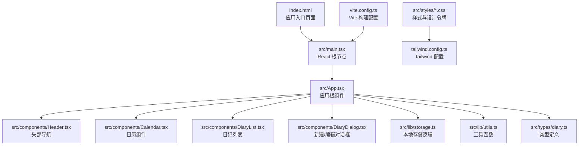
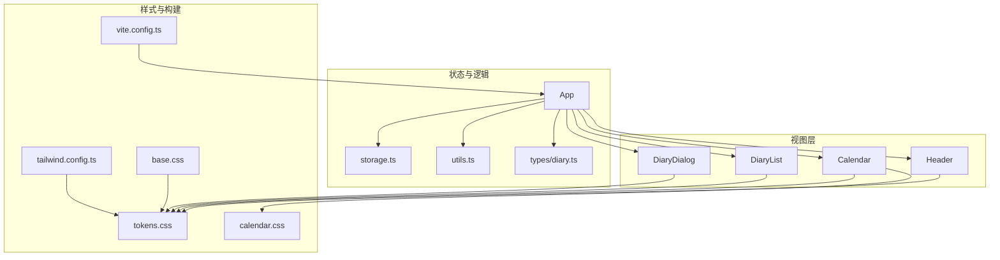
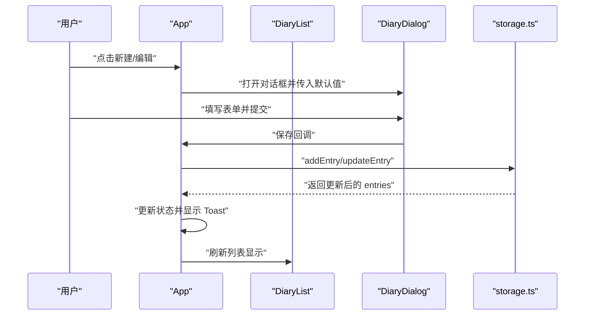
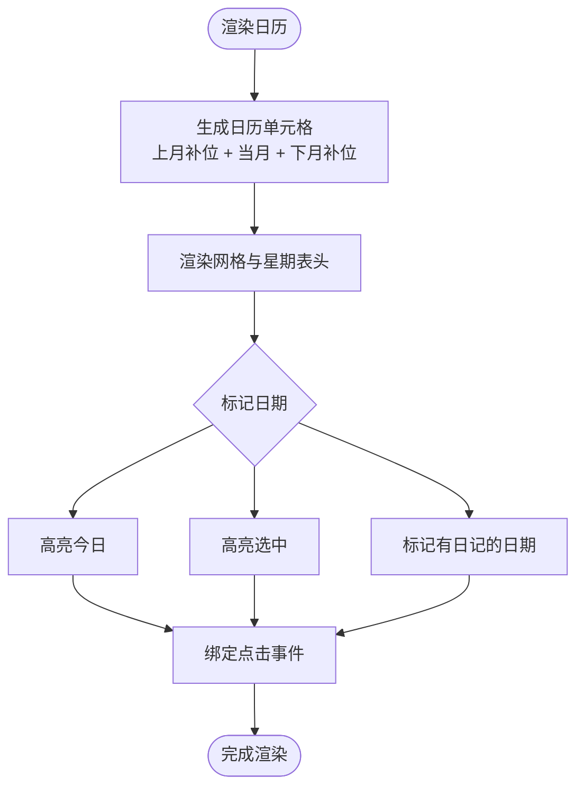
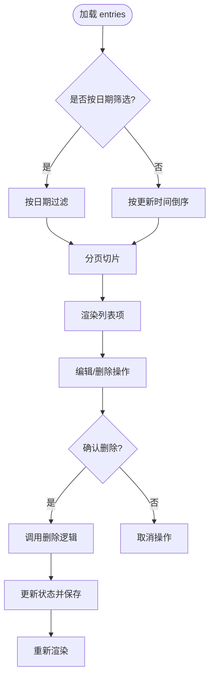
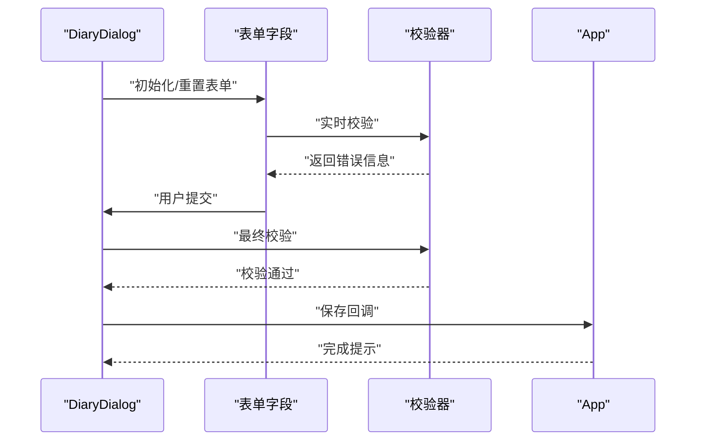
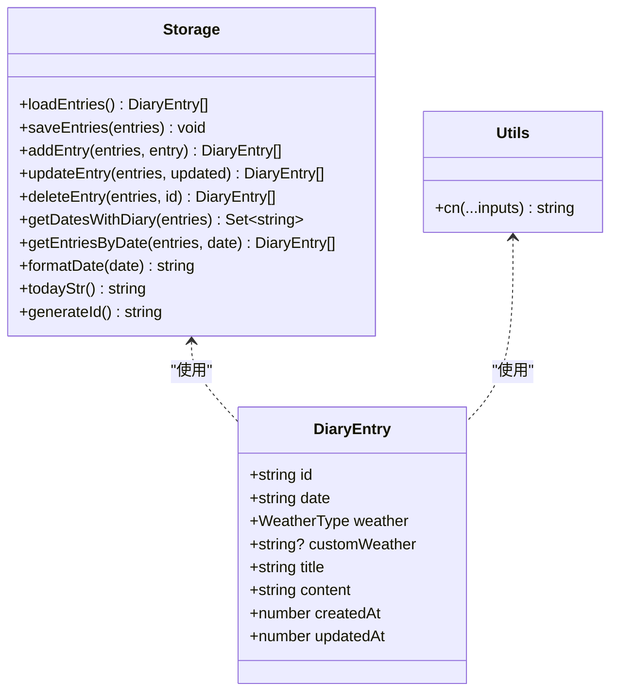
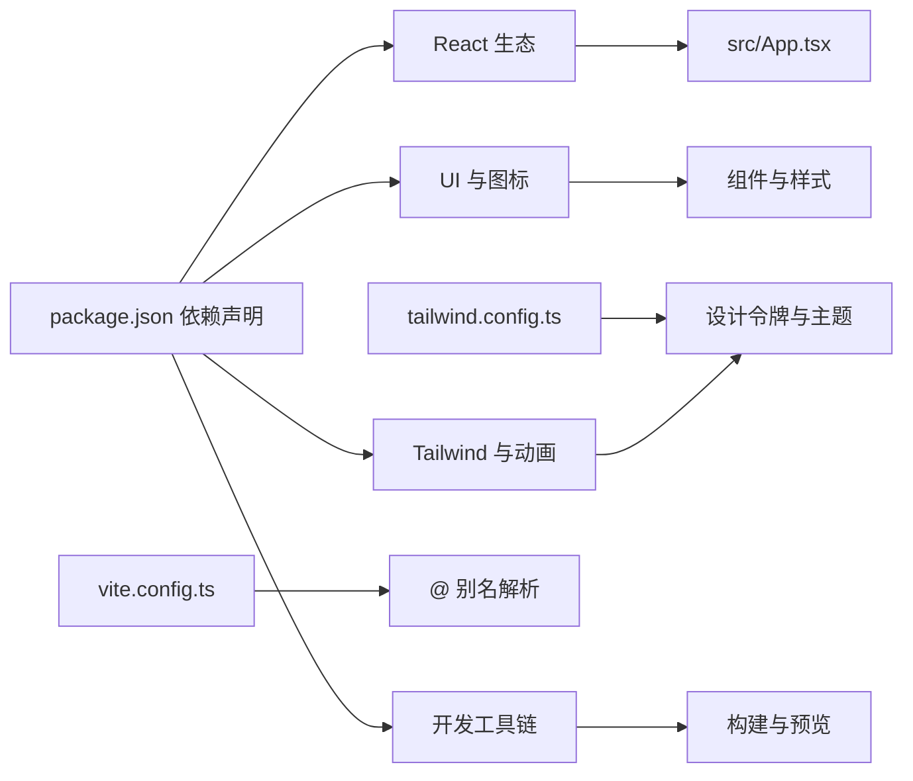

# 项目概述

<cite>
**本文档引用的文件**
- [package.json](file://package.json)
- [vite.config.ts](file://vite.config.ts)
- [tailwind.config.ts](file://tailwind.config.ts)
- [index.html](file://index.html)
- [src/main.tsx](file://src/main.tsx)
- [src/App.tsx](file://src/App.tsx)
- [src/components/Header.tsx](file://src/components/Header.tsx)
- [src/components/Calendar.tsx](file://src/components/Calendar.tsx)
- [src/components/DiaryList.tsx](file://src/components/DiaryList.tsx)
- [src/components/DiaryDialog.tsx](file://src/components/DiaryDialog.tsx)
- [src/lib/storage.ts](file://src/lib/storage.ts)
- [src/lib/utils.ts](file://src/lib/utils.ts)
- [src/types/diary.ts](file://src/types/diary.ts)
- [src/styles/base.css](file://src/styles/base.css)
- [src/styles/tokens.css](file://src/styles/tokens.css)
- [src/styles/calendar.css](file://src/styles/calendar.css)
</cite>

## 目录
1. [引言](#引言)
2. [项目结构](#项目结构)
3. [核心组件](#核心组件)
4. [架构总览](#架构总览)
5. [详细组件分析](#详细组件分析)
6. [依赖关系分析](#依赖关系分析)
7. [性能考量](#性能考量)
8. [故障排除指南](#故障排除指南)
9. [结论](#结论)

## 引言
My-Diary 是一个基于 React 与 TypeScript 构建的现代化日记管理应用，专注于为用户提供简洁、直观且富有温度的日记记录体验。项目通过本地存储实现数据持久化，支持日记的创建、编辑、删除与浏览，并提供按日期筛选与分页展示能力。技术栈采用 React 18.3.1、TypeScript、Tailwind CSS 与 Vite，兼顾开发效率与运行性能，适合初学者快速上手，也为有经验的开发者提供了清晰的架构与可扩展的设计。

## 项目结构
项目采用按功能模块组织的目录结构，核心入口位于 src 目录，包含组件、类型定义、样式与工具库等模块。构建工具使用 Vite，样式系统基于 Tailwind CSS 并结合自定义设计令牌，形成统一的视觉语言与交互反馈。

**图表来源**
- [index.html:1-16](file://index.html#L1-L16)
- [src/main.tsx:1-11](file://src/main.tsx#L1-L11)
- [src/App.tsx:1-170](file://src/App.tsx#L1-L170)
- [src/components/Header.tsx:1-32](file://src/components/Header.tsx#L1-L32)
- [src/components/Calendar.tsx:1-159](file://src/components/Calendar.tsx#L1-L159)
- [src/components/DiaryList.tsx:1-200](file://src/components/DiaryList.tsx#L1-L200)
- [src/components/DiaryDialog.tsx:1-232](file://src/components/DiaryDialog.tsx#L1-L232)
- [src/lib/storage.ts:1-58](file://src/lib/storage.ts#L1-L58)
- [src/lib/utils.ts:1-7](file://src/lib/utils.ts#L1-L7)
- [src/types/diary.ts:1-22](file://src/types/diary.ts#L1-L22)
- [src/styles/base.css:1-29](file://src/styles/base.css#L1-L29)
- [src/styles/tokens.css:1-69](file://src/styles/tokens.css#L1-L69)
- [src/styles/calendar.css:1-57](file://src/styles/calendar.css#L1-L57)
- [tailwind.config.ts:1-102](file://tailwind.config.ts#L1-L102)
- [vite.config.ts:1-13](file://vite.config.ts#L1-L13)

**章节来源**
- [package.json:1-30](file://package.json#L1-L30)
- [vite.config.ts:1-13](file://vite.config.ts#L1-L13)
- [tailwind.config.ts:1-102](file://tailwind.config.ts#L1-L102)
- [index.html:1-16](file://index.html#L1-L16)

## 核心组件
- 应用根组件 App：负责状态管理、数据加载与子组件协调，提供新建、编辑、删除、筛选与提示等交互。
- 组件层：Header 提供头部信息；Calendar 实现日历选择与标记；DiaryList 展示日记列表与分页；DiaryDialog 提供表单与校验。
- 工具与存储：storage.ts 封装本地存储读写与日期处理；utils.ts 提供类名合并工具；types/diary.ts 定义数据模型与天气选项。
- 样式系统：tokens.css 定义设计令牌；base.css 与 calendar.css 提供基础与组件级样式，配合 Tailwind CSS 实现一致的视觉与交互。

**章节来源**
- [src/App.tsx:1-170](file://src/App.tsx#L1-L170)
- [src/components/Header.tsx:1-32](file://src/components/Header.tsx#L1-L32)
- [src/components/Calendar.tsx:1-159](file://src/components/Calendar.tsx#L1-L159)
- [src/components/DiaryList.tsx:1-200](file://src/components/DiaryList.tsx#L1-L200)
- [src/components/DiaryDialog.tsx:1-232](file://src/components/DiaryDialog.tsx#L1-L232)
- [src/lib/storage.ts:1-58](file://src/lib/storage.ts#L1-L58)
- [src/lib/utils.ts:1-7](file://src/lib/utils.ts#L1-L7)
- [src/types/diary.ts:1-22](file://src/types/diary.ts#L1-L22)
- [src/styles/tokens.css:1-69](file://src/styles/tokens.css#L1-L69)
- [src/styles/base.css:1-29](file://src/styles/base.css#L1-L29)
- [src/styles/calendar.css:1-57](file://src/styles/calendar.css#L1-L57)

## 架构总览
应用采用“组件驱动 + 工具库 + 类型约束”的分层架构。组件间通过 props 传递数据与回调，状态集中在 App 根组件中，通过 useMemo 优化派生数据计算。样式系统通过 Tailwind CSS 与自定义设计令牌实现主题一致性与响应式布局。构建与别名解析由 Vite 与 Tailwind 配置共同完成。

**图表来源**
- [src/App.tsx:1-170](file://src/App.tsx#L1-L170)
- [src/components/Header.tsx:1-32](file://src/components/Header.tsx#L1-L32)
- [src/components/Calendar.tsx:1-159](file://src/components/Calendar.tsx#L1-L159)
- [src/components/DiaryList.tsx:1-200](file://src/components/DiaryList.tsx#L1-L200)
- [src/components/DiaryDialog.tsx:1-232](file://src/components/DiaryDialog.tsx#L1-L232)
- [src/lib/storage.ts:1-58](file://src/lib/storage.ts#L1-L58)
- [src/lib/utils.ts:1-7](file://src/lib/utils.ts#L1-L7)
- [src/types/diary.ts:1-22](file://src/types/diary.ts#L1-L22)
- [src/styles/tokens.css:1-69](file://src/styles/tokens.css#L1-L69)
- [src/styles/base.css:1-29](file://src/styles/base.css#L1-L29)
- [src/styles/calendar.css:1-57](file://src/styles/calendar.css#L1-L57)
- [tailwind.config.ts:1-102](file://tailwind.config.ts#L1-L102)
- [vite.config.ts:1-13](file://vite.config.ts#L1-L13)

## 详细组件分析

### 应用根组件 App
- 职责：加载本地日记数据、维护当前选中日期、控制对话框与提示、计算标记日期集合与展示列表、处理 CRUD 操作与保存。
- 数据流：从 storage.ts 读取 entries，通过 useMemo 计算 diaryDates 与 displayedEntries，确保渲染高效。
- 交互：提供新建、编辑、删除、日期筛选与 Toast 提示，统一通过状态变更触发重新渲染。

**图表来源**
- [src/App.tsx:40-65](file://src/App.tsx#L40-L65)
- [src/components/DiaryDialog.tsx:66-80](file://src/components/DiaryDialog.tsx#L66-L80)
- [src/lib/storage.ts:19-29](file://src/lib/storage.ts#L19-L29)

**章节来源**
- [src/App.tsx:1-170](file://src/App.tsx#L1-L170)
- [src/lib/storage.ts:1-58](file://src/lib/storage.ts#L1-L58)

### 日历组件 Calendar
- 功能：渲染月度日历，高亮今日与选中日期，标记存在日记的日期，支持上一页/下一页与回到今日。
- 交互：点击日期触发父组件 onSelectDate 回调，禁用非当月日期点击。
- 样式：通过 tokens.css 与 calendar.css 的设计令牌实现统一风格与动画效果。

**图表来源**
- [src/components/Calendar.tsx:17-159](file://src/components/Calendar.tsx#L17-L159)
- [src/styles/calendar.css:1-57](file://src/styles/calendar.css#L1-L57)
- [src/styles/tokens.css:1-69](file://src/styles/tokens.css#L1-L69)

**章节来源**
- [src/components/Calendar.tsx:1-159](file://src/components/Calendar.tsx#L1-L159)
- [src/styles/calendar.css:1-57](file://src/styles/calendar.css#L1-L57)
- [src/styles/tokens.css:1-69](file://src/styles/tokens.css#L1-L69)

### 日记列表 DiaryList
- 功能：展示日记列表，支持按日期筛选与分页；提供编辑与删除操作；空状态提示。
- 性能：使用 useMemo 与分页常量 PAGE_SIZE 控制渲染范围；在日期筛选切换时重置页码。
- 交互：悬停显示操作按钮；确认删除对话框；清空筛选按钮。

**图表来源**
- [src/components/DiaryList.tsx:23-131](file://src/components/DiaryList.tsx#L23-L131)
- [src/lib/storage.ts:41-43](file://src/lib/storage.ts#L41-L43)

**章节来源**
- [src/components/DiaryList.tsx:1-200](file://src/components/DiaryList.tsx#L1-L200)
- [src/lib/storage.ts:1-58](file://src/lib/storage.ts#L1-L58)

### 对话框 DiaryDialog
- 功能：提供新建/编辑日记的表单，包含日期、天气、标题与正文字段；内置表单校验与错误提示。
- 交互：ESC 快捷键关闭；聚焦标题输入框；保存时生成或更新时间戳；调用父组件回调。
- 样式：使用设计令牌与动画，保证视觉一致性与流畅过渡。

**图表来源**
- [src/components/DiaryDialog.tsx:16-80](file://src/components/DiaryDialog.tsx#L16-L80)
- [src/lib/storage.ts:55-57](file://src/lib/storage.ts#L55-L57)

**章节来源**
- [src/components/DiaryDialog.tsx:1-232](file://src/components/DiaryDialog.tsx#L1-L232)
- [src/lib/storage.ts:1-58](file://src/lib/storage.ts#L1-L58)

### 类型与工具
- 类型定义：DiaryEntry 接口与天气枚举，确保数据结构一致性与可维护性。
- 工具函数：cn 合并类名，提升样式组合灵活性。
- 存储接口：loadEntries/saveEntries/addEntry/updateEntry/deleteEntry/getDatesWithDiary/getEntriesByDate/formatDate/todayStr/generateId，封装本地存储与日期工具。

**图表来源**
- [src/types/diary.ts:1-22](file://src/types/diary.ts#L1-L22)
- [src/lib/storage.ts:1-58](file://src/lib/storage.ts#L1-L58)
- [src/lib/utils.ts:1-7](file://src/lib/utils.ts#L1-L7)

**章节来源**
- [src/types/diary.ts:1-22](file://src/types/diary.ts#L1-L22)
- [src/lib/storage.ts:1-58](file://src/lib/storage.ts#L1-L58)
- [src/lib/utils.ts:1-7](file://src/lib/utils.ts#L1-L7)

## 依赖关系分析
- 运行时依赖：React 与 React DOM 提供组件框架；lucide-react 提供图标；clsx 与 tailwind-merge 用于类名合并；tailwindcss-animate 提供动画插件。
- 开发依赖：@vitejs/plugin-react、TypeScript、Tailwind CSS、PostCSS、autoprefixer 等，支撑现代化开发流程。
- 构建与别名：Vite 配置启用 React 插件与路径别名 @ 指向 src，简化导入路径。
- 样式体系：Tailwind CSS 与自定义 tokens.css 结合，实现主题变量、渐变、阴影与动画的统一管理。

**图表来源**
- [package.json:11-28](file://package.json#L11-L28)
- [vite.config.ts:5-12](file://vite.config.ts#L5-L12)
- [tailwind.config.ts:1-102](file://tailwind.config.ts#L1-L102)

**章节来源**
- [package.json:1-30](file://package.json#L1-L30)
- [vite.config.ts:1-13](file://vite.config.ts#L1-L13)
- [tailwind.config.ts:1-102](file://tailwind.config.ts#L1-L102)

## 性能考量
- 渲染优化：App 使用 useMemo 缓存派生数据（如标记日期集合与按日期筛选结果），减少不必要的重渲染。
- 列表分页：DiaryList 采用固定分页大小与切片策略，避免长列表一次性渲染带来的卡顿。
- 本地存储：storage.ts 将完整 entries 写入 localStorage，避免频繁 IO；对新增/更新场景仅做必要替换与序列化。
- 样式与动画：通过设计令牌与 Tailwind 动画，减少自定义 JS 动画开销，保持流畅过渡。

[本节为通用性能建议，不直接分析具体文件，故无章节来源]

## 故障排除指南
- 无法保存/加载日记：检查浏览器 localStorage 权限与容量限制；确认 storage.ts 的读写逻辑未被拦截。
- 表单校验失败：DiaryDialog 内部对日期、标题、内容与自定义天气进行校验，检查错误提示信息定位问题。
- 样式异常：确认 Tailwind 配置与设计令牌加载顺序正确；检查 tokens.css 是否被正确引入。
- 构建问题：检查 Vite 配置与 @ 别名设置；确保 TypeScript 与 Tailwind 版本兼容。

**章节来源**
- [src/lib/storage.ts:1-17](file://src/lib/storage.ts#L1-L17)
- [src/components/DiaryDialog.tsx:56-80](file://src/components/DiaryDialog.tsx#L56-L80)
- [tailwind.config.ts:1-102](file://tailwind.config.ts#L1-L102)
- [vite.config.ts:1-13](file://vite.config.ts#L1-L13)

## 结论
My-Diary 以 React 与 TypeScript 为基础，结合 Tailwind CSS 与 Vite，构建了一个轻量而强大的日记应用。它通过清晰的组件职责划分、统一的设计令牌与高效的本地存储方案，实现了良好的用户体验与开发效率。对于初学者而言，项目结构简单易懂、功能边界明确；对于有经验的开发者，项目提供了可扩展的架构与完善的类型约束，便于进一步增强功能与优化性能。